# OSPF 

## Tópicos que abordaremos
Então, vamos ver o que abordaremos neste arquivo. Primeiro, apresentarei algumas das operações básicas do OSPF (esta será apenas uma introdução rápida, em outro artigo, vamos nos aprofundar realmente no assunto). Depois, falarei sobre as áreas do OSPF, que são um recurso exclusivo do protocolo, dividindo redes maiores em seções menores. Por fim, mostrarei algumas configurações básicas do OSPF, assim como fiz anteriormente para o RIP e o EIGRP. 

Certo, vamos começar com o OSPF.

## Revisão – Tipos de Protocolos de Roteamento Dinâmico

Primeiramente, aqui está o mesmo gráfico dos diferentes tipos de protocolos de roteamento que mostrei antes.

Lembre-se de que o OSPF é um protocolo de roteamento dinâmico do tipo *Link State* (estado do enlace). Você verá neste arquivo que ele funciona de maneira bem diferente dos protocolos de roteamento do tipo *Distance Vector* (vetor de distância), como o RIP e o EIGRP. Para recapitular: protocolos *Distance Vector* utilizam o conceito de "roteamento por boato" (*routing by rumor*), no qual cada roteador compartilha informações sobre as rotas que conhece e o custo da métrica para alcançar cada destino. No entanto, os roteadores não possuem um mapa completo da rede; eles apenas utilizam as informações fornecidas pelos roteadores vizinhos para determinar a melhor rota para cada destino.

Agora, vamos revisar como funcionam os protocolos *Link State*.

## Revisão – Como funcionam os protocolos *Link State*

Ao utilizar um protocolo de roteamento *Link State*, cada roteador cria um "mapa de conectividade" da rede. Para permitir isso, cada roteador anuncia informações sobre suas interfaces (suas redes conectadas) aos seus vizinhos. Esses anúncios são repassados ​​a outros roteadores, até que todos os roteadores da rede construam o mesmo mapa da rede. Isso é importante: todos os roteadores possuem o mesmo mapa completo da rede.

Então, cada roteador usa esse mapa de forma independente para calcular as melhores rotas para cada destino. Devido a esse processo, os protocolos de estado de link consomem mais recursos do roteador, pois mais informações são compartilhadas. Eles exigem mais do roteador. No entanto, os protocolos de estado de link tendem a reagir mais rapidamente a mudanças na rede do que os protocolos de vetor de distância.

Essa foi uma breve revisão dos protocolos de roteamento de estado de link. Agora, vamos nos aprofundar no funcionamento do OSPF; você entenderá melhor o significado de tudo isso e verá como ele difere do RIP e do EIGRP, mas também perceberá as semelhanças. Então, vamos começar com o OSPF.

## Introdução ao OSPF

OSPF significa "Open Shortest Path First" (Abrir o Caminho Mais Curto Primeiro). O protocolo OSPF utiliza o algoritmo "shortest path first" (caminho mais curto primeiro), criado pelo cientista da computação holandês Edsger Dijkstra. Outro nome para o algoritmo é "algoritmo de Dijkstra".

Existem três versões do OSPF.

- A versão 1 foi lançada em 1989. É antiga e não é mais utilizada.
- A versão 2 foi lançada em 1998 e é, tipicamente, a versão utilizada em redes IP versão 4.
- Existe também o OSPF versão 3, desenvolvido para IPv6. Ele também pode ser usado com IPv4, mas a versão 2 é mais comum em redes IPv4.

Certo, agora alguns pontos gerais sobre o OSPF.

Os roteadores armazenam informações sobre a rede em LSAs (Link State Advertisements — Anúncios de Estado de Link), que são organizados em uma estrutura chamada LSDB (Link State Database — Banco de Dados de Estado de Link). LSA e LSDB são dois termos importantes no OSPF. Falarei mais sobre eles ao longo destes arquivos sobre o protocolo.

Os roteadores propagam (fazem o *flood* de) LSAs até que todos os roteadores na área OSPF tenham o mesmo mapa da rede, ou seja, o mesmo LSDB. Portanto, esses são mais dois termos importantes: *flood* e *area* (área). 

Você já conhece o termo *flood*; os switches fazem isso quando recebem um quadro de *broadcast* ou *unicast* desconhecido. No caso do OSPF, isso significa enviar os LSAs para todos os seus vizinhos OSPF. As "áreas" do OSPF são uma característica única do protocolo, e falarei mais sobre elas mais adiante neste arquivo. Deixe-me detalhar brevemente sobre LSAs e o LSDB.

### Propagação (Flood) de LSA

Então, digamos que esta rede de quatro roteadores esteja executando o OSPF. Todos esses roteadores são vizinhos OSPF, possuem o mesmo banco de dados de estado de link e a rede está estável. Então, o OSPF é habilitado na interface G1/0 do roteador R4.

Assim, o R4 precisa informar aos outros roteadores sobre esse novo segmento de rede. Para isso, o R4 cria um LSA para comunicar aos seus vizinhos a existência da rede na interface G1/0. Um LSA do OSPF contém algumas informações básicas, como o RID, ou seja, o ID do roteador. Para esta demonstração, o ID do roteador R4 é 4.4.4.4; nenhuma de suas interfaces físicas possui o endereço IP 4.4.4.4; portanto, ou o R4 tem uma interface de loopback com o endereço IP 4.4.4.4, ou o ID do roteador foi configurado manualmente.

A rede na interface G1/0 está, naturalmente, incluída no LSA, já que esse é o objetivo principal do LSA. O custo do R4 também está incluído. Falarei mais sobre a métrica do OSPF, chamada de custo, no próximo arquivo, mas esta interface GigabitEthernet tem um custo de 1. 

O LSA é então propagado (flooded) por toda a rede até que todos os roteadores recebam uma cópia. O processo ocorre desta forma. 

Isso resulta em todos os roteadores da área OSPF possuindo o mesmo LSDB. O LSDB tem esta aparência da imagem anterior, contendo LSAs para todos os diferentes links da rede. Agora que o OSPF foi ativado na interface G1/0 do R4, esse novo LSA é adicionado ao LSDB. Tenho certeza de que repetirei isso muitas vezes, mas lembre-se de que esse LSDB é idêntico para todos os roteadores na área OSPF. Cada roteador então utiliza o algoritmo SPF — o algoritmo de Dijkstra — para calcular sua melhor rota para 192.168.4.0/24. 

Lembre-se: cada um desses roteadores possui um mapa completo da rede. Assim, por exemplo, ao olharmos para este diagrama, você e eu podemos ver que a melhor rota do R2 para 192.168.4.0/24 é esta rota via G1/0. Bem, o R2 está basicamente analisando o mesmo diagrama, então ele consegue calcular que enviar o tráfego pela interface G1/0 é a melhor rota. É claro que ele não está olhando para um diagrama visual como nós, mas, na prática, é a mesma coisa. Por fim, observe que cada LSA individual possui um temporizador de envelhecimento, que é de 30 minutos por padrão. O LSA será propagado novamente (flooded) após o término do temporizador; portanto, isso ocorre a cada 30 minutos, por padrão.

### Processo Básico do OSPF

Deixe-me resumir o processo. No OSPF, existem três etapas principais no processo de compartilhamento de LSAs e determinação da melhor rota para cada destino na rede. 

- A Etapa 1 consiste em estabelecer uma relação de vizinhança com outros roteadores conectados ao mesmo segmento. Na rede da imagem anterior, por exemplo, o R4 era vizinho OSPF do R2 e do R3.
- A Etapa 2 consiste em trocar LSAs com os roteadores vizinhos, algo que você viu na imagem anterior.
- Em seguida, cada roteador calcula de forma independente suas melhores rotas para cada destino e as insere na tabela de roteamento.

Abordarei essas etapas detalhadamente no próximo arquivo. Apenas tenha em mente esse processo básico do OSPF. Vamos passar para outro conceito fundamental do OSPF, que não existe no RIP ou no EIGRP: áreas OSPF.

### Áreas OSPF

O OSPF utiliza áreas para dividir a rede. No entanto, redes pequenas podem operar com uma única área sem efeitos negativos no desempenho da rede. Por exemplo, esta rede com quatro roteadores é uma rede pequena. 

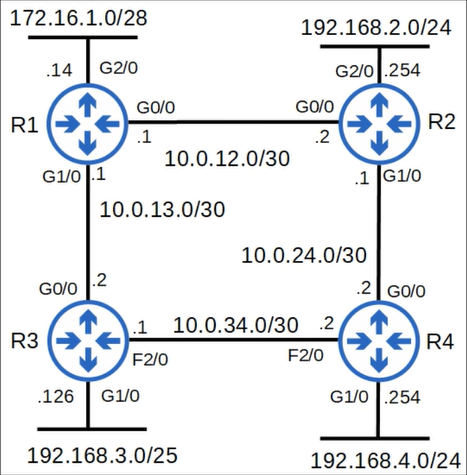

Ao configurar o OSPF em uma rede como essa, podemos utilizar apenas uma única "área" OSPF e não haverá degradação do desempenho da rede. Em redes maiores, contudo, um projeto de área única pode acarretar alguns efeitos negativos. Por exemplo, se a rede OSPF tivesse 500 roteadores com mais de 1000 sub-redes, em vez de 4 roteadores e apenas algumas sub-redes, usar uma única área OSPF seria uma má ideia. Você deve dividir uma rede grande como essa em várias áreas menores. Agora, quais são alguns dos efeitos negativos de usar um design de área única em uma rede grande?

Bem, por exemplo, o algoritmo SPF leva mais tempo para calcular rotas em uma rede grande. Ele também exige exponencialmente mais poder de processamento em cada roteador para realizar os cálculos. O fato de cada roteador compartilhar um único e enorme banco de dados de estado de enlace também consome mais memória nos roteadores. Além disso, qualquer pequena alteração na rede — por exemplo, uma nova interface sendo ativada — faria com que LSAs fossem propagados (flooded) para todos os 500 roteadores, e todos eles teriam que refazer o cálculo SPF. Ao dividir uma rede OSPF grande em várias áreas menores, você pode evitar esses efeitos negativos. 

Não vou criar um diagrama com 500 roteadores, mas aqui está um exemplo de uma rede maior do que a anterior. 

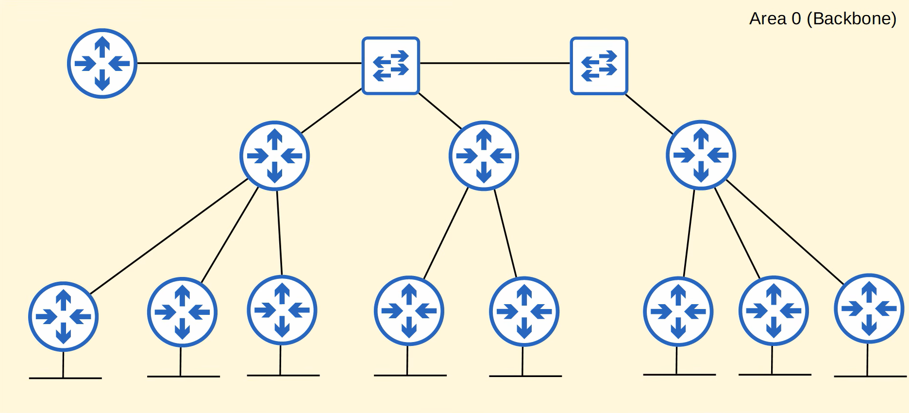

É possível transformar esta em uma rede grande de área única. Todas as interfaces de todos os roteadores são atribuídas à área 0, também conhecida como área backbone. Você verá em breve que a área 0 tem importância especial no OSPF, sendo chamada de "backbone area". Agora, em vez de uma única área grande, vou mostrar como a rede pode ser dividida em áreas separadas. Veja como isso é feito.

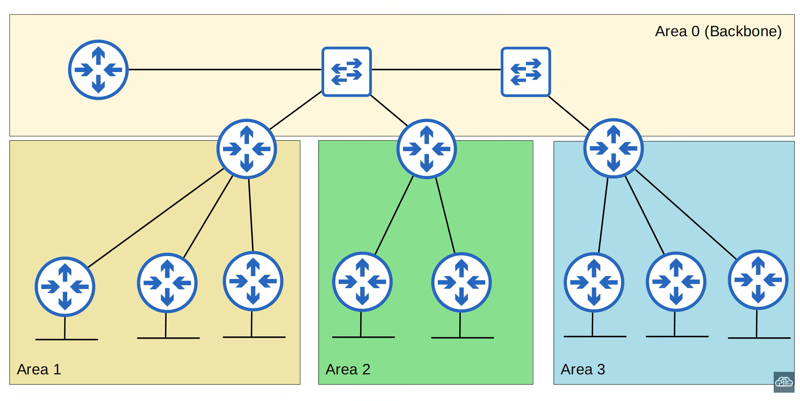

Existem algumas regras e terminologias sobre áreas OSPF que você precisa conhecer; vou explicá-las agora. 

Primeiramente, o que é uma área? É um conjunto de roteadores e links que compartilham o mesmo LSDB — banco de dados de estado de link. Olhando para este diagrama mais uma vez: quantas áreas existem? Área 0, Área 1, Área 2 e Área 3. Portanto, existem quatro áreas. Cada uma dessas áreas mantém um LSDB exclusivo.

Em seguida, a área de backbone (que é a área 0) é uma área — uma área especial — à qual todas as outras áreas devem se conectar. Vamos verificar aquele diagrama de rede novamente. Observe que a área 1, a área 2 e a área 3 se conectam à área 0, a área de backbone.

A seguir: roteadores com todas as interfaces na mesma área são chamados de "roteadores internos". Então, neste diagrama, quais são os roteadores internos? Se todas as interfaces do roteador estiverem na mesma área, ele é um roteador interno. Os roteadores destacados em vermelho são "Internal Routers".

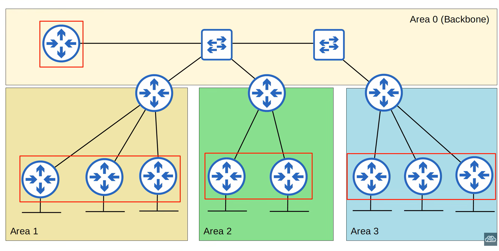

A seguir: roteadores com interfaces em múltiplas áreas são chamados de "roteadores de borda de área" (ABRs), porque constituem a fronteira entre diferentes áreas OSPF. Nesta rede, quais roteadores são ABRs? Lembre-se de que os ABRs (Area Border Routers — Roteadores de Fronteira de Área) são roteadores com interfaces em múltiplas áreas OSPF. Os roteadores destacados em vermelho são "Area Border Routers".

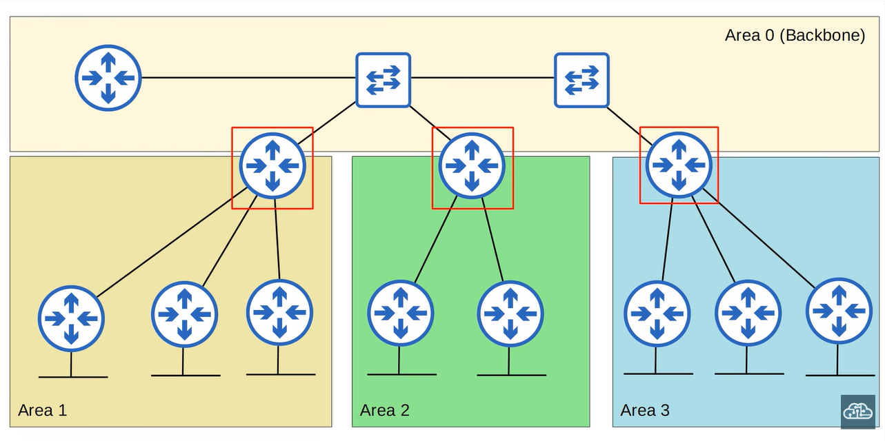

Mais uma informação sobre os ABRs: eles mantêm um LSDB separado para cada área à qual estão conectados. Recomenda-se conectar um ABR a, no máximo, duas áreas. Conectar um ABR a três ou mais áreas pode sobrecarregar o roteador. Portanto, um projeto como o que mostro aqui representa um bom design de rede OSPF, com cada ABR conectado apenas a duas áreas. 

A seguir, os roteadores conectados à área de backbone — que, como mencionei anteriormente, é a área 0 — são chamados de roteadores de backbone. Isso inclui os roteadores de fronteira de área (ABRs), aliás. Então, quais roteadores nesta rede são roteadores de backbone? Os roteadores destacados em vermelho são "Backbone Routers".

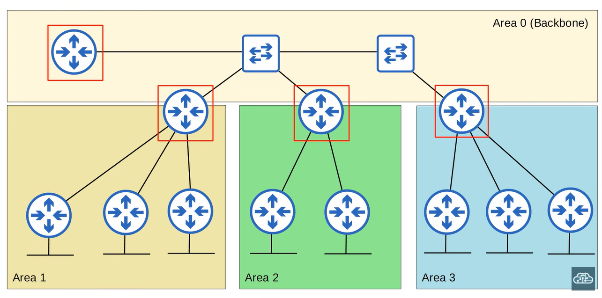

Próximo termo: uma "rota intra-área" é uma rota para um destino dentro da mesma área OSPF. Por exemplo, de um roteador na área 1 para um destino que também está na área 1. Vamos ver um exemplo.

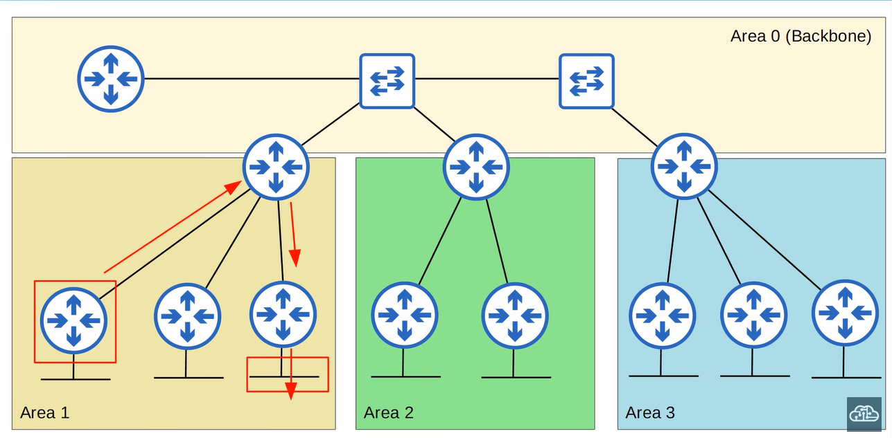

Se o roteador aprender uma rota para esta sub-rede na área 1, ela será considerada uma rota intra-área, porque o destino está na mesma área que o roteador.

Aqui está o último termo. Uma "rota interáreas" é uma rota para um destino em uma área OSPF diferente. Por exemplo, se um roteador na área 1 aprende uma rota para um destino na área 2, essa é uma rota interárea. Vamos ver mais um exemplo.

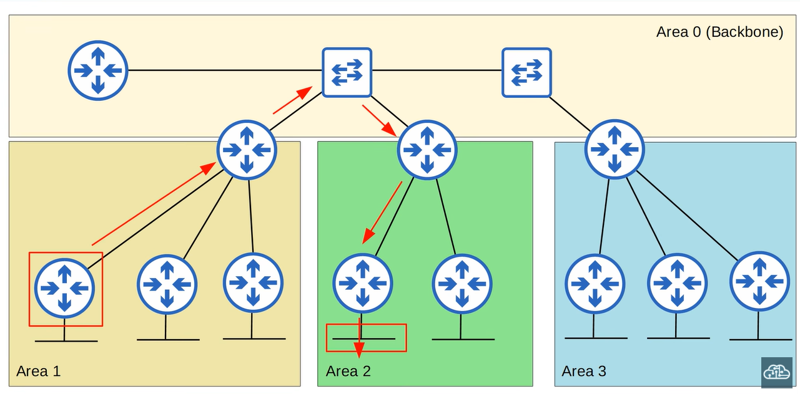

Se o roteador na área 1 aprende uma rota para a sub-rede na área 2, ela é considerada uma rota interárea. O roteador e o destino estão em duas áreas OSPF diferentes. Então, esses são alguns termos importantes do OSPF relacionados às áreas OSPF. Area, backbone area, internal routers, area border routers (ABR), backbone routers, intra-area route e inter-area route. A seguir, vamos abordar algumas regras adicionais sobre áreas OSPF.

### Regras de Área OSPF

Primeiro, as áreas OSPF devem ser "contíguas". O que isso significa? Significa que cada área individual deve ser conectada, e não dividida. É mais fácil demonstrar com o diagrama de rede. 

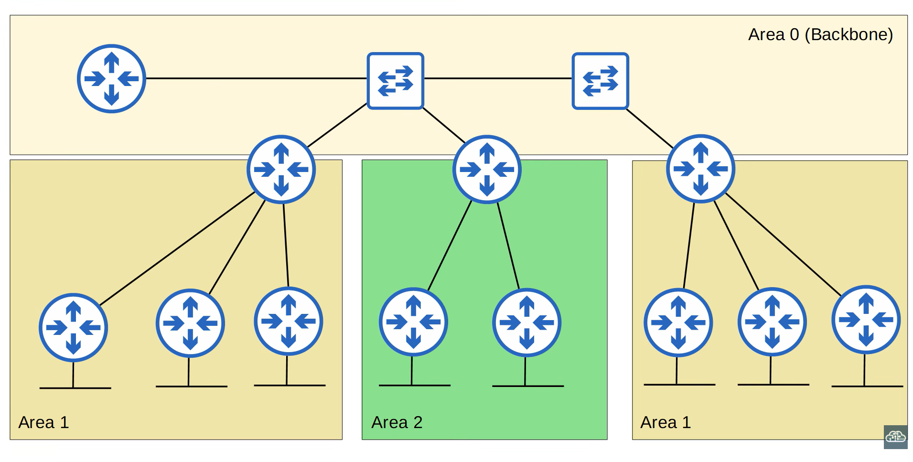

A área 1 agora é não contígua. Em vez de estar toda conectada, metade da área 1 está de um lado e a outra metade está do outro lado. Esse tipo de projeto de rede não é permitido no OSPF e causará problemas. Então, em vez de ter a área 1 dividida e não contígua dessa forma, você deve transformar esta seção à direita em uma área separada: a área 3. 

Agora, todas as áreas são contíguas e o OSPF pode funcionar corretamente.

Próxima regra: todas as áreas OSPF devem ter pelo menos um ABR conectado à área backbone. Na verdade, já mencionei isso, mas vale a pena repetir. Vamos olhar novamente para o diagrama de rede. Então, observe que a área 1 possui um ABR conectado tanto à área 1 quanto à área 0; a área 2 possui um ABR conectado tanto à área 2 quanto à área 0; e a área 3 também possui um ABR conectado tanto à área 3 quanto à área 0. Esse é um projeto de rede OSPF correto.

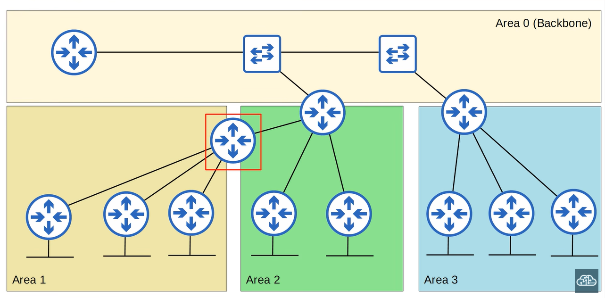

Uma rede como esta não representa um projeto OSPF correto e causará problemas, pois a área 1 não possui um ABR conectado à área de backbone, área 0.

Mais uma regra: interfaces OSPF na mesma sub-rede devem estar na mesma área. Se não estiverem na mesma área, elas não se tornarão vizinhas OSPF e não trocarão informações sobre as redes que conhecem. Em outro arquivo, detalharei outros requisitos para que roteadores se tornem vizinhos OSPF, mas, por enquanto, vamos ficar apenas com esta regra. Então, deixe-me demonstrar. 

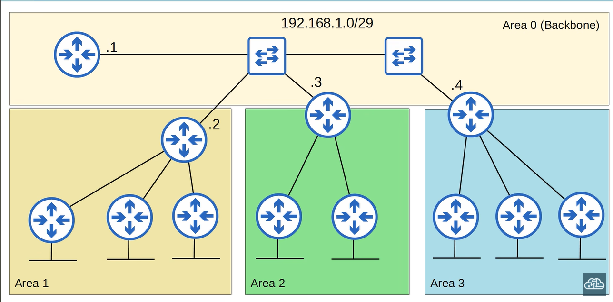

Neste exemplo, há três roteadores que possuem uma interface na área 0, na sub-rede 192.168.1.0/29. O roteador na área 1 também possui uma interface na sub-rede 192.168.1.0/29, mas a interface está na área 1, e não na área 0. Embora todas as quatro interfaces estejam na mesma sub-rede e o OSPF esteja habilitado nelas, o roteador da área 1 não se tornará vizinho OSPF dos outros. 

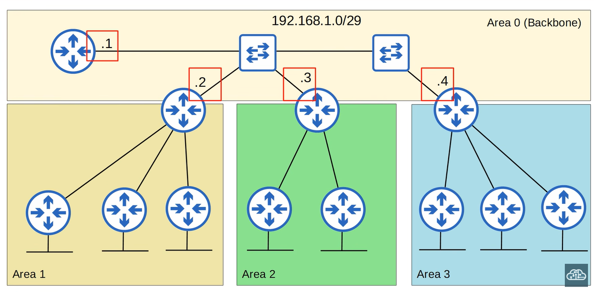

Desta vez, a interface do ABR da área 1 na sub-rede 192.168.1.0/29 está configurada corretamente na área 0.  Assim, todos os quatro roteadores se tornarão vizinhos OSPF. Aqui está um resumo dessas três regras.

- Áreas OSPF devem ser contíguas;
- Todas as áreas OSPF devem ter um roteador ABR conectado à área 0, backbone area; e
- Interfaces OSPF na mesma subrede  devem estar na mesma área.

É claro que abordarei muitos outros pontos sobre o OSPF nos próximos arquivos. Falarei detalhadamente sobre vizinhos OSPF, LSAs OSPF e outros tópicos. Mas agora vamos abordar algumas configurações básicas do OSPF para que possamos praticá-las no vídeo de laboratório.

### Configuração Básica de OSPF

Então, vamos usar a mesma topologia de rede que utilizamos para RIP e EIGRP, já que você já está familiarizado com ela.

Todas essas interfaces de roteador estão na área OSPF 0. Já configurei os roteadores R2, R3 e R4, então vamos configurar o OSPF no R1. Aqui está a configuração básica do OSPF; vamos analisá-la. 

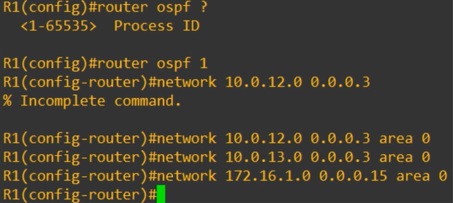

Primeiramente, para entrar no modo de configuração do OSPF, usa-se o comando `router ospf`, seguido de um ID de processo. Um roteador pode executar vários processos OSPF simultaneamente, e esse ID é usado no roteador para identificar cada um deles. Normalmente, utiliza-se apenas um único processo OSPF, então não se preocupe muito com esse número; eu escolhi usar o 1.

Se você se lembra da configuração do EIGRP, utilizava-se o comando `router eigrp`, seguido de um número de AS. Para que roteadores EIGRP se tornem vizinhos, seus números de AS precisam coincidir. No entanto, o ID de processo do OSPF é diferente. O ID de processo do OSPF tem significado local. Roteadores com IDs de processo diferentes podem se tornar vizinhos OSPF. Geralmente, uso apenas o ID de processo 1, mas você poderia, por exemplo, usar o ID de processo 1 no R1 e o ID de processo 2 no R2; eles ainda assim se tornariam vizinhos OSPF e trocariam LSAs.

Observe que esse ID de processo não tem relação alguma com a área. Você verá a seguir que a área é configurada separadamente. Então, em seguida, tentei usar o comando `network`, assim como fiz no EIGRP. Note que o OSPF utiliza máscaras curinga (*wildcard masks*), exatamente como o EIGRP. Se precisar revisá-las, volte e leia o arquivo sobre RIP e EIGRP. Basicamente, trata-se de uma máscara de sub-rede invertida. Enfim, tentei usar aquele comando, mas o roteador respondeu com "Incomplete command" (comando incompleto).

Isso acontece porque o comando `network` do OSPF exige que você especifique a área. Então, ativei o OSPF em todas essas interfaces, na área 0. No OSPF de área única, é possível usar qualquer número de área, mas considera-se uma boa prática utilizar a área 0. Antes de prosseguir, deixe-me revisar a função do comando `network`; ele funciona exatamente como no RIP e no EIGRP. O comando `network` instrui o OSPF a procurar interfaces com um endereço IP contido na faixa especificada no comando e, em seguida, ativar o OSPF nessa interface na área especificada. 

Por exemplo, no primeiro comando `network`, especifiquei 10.0.12.0 com uma máscara curinga (wildcard) /28, na área 0. A interface G0/0 do R1 tem o endereço IP 10.0.12.1, que está contido na faixa 10.0.12.0/28. Portanto, o OSPF será ativado na interface G0/0, na área 0. Quando o OSPF é ativado na interface, o roteador tenta estabelecer uma vizinhança OSPF com outros roteadores vizinhos que também tenham o OSPF ativado. Nesse caso, o R1 estabelecerá vizinhança OSPF com o R2 e o R3. Explicarei esse processo detalhadamente no próximo arquivo.

Então, lembre-se apenas de que o comando `network` serve simplesmente para indicar ao roteador em quais interfaces o OSPF deve ser ativado. Ele não instrui o roteador a "anunciar essas redes". Mas já abordamos isso antes, no arquivo sobre RIP e EIGRP; agora, vamos ver algumas outras configurações que você pode realizar no OSPF.

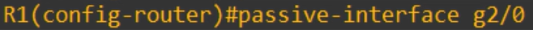

Para começar, o comando `passive-interface`. Você já conhece esse comando do RIP e do EIGRP; ele funciona exatamente da mesma forma no OSPF. O comando `passive-interface` instrui o roteador a parar de enviar mensagens "hello" do OSPF por meio daquela interface. O OSPF utiliza mensagens "hello" para se anunciar a outros roteadores — aguarde o próximo arquivo para mais detalhes sobre isso.

No entanto, o roteador continuará enviando LSAs para informar seus vizinhos da sub-rede configurada na interface. Então, embora o R1 não envie pacotes *hello* pela interface G2/0 nem tente encontrar vizinhos OSPF, ele ainda informará aos seus outros vizinhos sobre a rede 172.16.1.0/28. Você deve sempre usar esse comando em interfaces que não possuem vizinhos OSPF. É um desperdício enviar continuamente mensagens *hello* por uma interface à qual não há outros roteadores conectados. Portanto, esse é o comando `passive-interface`; ele é basicamente o mesmo utilizado para RIP e EIGRP.

#### Anunciar uma rota padrão no OSPF

A seguir, vamos ver como anunciar uma rota padrão no OSPF, assim como mostrei anteriormente para o RIP.

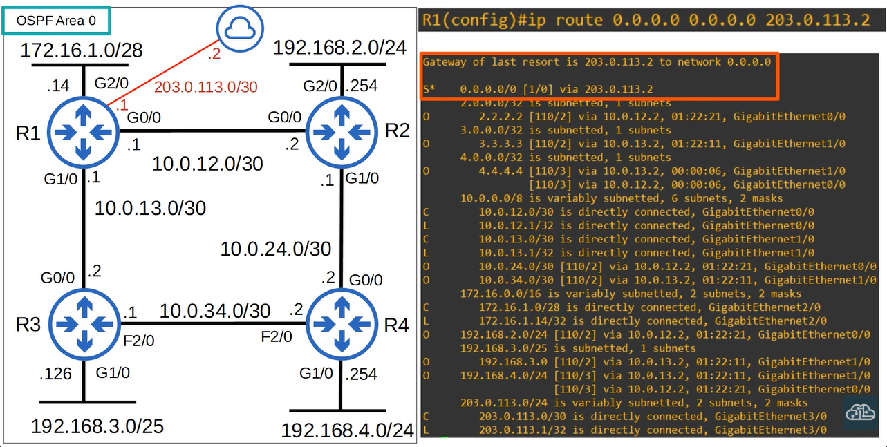

Então, adicionei uma conexão com a Internet ao R1. Em seguida, configurei uma rota padrão no R1, sendo que o próximo salto (*next hop*) é o endereço IP do provedor (ISP):
23:41
203.0.113.2. Aqui estão essas informações na tabela de roteamento do R1.
23:47
Fique à vontade para pausar aqui se quiser conferir também as outras rotas OSPF que o R1 aprendeu.
23:54
Assim como mostrei no RIP, o comando para anunciar a rota padrão no OSPF é DEFAULT-INFORMATION ORIGINATE.
24:01
No OSPF, isso fará com que o roteador crie um novo LSA e o propague (*flood*). Verifiquei a tabela de roteamento do R2 e é possível ver que ele adicionou a rota padrão via R1 à sua
24:11
tabela de rotas. O R3 e o R4 fariam o mesmo. Agora, vamos dar uma olhada no comando SHOW IP PROTOCOLS sob a perspectiva do OSPF, e vamos
show ip protocols
24:22
verificar também alguns outros comandos. Na parte superior, aparece a informação "routing protocol is ospf 1".
24:28
1 é o ID do processo que configurei anteriormente. O OSPF também utiliza um Router ID, e esse identificador é determinado exatamente da mesma forma que
24:37
no EIGRP; vamos relembrar. Aqui está a ordem de prioridade para determinar o Router ID do OSPF.
24:46
Primeiramente, se você configurar o Router ID manualmente, esse será o Router ID utilizado.
24:51
Se você não configurar o Router ID manualmente, o endereço IP mais alto em uma interface loopback
24:57
será definido como o Router ID. Se o roteador não possuir interfaces loopback com endereço IP, o endereço IP mais alto em uma
25:04
interface física será definido como o Router ID. Atualmente, o Router ID do R1 é 172.16.1.14, pois não configurei manualmente o
25:13
Router ID e também não configurei uma interface loopback no R1. Vamos ver como configurar o Router ID manualmente.
25:22
No modo de configuração do OSPF, utilize o comando ROUTER-ID. Isso é um pouco diferente do EIGRP; no EIGRP, o comando é EIGRP ROUTER-ID, mas
25:33
no OSPF é apenas ROUTER-ID. Então, inseri o Router ID 1.1.1.1, mas o roteador exibiu esta mensagem:
25:43
"Reinicie ou use o comando 'clear ip ospf process' para que isso entre em vigor".
25:49
Portanto, no momento, o Router ID ainda é 172.16.1.14; para que o 1.1.1.1 entre em vigor, precisamos
25:57
reiniciar o roteador ou usar aquele comando para limpar o processo OSPF e reiniciá-lo.
26:02
Eu fiz isso: a partir do modo EXEC privilegiado, utilizei o comando CLEAR IP OSPF PROCESS.
26:10
Basicamente, isso reinicia o OSPF no roteador. Essa é uma má ideia em uma rede real, pois o roteador perderá todas as suas rotas OSPF
26:18
por um curto período e não conseguirá encaminhar tráfego para esses destinos. Em um laboratório como este, no entanto, não há problema.
26:27
Uma observação: note o "no" entre colchetes. Quando você vê isso após inserir um comando, significa que "no" é a opção padrão.
26:35
Se você apenas pressionar Enter, o roteador assumirá "no" e não limpará o processo OSPF.
26:41
No entanto, eu digitei "yes", então ele foi limpo. Depois, executei o comando SHOW IP PROTOCOLS novamente e você pode ver que o Router ID agora é 1.1.1.1.
26:53
Agora, vamos analisar o restante do comando. Veja isto: "It is an autonomous system boundary router" (É um roteador de borda de sistema autônomo).
26:59
Um roteador de borda de sistema autônomo, ou ASBR, é um roteador OSPF que conecta a rede OSPF
27:06
a uma rede externa. O R1 está conectado à Internet. Ao usar o comando DEFAULT-INFORMATION ORIGINATE, o R1 se torna um ASBR; ele conecta a
27:16
rede OSPF à Internet. É por isso que vemos essa saída aqui no R1.
27:23
A seguir, o número de áreas neste roteador é 1: 1 normal, 0 stub, 0 nssa.
27:31
Esses são três tipos diferentes de áreas OSPF; não é necessário conhecer os diferentes tipos para o CCNA, mas queria destacar que você pode ver o número de áreas em que este
27:40
roteador está inserido — apenas uma, pois trata-se de OSPF de área única. Em seguida, o número máximo de caminhos é 4.
27:49
Ao contrário do EIGRP, o OSPF não suporta balanceamento de carga com custos desiguais, mas suporta balanceamento de carga ECMP
27:56
em até 4 caminhos por padrão. Para alterar o número máximo de caminhos, use o comando MAXIMUM-PATHS, assim como no RIP
28:05
e no EIGRP. Aqui, alterei o número para 8. A seção "routing for networks" mostra os comandos de rede que utilizamos.
28:14
Vale ressaltar que isso determina apenas em quais interfaces o OSPF será ativado; não
28:20
instrui o OSPF a propagar (flood) LSAs para essas redes específicas. Aqui está a interface passiva que configuramos, e aqui estão os vizinhos do R1.
28:30
Observe os IDs do roteador; eu configurei essas interfaces de loopback

...nos roteadores R2, R3 e R4 e
28:37
seus endereços IP tornaram-se os IDs de roteador. Por fim, aqui embaixo é exibida a AD (Distância Administrativa) do OSPF; o padrão é 110, como vocês sabem.
28:46
Se quiser alterá-la, o comando é o mesmo usado para RIP e EIGRP.
28:51
No modo de configuração do OSPF, basta usar o comando DISTANCE. Por exemplo, eu a alterei para 85, de modo que as rotas OSPF tenham preferência sobre as rotas EIGRP neste roteador.
29:02
É isso para esta aula. Abordamos muitas informações, mas grande parte delas é semelhante ou igual ao que
Tópicos abordados
29:08
aprendemos sobre RIP e EIGRP. Claro, também houve muitas informações novas.
29:14
Antes de passar para o quiz, vamos revisar o que vimos. Apresentei uma visão geral básica das operações do OSPF, incluindo uma breve análise das LSAs, que
29:23
abordaremos com mais detalhes posteriormente. Introduzi o conceito de áreas OSPF.
29:29
Embora o CCNA exija apenas a configuração de OSPF de área única, você ainda precisa ter uma compreensão básica
29:34
sobre áreas OSPF. Lembre-se das regras e termos básicos do OSPF, como *area border router* (ABR) e
29:42
*autonomous system boundary router* (ASBR). Por fim, vimos algumas configurações básicas do OSPF.
29:50
A maioria delas era igual à do RIP e do EIGRP, com algumas pequenas diferenças.

