# OSPF

## Tópicos que abordaremos

Vamos ver o que abordaremos neste arquivo. Trataremos de três tópicos principais.

- Primeiro, a métrica do OSPF, que, como você sabe, é chamada de "custo";
- O próximo tópico será como os roteadores se tornam vizinhos OSPF. Já mencionei vizinhos OSPF anteriormente, mas ainda não mostrei o processo em si. Vamos detalhá-lo neste arquivo; e
- Por fim, apresentarei mais algumas configurações do OSPF.

Vamos falar sobre a métrica do OSPF.

## Custo OSPF

Como você já sabe, a métrica do OSPF é chamada de "custo". Ela é calculada automaticamente com base na largura de banda — ou seja, a velocidade — da interface. Você também pode configurar manualmente o custo de cada interface, mas mostrarei isso mais adiante. O custo da interface é calculado dividindo-se um valor chamado "largura de banda de referência" pela largura de banda da interface. A largura de banda de referência padrão do OSPF é de 100 megabits por segundo.

Então, por exemplo, uma interface Ethernet comum com velocidade de 10 megabits por segundo tem um custo OSPF de 10, pois 100 dividido por 10 é igual a 10. Uma interface FastEthernet, com velocidade de 100 megabits por segundo, tem um custo OSPF de 1, pois 100 dividido por 100 é 1. 

Agora, e quanto a uma interface Gigabit Ethernet, com velocidade de 1000 megabits por segundo? Ela tem custo 1, embora 100 dividido por 1000 seja igual a 0,1. E quanto a uma interface Ethernet de 10 Gigabits, com velocidade de 10.000 megabits por segundo? Ela também tem custo 1, embora 100 dividido por 10.000 seja igual a 0,01. Por que isso acontece?

Bem, no OSPF, todos os valores menores que 1 são convertidos para 1. Portanto, FastEthernet, Gigabit Ethernet, Ethernet de 10 Gigabits, etc., são equivalentes e todas têm custo 1 por padrão. Vou mostrar na CLI. Aqui está a mesma topologia de rede de antes. 

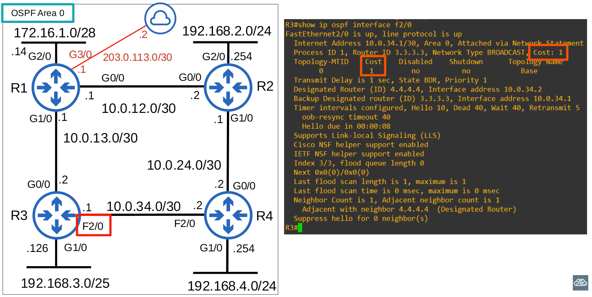

Vamos verificar o custo da interface F2/0 do R3. Usei o comando `show ip ospf interface f2/0`.  O custo aparece em dois lugares. Como eu disse, o custo padrão de uma interface FastEthernet é 1, pois ela possui uma velocidade de 100 megabits por segundo e a largura de banda de referência padrão é de 100 megabits por segundo. Agora, vamos verificar o custo OSPF padrão na interface G0/0 do R3.

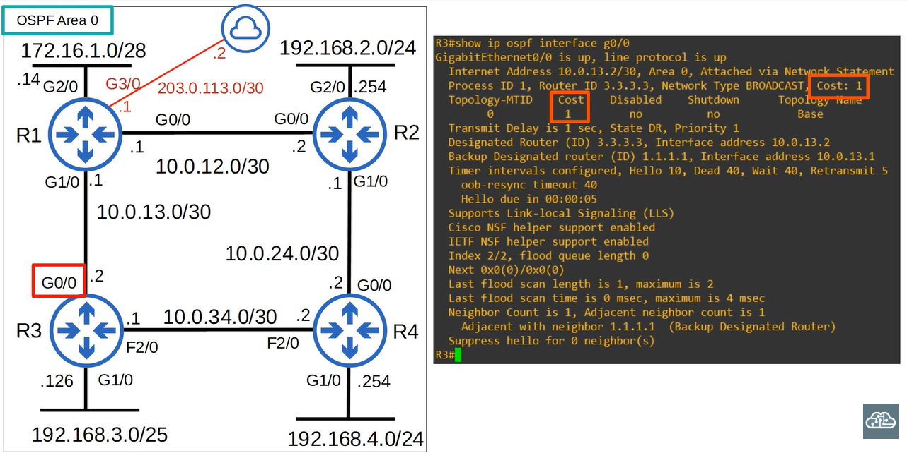

Digitei `show ip ospf interface g0/0` e, como você pode ver, o custo aqui também é 1. Claramente, a situação padrão não é a ideal. Felizmente, é possível alterar isso.

### Alterando a largura de banda de referência

Você pode — e deve — alterar a largura de banda de referência usando este comando, a partir do modo de configuração do OSPF: `auto-cost reference-bandwidth`, seguido pelo valor da largura de banda de referência em megabits por segundo. Vamos analisar esse comando.

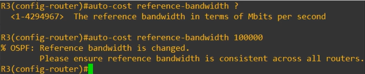

Como mostrei na imagem anterior, a largura de banda de referência é configurada em megabits por segundo. Configurei o valor como 100.000; então, qual será o custo das interfaces FastEthernet e Gigabit Ethernet? 100.000 dividido por 100 resulta em 1.000; esse é, portanto, o custo de uma interface FastEthernet. E quanto à Gigabit Ethernet? 100.000 dividido por 1.000 resulta em 100; esse é o custo de uma interface Gigabit Ethernet.

Por que configurar um valor tão alto para a largura de banda de referência? Bem, você deve configurar uma largura de banda de referência superior à velocidade dos links mais rápidos da sua rede, para permitir futuras atualizações. Os 100.000 megabits por segundo que configurei como largura de banda de referência equivalem a uma interface de 100 gigabits por segundo, o que é 100 vezes mais rápido do que as interfaces mais velozes desta rede: a Gigabit Ethernet padrão.

Por fim, observe a mensagem exibida ao configurar a largura de banda de referência: "Certifique-se de que a largura de banda de referência seja consistente em todos os roteadores". Portanto, para garantir um custo consistente para a largura de banda de cada interface em toda a rede, você deve configurar a mesma largura de banda de referência em todos os roteadores OSPF da rede. 

Certo, defini a mesma largura de banda de referência OSPF de 100 gigabits por segundo em todos os roteadores.

## Custo OSPF (continuação)

O custo OSPF até um destino é a soma dos custos das interfaces de "saída" (ou *outgoing*). Isso funciona exatamente como o custo do Spanning Tree. Por exemplo: qual é o custo para o R1 alcançar a rede 192.168.4.0/24? 

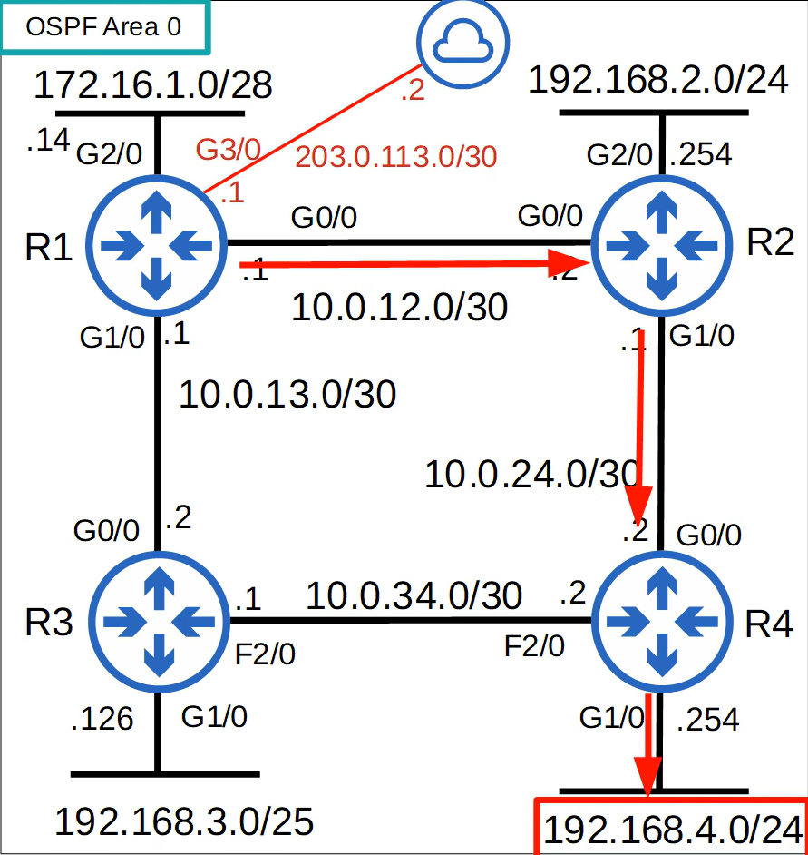

Para chegar a 192.168.4.0, um pacote sairia pelas interfaces G0/0 do R1, G1/0 do R2 e G1/0 do R4. Ou seja: 100 mais 100 mais 100, resultando em um custo total de 300. Verificaremos a tabela de roteamento do R1 em breve, mas há mais um detalhe: interfaces Loopback têm custo 1. Então, qual é o custo para o R1 alcançar o endereço 2.2.2.2, que corresponde à interface Loopback0 do R2? 

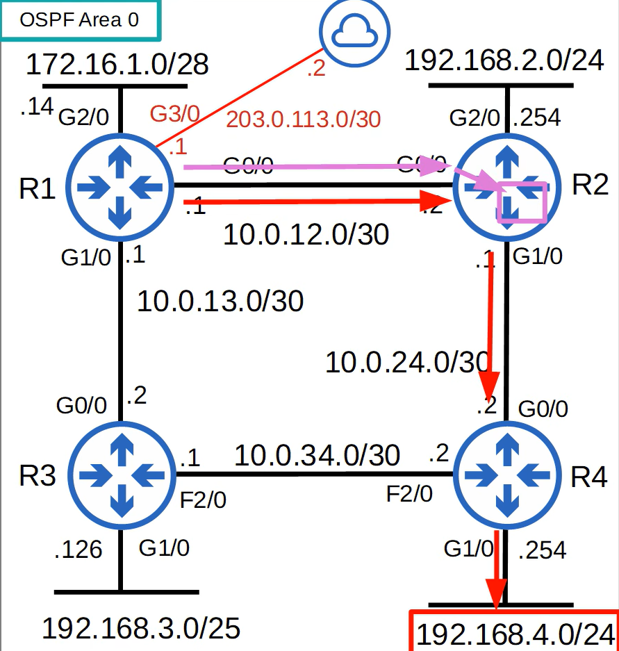

Para chegar a 2.2.2.2, o pacote deve sair pela interface G0/0 do R1 e pela interface loopback0 do R2. Agora, ele não chega a sair por nenhuma interface física para alcançar a interface de loopback virtual, mas um custo de 1 é adicionado à métrica. Portanto, o custo do R1 para alcançar 2.2.2.2 é 101. Aqui está a tabela de roteamento do R1 antes de alterar a largura de banda de referência em todos os roteadores, de modo que todos mantêm a largura de banda de referência padrão de 100 megabits por segundo. 

Observe que existem duas rotas para 192.168.4.0: uma via R2 e outra via R3. Embora a conexão entre R3 e R4 seja uma conexão FastEthernet mais lenta, ela possui o mesmo custo de 1 que as interfaces Gigabit Ethernet. E aqui está a tabela de roteamento do R1 após alterar a largura de banda de referência de cada roteador para 100.000 megabits por segundo.

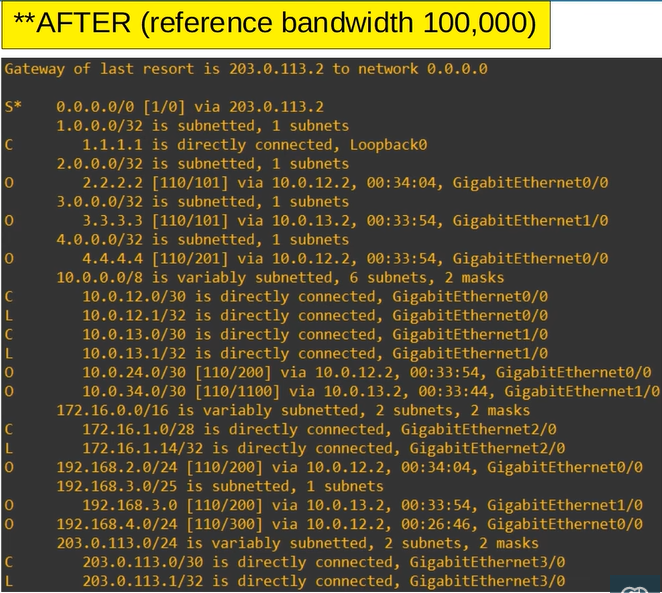

Agora, o R1 insere apenas uma rota para 192.168.4.0 na tabela de roteamento, e o custo é 300, conforme calculamos anteriormente. Observe que o custo para 2.2.2.2 é 101, como também calculamos antes.

Agora, vou mostrar como configurar manualmente o custo OSPF de uma interface. O comando é `ip ospf cost`, seguido pelo valor de custo que você deseja definir. Você configura isso diretamente na interface, e esse custo terá prioridade sobre o custo calculado automaticamente. Por exemplo, configurei o custo da interface G0/0 do R1 como 10.000 e agora você pode ver que o custo é 10.000 em vez de 100. 

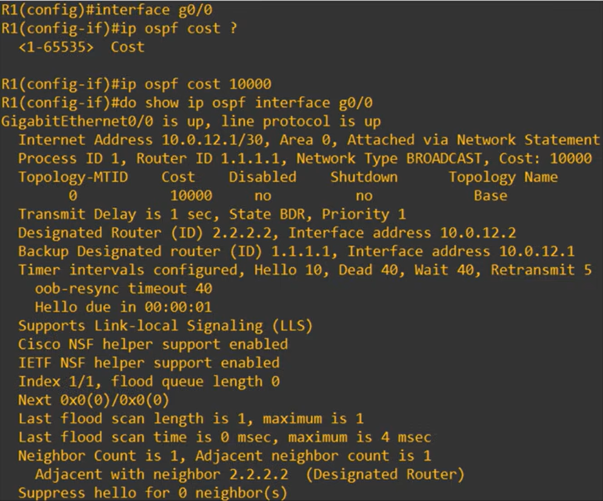

Outra opção para alterar o custo OSPF de uma interface é modificar a largura de banda da interface usando o comando `bandwidth`. Relembrando: a fórmula para calcular o custo OSPF é a largura de banda de referência dividida pela largura de banda da interface. Mostrei como alterar a largura de banda de referência, mas você também pode alterar a largura de banda da interface. Agora, preciso esclarecer a diferença entre "velocidade" e "largura de banda" da interface.

Embora a largura de banda corresponda à velocidade da interface por padrão, alterar a largura de banda da interface não altera, de fato, a velocidade de operação da interface. A largura de banda é apenas um valor utilizado para calcular o custo OSPF, a métrica EIGRP, etc. Para alterar a velocidade de operação da interface, utilize o comando `speed`. É assim que você realmente altera a velocidade com que a interface transmite dados fisicamente. Se você alterar a largura de banda de uma interface Gigabit Ethernet para 100 megabits por segundo, ela continuará operando a 1 gigabit por segundo. No entanto, para fins de cálculo de custo OSPF, será utilizada a largura de banda de 100 megabits por segundo.

Como o valor da largura de banda é usado em outros cálculos, e não apenas no custo OSPF, não é recomendável alterar esse valor para modificar o custo OSPF da interface. Recomenda-se alterar a largura de banda de referência e, em seguida, utilizar o comando `ip ospf cost` para modificar o custo de interfaces individuais, se desejar. No entanto, se você quiser alterar a largura de banda da interface, aqui está o comando: `bandwidth`, seguido pela largura de banda em kilobits por segundo.

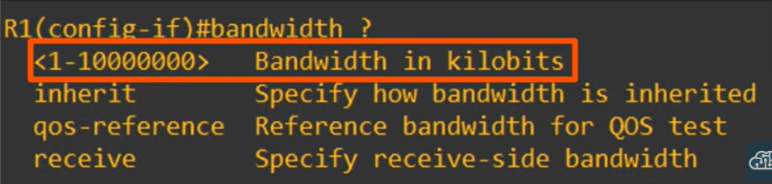

Observe que isso é diferente da largura de banda de referência, que é inserida em megabits por segundo. O comando de largura de banda da interface é inserido em kilobits por segundo. Antes de inserir qualquer comando desse tipo, recomendo fortemente usar o ponto de interrogação para verificar as unidades em que o comando deve ser inserido. Por exemplo, em comandos que envolvem tempo, alguns são inseridos em segundos, outros em minutos. Para comandos que envolvem velocidade, alguns são inseridos em kilobits, outros em megabits, etc. Sempre verifique se você está inserindo as unidades corretas. Vamos resumir.

## Resumo do custo OSPF

Existem três maneiras de modificar o custo OSPF. 

1. A primeira é alterar a largura de banda de referência. O comando é `auto-cost reference-bandwidth` seguido pela largura de banda de referência em megabits por segundo, inserido no modo de configuração OSPF.
2. A próxima forma é configurar manualmente o custo OSPF da interface com o comando `ip ospf cost`, inserido no modo de configuração da interface.
3. Por fim, você também pode alterar a largura de banda da interface, embora isso não seja recomendado. O comando é `bandwidth`, seguido pela largura de banda em kilobits por segundo, inserido no modo de configuração da interface.

Já mostrei o comando `show ip ospf interface`, mas aqui está uma maneira mais rápida de verificar o custo OSPF de cada interface. O comando `show ip ospf interface brief` fornece uma visão geral conveniente de cada interface com OSPF habilitado no roteador. 

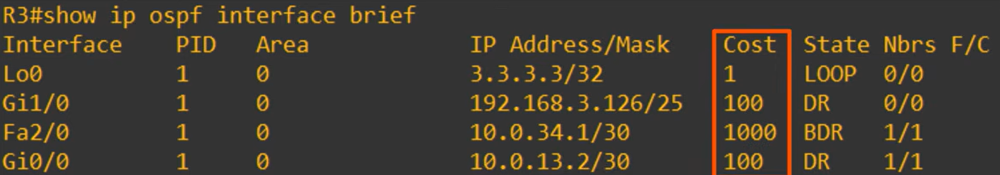

Certo, vamos passar para o próximo tópico. Este é outro tópico muito importante no OSPF: vizinhos OSPF.

## Vizinhos OSPF

Garantir que os roteadores se tornem vizinhos OSPF com sucesso é a tarefa principal na configuração e na resolução de problemas do OSPF. Assim que os roteadores se tornam vizinhos, eles realizam automaticamente o trabalho de compartilhar informações de rede, calcular rotas, etc. Portanto, basta garantir que o OSPF esteja ativado nas interfaces corretas e que as condições adequadas sejam atendidas para permitir que os roteadores se tornem vizinhos. Claro, existem configurações OSPF mais avançadas que você pode realizar, mas para a operação básica do OSPF elas não são necessárias. No entanto, se os roteadores não conseguirem se tornar vizinhos OSPF, o OSPF não consegue operar de forma alguma, então isso é muito importante. Então, como os roteadores se tornam vizinhos OSPF?

Quando o OSPF é ativado em uma interface, o roteador começa a enviar mensagens "hello" do OSPF a partir da interface em intervalos regulares (determinados pelo temporizador "hello"). Elas são usadas para apresentar o roteador a possíveis vizinhos OSPF. Ao trocar mensagens "hello", eles verificam se são compatíveis para se tornarem vizinhos OSPF, e então negociam seu relacionamento de vizinhança. A propósito, o temporizador "hello" padrão é de 10 segundos em uma conexão Ethernet. As mensagens "hello" do OSPF são enviadas via multicast para o endereço IP 224.0.0.5, que é o endereço multicast para todos os roteadores OSPF. Você se lembra do endereço multicast do RIP? É 224.0.0.9. E o EIGRP? 224.0.0.10. Além disso, as mensagens OSPF são encapsuladas em um cabeçalho IP, e o campo "protocol" (protocolo) do cabeçalho IP tem o valor 89 para indicar o OSPF.

### Estados de vizinhança - Down

Certo, para que os roteadores OSPF se tornem vizinhos, eles precisam passar por vários estados de vizinhança. Vou dar uma visão geral básica de cada um dos estados de vizinhança. Embora seja apenas uma visão geral básica, vou fornecer muitas informações nas próximas imagens.

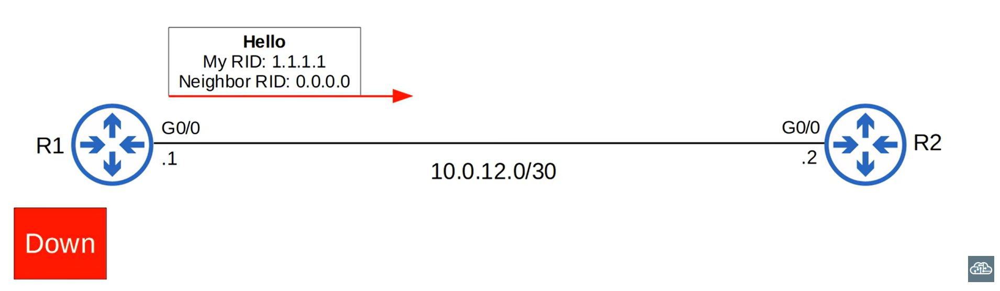

Então, vamos supor que o OSPF já esteja ativado na interface G0/0 do R2. Em seguida, o OSPF é ativado na interface G0/0 do R1. Ele envia uma mensagem Hello do OSPF para o endereço 224.0.0.5. Há mais campos na mensagem Hello, mas dois importantes são o Router ID do R1 e o Router ID do vizinho. No entanto, o R1 ainda não conhece o R2, portanto, o campo de Router ID do vizinho é 0.0.0.0. O R1 ainda não conhece nenhum vizinho OSPF, então o estado atual do vizinho é Down. Este é o primeiro estado de vizinho OSPF: "Down". Quando o R2 receber o pacote Hello, ele adicionará uma entrada para o R1 em sua tabela de vizinhos OSPF.

### Estados de vizinho – Init

Na tabela de vizinhos do R2, o relacionamento com o R1 está agora no estado Init.

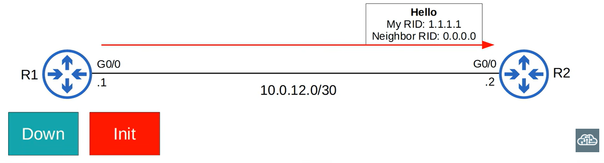

Observe que o R1 ainda não conhece o R2, portanto, não terá entradas em sua tabela de vizinhos OSPF. Basicamente, o estado Init significa que um pacote Hello foi recebido, mas o Router ID do próprio R2 não está no pacote Hello. O Router ID do R2 é 2.2.2.2, mas o Router ID do vizinho no pacote Hello do R1 é 0.0.0.0. Então, esse é o estado Init. O próximo estado é o estado 2-way.

### Estados de vizinho – 2-way

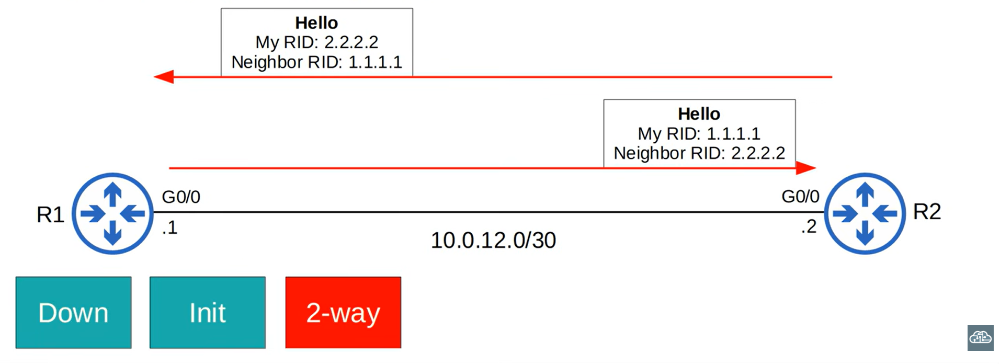

O R2 enviará um pacote Hello contendo o RID de ambos os roteadores. O R1 inserirá o R2 em sua tabela de vizinhos OSPF no estado 2-way. Em seguida, o R1 enviará outra mensagem Hello, desta vez contendo o RID do R2. Agora, ambos os roteadores estão no estado "2-way". O estado "2-way" significa que o roteador recebeu um pacote Hello contendo o seu próprio RID.

Se ambos os roteadores atingirem o estado "2-way", isso significa que todas as condições foram atendidas para que se tornem vizinhos OSPF. Eles estão agora prontos para compartilhar LSAs e construir uma LSDB comum. Por outro lado, se não conseguirem atingir esse estado "2-way", você sabe que precisa realizar a solução de problemas e descobrir o que os impede de alcançá-lo. Em alguns tipos de rede, um DR (Designated Router) e um BDR (Backup Designated Router) serão eleitos neste momento. Falarei sobre tipos de rede OSPF e eleições de DR/BDR posteriormente, então não se preocupe com eles por enquanto. Eu só queria apresentar os termos DR e BDR.

Neste ponto, os roteadores já são vizinhos OSPF. Nos próximos estados de vizinhança, eles compartilharão LSAs e formarão uma adjacência OSPF completa. Vamos para o próximo estado de vizinhança.

### Estados de vizinhança - Exstart

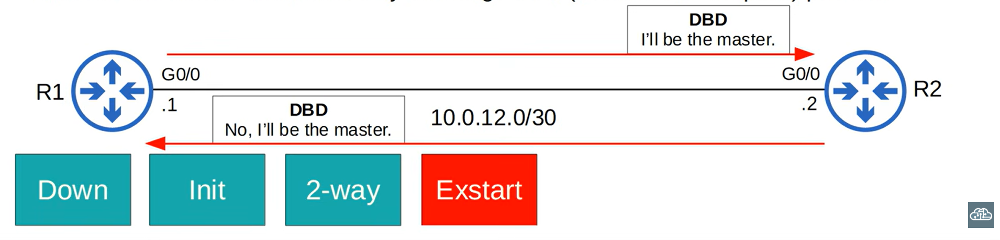

Após o estado "2-way", os dois roteadores se prepararão para trocar informações sobre suas LSDBs. Antes disso, eles precisam escolher qual deles iniciará a troca. Assim, eles decidirão qual será o roteador Master (mestre) e qual será o roteador Slave (escravo). Observe que esses papéis são diferentes do DR e do BDR que mencionei anteriormente. Essa relação Master/Slave é necessária apenas para essa troca inicial de informações da LSDB. Eles decidem qual será o Master e qual será o Slave durante o estado Exstart.

O roteador com o RID mais alto se tornará o Master e iniciará a troca. O roteador com o RID mais baixo se tornará o Slave. Portanto, neste caso, o R2 será o master e o R1 será o slave. Para definir quem é Master e quem é Slave, eles trocam pacotes DBD (Database Description). Os pacotes DBD também são importantes no próximo estado; por isso, falarei mais sobre eles depois.

Basicamente, o estado Exstart serve apenas para preparar o próximo estado. O R1 envia um pacote DBD alegando ser o master. No entanto, o R2 corrige o R1. O R2 possui o Router ID mais alto e afirma que ele será o master.

### Estados de vizinhança – Exchange

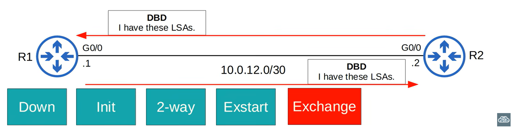

No próximo estado, o estado Exchange, os roteadores trocam pacotes DBD que contêm uma lista das LSAs em seus LSDBs. Esses DBDs não incluem informações detalhadas sobre as LSAs, apenas informações básicas indicando ao vizinho quais LSAs eles possuem. Basicamente, os roteadores informam uns aos outros: "Eu tenho estas LSAs", mas não estão enviando as LSAs propriamente ditas ainda. Os roteadores comparam as informações do DBD recebido com as informações de seus próprios LSDBs para determinar quais LSAs precisam receber do vizinho. Após a troca de DBDs, eles passam para o próximo estado.

### Estados de vizinhança – Loading

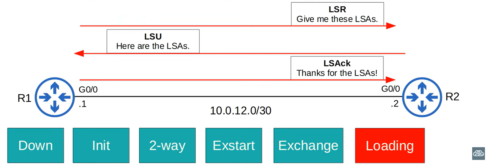

O próximo estado é o estado de Loading. Nesse estado, os roteadores enviam mensagens LSR (Link State Request) para solicitar que seus vizinhos enviem quaisquer LSAs que eles não possuam. No estado de Exchange (Troca), eles trocaram pacotes DBD, então sabem quais LSAs seus vizinhos possuem. Assim, essas mensagens LSR são usadas para solicitar quaisquer LSAs ausentes, garantindo que cada roteador tenha as mesmas LSAs. A imagem mostra apenas um lado da troca, mas o R2 também enviará mensagens LSR ao R1 para quaisquer LSAs ausentes. 

Em seguida, as próprias LSAs são enviadas em mensagens LSU (Link State Update). O R2 envia ao R1 as LSAs solicitadas em uma mensagem LSU. O R1 também fará o mesmo para o R2. Finalmente, os roteadores enviam mensagens LSAck — outro tipo de mensagem OSPF — para confirmar o recebimento das LSAs. Agora, o estado de Loading está concluído e os roteadores possuem o mesmo LSDB.

### Estados de vizinhança – Full

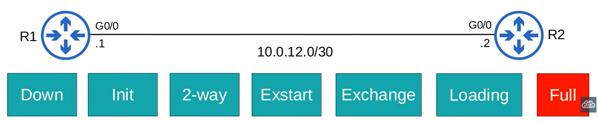

Chegamos ao estado final do OSPF. No estado Full, os roteadores possuem uma adjacência OSPF completa e LSDBs idênticos.  Mas isso não significa que o processo esteja concluído. Eles continuam enviando e aguardando pacotes Hello — por padrão, a cada 10 segundos — para manter a adjacência de vizinhança. Para manter essa adjacência, utiliza-se outro temporizador, chamado de temporizador "Dead" (ou de inatividade).

Sempre que um pacote Hello é recebido, o temporizador "Dead" — cujo padrão é de 40 segundos — é reiniciado. No entanto, se a contagem regressiva do temporizador "Dead" chegar a zero sem que nenhuma mensagem Hello seja recebida, o vizinho é removido. Se a vizinhança permanecer ativa, os roteadores continuarão compartilhando LSAs à medida que a rede sofrer alterações, garantindo que cada roteador possua um mapa completo e preciso da rede. Essa é a principal vantagem dos protocolos de roteamento dinâmico: os roteadores reagem automaticamente a mudanças na rede, adicionando, removendo ou alterando rotas conforme necessário.

## Resumo sobre vizinhos OSPF

Vamos resumir esse processo.

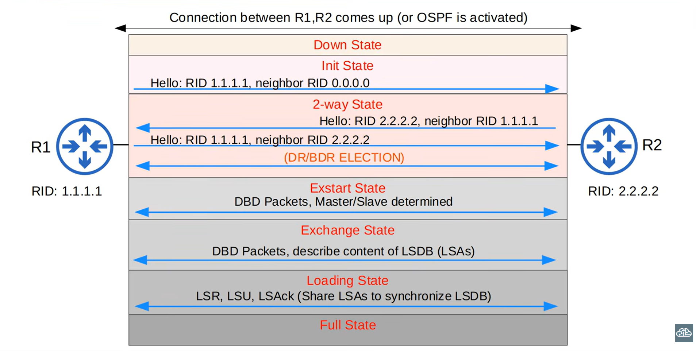

1. Primeiramente, a conexão entre R1 e R2 é estabelecida, ou o OSPF é ativado nas interfaces, iniciando o processo. O primeiro estado é o estado "Down" (Inativo); R1 e R2 ainda não se conhecem, mas enviam pacotes Hello por meio de suas interfaces. Vamos supor que R1 envie o primeiro pacote Hello.

2. O estado "Init" (Inicialização) ocorre quando R2 recebe esse primeiro pacote Hello de R1, mas o próprio Router ID de R2 ainda não consta no pacote. 

3. No estado "2-way" (Bidirecional), os roteadores trocam mais pacotes Hello, mas o Router ID de R1 é incluído nos pacotes Hello de R2, e o Router ID de R2 é incluído nos pacotes Hello de R1. Em alguns tipos de conexões OSPF, ocorre uma eleição para o roteador designado e o roteador designado de backup. Falarei mais sobre isso no último arquivo sobre OSPF.

4. A seguir, temos o estado Exstart. Os roteadores trocam pacotes DBD para determinar qual será o Master (Mestre) e qual será o Slave (Escravo). 

5. O Master é o roteador que inicia a troca de DBD no próximo estado, o estado Exchange (Troca). Eles trocam pacotes DBD para informar um ao outro sobre o conteúdo de suas LSDBs.

6. O próximo estado é o estado Loading (Carregamento). Eles usam LSRs (Link State Requests – Solicitações de Estado de Link) para solicitar LSAs uns aos outros. 
As LSAs são enviadas em pacotes LSU (Link State Update – Atualização de Estado de Link). Finalmente, pacotes LSAck são enviados para confirmar o recebimento das LSAs solicitadas.

7. Por fim, os roteadores atingem o estado Full (Completo) e estabelecem uma adjacência OSPF completa.

As três etapas principais no processo de compartilhamento de LSAs e determinação das melhores rotas para cada destino são: 1) tornar-se vizinho, 2) trocar LSAs e 3) calcular as melhores rotas.

Analisando esse processo novamente: estes três primeiros estados envolvem tornar-se vizinho; estes três envolvem a troca de LSAs para sincronizar a LSDB; e, então, os roteadores usam a métrica
22:03
que ensinei para calcular a melhor rota para cada destino. Essa é uma visão geral básica de como o OSPF funciona.
22:10
Além disso, aqui está um quadro-resumo rápido dos 5 tipos diferentes de mensagens OSPF. Tabela de tipos de mensagens OSPF
22:16
Observe que elas são numeradas de 1 a 5: 1 é Hello, 2 é DBD, etc.
22:23
Já descrevi a finalidade básica de cada uma dessas mensagens; portanto, você pode pausar o vídeo aqui ou tirar uma captura de tela se quiser usar esta tabela para revisar.
22:34
Após essa visão geral, vamos analisar novamente alguns comandos "show" do OSPF; agora você deve compreender melhor a saída desses comandos.
Comandos "show" do OSPF
22:42
Aqui está o comando SHOW IP OSPF NEIGHBOR; eu o executei no R1.
22:47
Observe o estado "Full" com ambos os vizinhos

...R2 e R3. Além disso, tanto R2 quanto R3 são DRs.
22:54
Novamente, explicarei o que são DRs no próximo vídeo. Observe também o *dead time* (tempo de inatividade).
23:00
Ele faz uma contagem regressiva a partir de 40, mas reinicia assim que o R1 recebe um pacote Hello do vizinho.
23:06
Então, supondo que um pacote Hello seja recebido a cada 10 segundos, a contagem deve ir até 30, reiniciar
23:12
para 40, contar até 30, reiniciar para 40, etc. Agora, vamos dar outra olhada no comando `SHOW IP OSPF INTERFACE`, focando na interface G0/0 do R1.
23:25
Aqui você pode ver os temporizadores padrão de Hello e Dead: 10 e 40.
23:30
"Hello due in 7 seconds" (Hello previsto para daqui a 7 segundos) significa que o R1 enviará uma mensagem Hello por essa interface em 7 segundos, como ele faz a cada 10 segundos.
23:40
A contagem de vizinhos é 1, e a contagem de vizinhos adjacentes é 1. O R1 tem apenas um vizinho conectado à sua interface G0/0: o R2.
23:49
No próximo vídeo, explicarei a diferença entre um vizinho e um vizinho adjacente.
23:54
Por fim, vizinho adjacente 2.2.2.2, roteador designado (*Designated Router*).
24:00
Como vimos anteriormente no comando `SHOW IP OSPF NEIGHBOR`, o R2 é um roteador designado. Novamente, falarei sobre isso no Dia 28, mas sinta-se à vontade para pesquisar no Google se tiver curiosidade
24:11
sobre o assunto. Certo, por hoje é só sobre vizinhos OSPF; abordaremos mais alguns detalhes no
24:17
Dia 28. Vamos prosseguir e ver um pouco mais sobre a configuração do OSPF. Configuração do OSPF (continuação)
24:23
Já mostrei algumas novas configurações do OSPF quando falamos sobre a métrica do OSPF, especificamente
24:30
os comandos `auto-cost reference-bandwidth` e `ip ospf cost`. Então, vamos analisar mais algumas configurações adicionais.
24:40
Primeiro, você se lembra da finalidade do comando `network`? Ele funciona da mesma forma para RIP, EIGRP e OSPF.
24:48
Ele simplesmente indica ao roteador em quais interfaces o protocolo de roteamento deve ser ativado. Bem, na verdade, você pode habilitar o OSPF diretamente em uma interface, sem usar o comando
24:58
`network`. Por exemplo, vamos supor que o R1 ainda não tenha nenhuma configuração de OSPF.
25:05
Veja como habilitar o OSPF nas interfaces. Você pode ativar o OSPF diretamente em uma interface com este comando: `ip ospf`, seguido pelo
25:15
ID do processo, depois `area` e o ID da área. Observe que isso é feito no modo de configuração de interface.
25:24
Agora o OSPF está habilitado nessas interfaces, e eu nem precisei entrar no modo de configuração do OSPF.
25:30
A seguir, outro método para configurar interfaces passivas. Consegue perceber a diferença?
25:37
Você pode configurar todas as interfaces do roteador como interfaces passivas do OSPF por padrão com
25:42
o comando `passive-interface default`. Depois, pode usar o comando `no passive-interface` para remover essa configuração apenas de interfaces específicas.
25:52
Essa é simplesmente outra maneira de configurar interfaces passivas. Dependendo da quantidade de interfaces passivas que você precisa configurar, esse método pode ser
26:00
mais rápido, ou talvez o método convencional seja mais rápido. De qualquer forma, o resultado é o mesmo.
26:07
Se você configurar o OSPF diretamente nas interfaces, verá uma saída ligeiramente diferente no comando `show ip protocols`. 26:14
A seção "routing for networks" (roteamento para redes) está vazia; em vez disso, são exibidas aqui as interfaces nas quais você ativou o OSPF, sob o título "routing on interfaces configured explicitly" (roteamento em interfaces configuradas explicitamente).
26:25
No entanto, o restante da saída é o mesmo. Antes de passarmos para o quiz de hoje, vamos recapitular o que vimos.
Tópicos abordados
26:33
Primeiro, mostrei a métrica do OSPF, chamada de "custo" (cost). Por padrão, ela é calculada automaticamente dividindo-se a largura de banda de referência pela
26:41
largura de banda real da interface. No entanto, se o resultado for um valor menor que 1, ele é convertido para 1.
26:49
A largura de banda de referência padrão é 100; portanto, qualquer interface com velocidade igual ou superior a 100 megabits por segundo terá um custo igual a 1.
26:58
Você pode modificar a largura de banda de referência com o comando `AUTO-COST REFERENCE-BANDWIDTH`.
27:04
Também é possível configurar manualmente o custo de uma interface usando o comando `IP OSPF COST`.
27:11
Outra opção para modificar o custo de uma interface é alterar a largura de banda com o comando `BANDWIDTH`, embora esse não seja o método recomendado.
27:19
Por fim, a métrica de uma rota é o custo total das interfaces de saída que compõem essa rota.
27:25
Em seguida, estudamos o processo que os roteadores utilizam para se tornarem vizinhos OSPF. Aqui está o diagrama de resumo.
27:32
Esta é, provavelmente, a parte mais difícil desta aula. Recomendo assisti-la algumas vezes e, talvez, pesquisar no Google por "ospf neighbor
27:40
states" (estados de vizinhança OSPF) para saber mais sobre o processo. Por último, apresentei mais algumas configurações do OSPF.
27:48
Em vez de usar o comando `NETWORK`, você pode ativar o OSPF diretamente em uma interface usando este comando. 27:55
Como um método alternativo para configurar interfaces passivas, você pode configurar todas as interfaces como passivas usando o comando PASSIVE-INTERFACE DEFAULT e, em seguida, tornar ativas apenas interfaces específicas
28:05
posteriormente.

