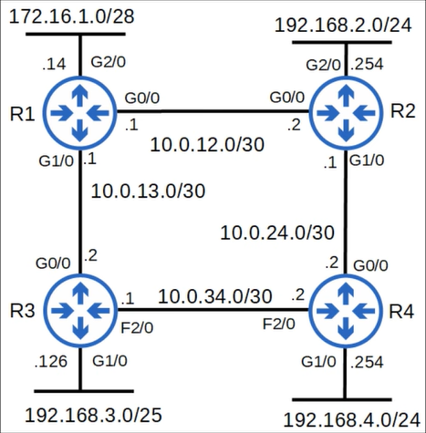

Primeiro, vamos ver o que abordaremos neste arquivo. 

- Começando pelos tipos de rede OSPF. Eles se referem aos diferentes tipos de conexão entre roteadores OSPF e como essas conexões influenciam o comportamento do OSPF;
- Em seguida, abordaremos os requisitos de vizinhança e adjacência no OSPF. No arquivo "OSPF_1.md", vimos o processo que os roteadores utilizam para se tornarem vizinhos OSPF; no entanto, não analisamos detalhadamente os requisitos para uma adjacência de vizinhança bem-sucedida;
-  Depois, veremos alguns tipos de LSA (*Link State Advertisement* — Anúncio de Estado de Link). Existem muitos.

## Interfaces Loopback

Antes de entrarmos nesses tópicos, quero dedicar um momento para explicar um pouco sobre as interfaces loopback. Já as mencionei nos arquivos anteriores, mas deixe-me explicá-las com mais detalhes. Uma interface loopback é uma interface virtual no roteador. Você já sabe disso. Ela está sempre no estado *up/up* (a menos que você a desative manualmente). Isso significa que o status de uma interface loopback não depende de uma interface física. Interfaces físicas podem apresentar problemas de hardware e falhar; no entanto, isso não acontece com uma interface loopback, a menos que o próprio roteador falhe.

Assim, ela fornece um endereço IP consistente que pode ser usado para acessar e identificar o roteador. Às vezes, é necessário enviar tráfego diretamente para um roteador.

Digamos que o R1 não tenha uma interface loopback no momento, e o R4 receba um pacote destinado ao R1 no endereço IP 10.0.13.1, que é o endereço da sua interface G1/0. Ele poderia encaminhá-lo para o R1 via sua interface f2/0. E se a interface G1/0 do R1 cair por algum motivo? Se o R4 receber um pacote destinado ao R1 no endereço 10.0.13.1, ele não conseguirá enviar o pacote para o R1.

Que tal se o R1 tiver uma interface loopback, 1.1.1.1, e ela for usada para identificar o R1 em vez do endereço 10.0.13.1? Mesmo que uma interface física falhe, quando o R4 receber um pacote destinado à interface loopback do R1, ele ainda conseguirá enviar o pacote para o R1. Então, é por isso que é uma boa ideia configurar uma interface loopback em um roteador. Ela fornece uma interface com um endereço IP que está sempre ativo e pode ser usada de forma consistente para identificar e alcançar o roteador. Agora, vamos analisar os diferentes tipos de rede OSPF. 

## Tipos de Rede OSPF

O tipo de rede OSPF refere-se ao tipo de conexão entre vizinhos OSPF, e esse tipo influencia a maneira como o OSPF se comporta em alguns aspectos. O tipo de conexão mais comum em redes modernas é o Ethernet, é claro. Existem três tipos principais de rede OSPF. 

- O primeiro é o tipo de rede ***Broadcast***, que é habilitado por padrão em interfaces Ethernet e FDDI. O FDDI é uma tecnologia antiga e você não precisa perder tempo aprendendo sobre ela. O tipo de rede OSPF *broadcast* é utilizado por padrão;
- O próximo é o tipo de rede ***Ponto a Ponto*** (*Point-to-Point*), que é habilitado por padrão em interfaces PPP e HDLC; e
- O último tipo de rede principal é o ***Non-broadcast*** (não broadcast). Ele é habilitado por padrão em interfaces Frame Relay e X.25.

### Tipo de rede Broadcast

Primeiro, o tipo de rede *broadcast*. Como acabei de mencionar, esse tipo de rede é habilitado em interfaces Ethernet e FDDI por padrão.

Nos arquivos anteriores, todas as conexões OSPF que analisamos utilizaram o tipo de rede *Broadcast*, pois são todas conexões Ethernet. No diagrama de rede acima, todas são conexões Ethernet; lembre-se de que "G" significa "Gigabit Ethernet", e, portanto, essas conexões entre os roteadores utilizam o tipo de rede *Broadcast*. Agora, vamos abordar algumas características do tipo de rede *Broadcast*. 

Primeiro, os roteadores descobrem vizinhos dinamicamente enviando e escutando mensagens "Hello" do OSPF, utilizando o endereço multicast 224.0.0.5. Você já sabe disso pelo arquivo passado, quando mostrei como os roteadores OSPF se tornam vizinhos. No entanto, nem todos os tipos de rede descobrem vizinhos dinamicamente dessa forma. Não abordaremos esse tipo de rede aqui, mas, no caso do tipo de rede "Non-broadcast" (não broadcast), é necessário configurar os vizinhos manualmente.

Certo, próximo ponto. Um DR, ou roteador designado, e um BDR (Backup Designated Router) deve ser eleito em cada sub-rede. No entanto, em casos como a interface G1/0 dos roteadores R1, R3, R4 e R5, onde não há vizinhos OSPF, existe apenas um DR, sem BDR. Roteadores que não são o DR ou o BDR da sub-rede tornam-se "DROther". Então, vamos analisar a rede acima. Cada sub-rede precisa de um DR. Nas sub-redes da interface G1/0 dos roteadores R1, R3, R4 e R5 é simples: não há vizinhos OSPF, então cada roteador se torna o DR da sub-rede. 

E quanto à sub-rede 192.168.1.0/30 entre R1 e R2? Mais adiante, mostrarei como o DR é eleito, mas vamos supor que R2 seja o DR. 

Assim, R1 torna-se o BDR do segmento. E quanto à sub-rede 192.168.2.0/29 à qual R2, R3, R4 e R5 se conectam? Por exemplo, R5 poderia ser o DR, R4 o BDR, e então R2 e R3 tornam-se DROthers. Você provavelmente está se perguntando como essas eleições funcionam e qual é a finalidade do DR e do BDR. Bem, vamos abordar isso.

### Broadcast - Eleição de DR/BDR

Então, é assim que o DR e o BDR são eleitos. Existe uma ordem de prioridade. 

Primeiramente, o roteador com a maior prioridade de interface OSPF na sub-rede torna-se o DR do segmento. No entanto, todas as interfaces têm a mesma prioridade por padrão; portanto, os roteadores comparam seus IDs de roteador OSPF. O roteador com o maior ID de roteador OSPF vence. O "primeiro lugar" na eleição torna-se o DR da sub-rede, e o "segundo lugar" torna-se o BDR. A prioridade padrão da interface OSPF é 1 em todas as interfaces. Então, como eu disse, por padrão, o roteador com o maior ID de roteador se tornará o DR do segmento. Aqui está uma saída parcial do comando SHOW IP OSPF INTERFACE G0/0 no R5. Observe o ID
8:29
do roteador. Configurei uma interface loopback em cada roteador, e o endereço IP da interface
8:35
loopback tornou-se o ID do roteador. O estado é DR, e a prioridade é o padrão 1. O R5 tem
8:43
o maior ID de roteador entre os roteadores conectados à sub-rede 192.168.2.0/29; por isso, ele se tornou
8:50
o DR. Aqui embaixo, o DR (o próprio R5) e o BDR (R4) do segmento estão listados, incluindo
8:58
seus IDs de roteador e o endereço IP da interface na sub-rede.
9:03
E aqui está a mesma saída para o R2. A principal diferença que quero destacar é o estado DROTHER. Agora, e se eu quiser tornar o R2 o DR do segmento em vez do R5? Vamos
9:14
ver como alterar a prioridade da interface OSPF. O comando para alterar a prioridade OSPF de uma interface é IP OSPF PRIORITY, seguido
Broadcast - Prioridade OSPF
9:24
pela prioridade, com uma faixa de 0 a 255. Eu a alterei para o valor máximo, 255, no R2. 9:33
Uma observação: se você definir a prioridade da interface OSPF como 0, o roteador NÃO poderá ser o DR/BDR
9:40
para a sub-rede, em hipótese alguma. Então, vamos verificar se o R2 se tornou o DR do segmento.
9:46
Isso é estranho. O estado do R2 ainda é DROTHER, mesmo tendo a maior prioridade. Por que
9:53
isso acontece? É porque a eleição de DR/BDR não é "preemptiva". Você aprenderá mais
9:59
sobre "preempção" no Dia 29, quando estudarmos Protocolos de Redundância de Primeiro Salto (First-Hop Redundancy Protocols). Mas
10:05
o que "não preemptivo" significa é que, uma vez selecionados, o DR e o BDR mantêm suas
10:11
funções até que o OSPF seja reiniciado, a interface falhe ou seja desativada, etc. Então, embora seja uma má
10:18
ideia fazer isso em uma rede em produção, vou reiniciar o processo OSPF no R5 e vamos ver o que
10:24
acontece. Reiniciei o processo OSPF no R5 e você pode ver que todos os seus vizinhos ficaram inativos (estado DOWN).
10:33
Depois, o R2 e o R4 retornaram ao estado FULL, mas o R3 não. Há uma razão importante
10:39
para isso, que você aprenderá em breve. Em seguida, usei o comando SHOW IP OSPF NEIGHBOR para visualizar
10:45
o estado dos vizinhos do R5. Veja aqui: há dois pontos importantes sobre
10:50
o OSPF que podemos aprender analisando esta seção. Primeiro, o R4 tornou-se o DR, e não o R2. O R2 tornou-se
10:59
o BDR. O que podemos aprender com isso? Podemos aprender que, quando o DR cai, o BDR
11:06
assume o papel de novo DR. Em seguida, é realizada uma eleição para o próximo BDR. O R4, que era o BDR, imediatamente
11:14
assumiu como o novo DR, e então foi feita uma eleição entre os outros roteadores para o próximo BDR. O R2 tem a maior prioridade, 255, então ele se tornou o BDR. Certo, próximo ponto. O R3
11:28
é um DROther e permanece estável no estado 2-way. O R5 também se tornou um DROther, aliás. O que
11:36
podemos aprender com isso? Podemos aprender que os DROthers só avançam para o estado FULL
11:42
com o DR e o BDR da sub-rede. O estado de vizinhança com outros DROthers será 2-way. Isso
11:49
nos dá uma pista sobre a finalidade do DR e do BDR, assunto que abordarei no próximo slide.
11:55
Mas lembre-se destes dois pontos: o BDR se torna o DR se o DR atual for removido,
12:01
mesmo que não tenha a prioridade mais alta. Além disso, os DROthers não formam adjacências completas
12:06
com outros DROthers; eles permanecem no estado 2-way.
12:12
Repetindo: no tipo de rede broadcast, os roteadores só formam uma adjacência OSPF completa
12:17
com o DR e o BDR do segmento. Portanto, os roteadores só trocam...

...trocam LSAs com o DR e
12:24
o BDR. Os DROthers não trocam LSAs entre si. Lembre-se de que, no estado "2-way",
12:32
os roteadores ainda não compartilharam LSAs entre si. Todos os roteadores ainda terão o mesmo LSDB, mas isso reduz a quantidade de LSAs inundando a rede. Vamos ver um exemplo.
12:43
Se 6 roteadores estiverem conectados ao mesmo segmento e todos compartilharem LSAs entre si,
12:49
o resultado será este: uma enorme quantidade de LSAs inundando e congestionando a rede. E se
12:55
usarmos um DR e um BDR? Se os roteadores trocarem LSAs apenas com o DR e o BDR, como você pode ver, o número de LSAs
13:04
inundando a rede é reduzido. Para ser sincero, em roteadores modernos isso provavelmente
13:09
não é um grande problema na maioria dos casos, mas ainda assim ajuda a reduzir o tráfego de rede desnecessário.
13:15
Aliás, quando os roteadores precisam enviar mensagens para o DR e o BDR, eles usam o endereço multicast
13:20
224.0.0.6. Isso é diferente do endereço multicast OSPF "todos os roteadores" (all routers), que é 224.0.0.5.
13:29
Aqui está uma rápida revisão do processo de vizinhança do OSPF. Lembra que eu disse que esses primeiros
13:36
passos envolvem tornar-se vizinho? Então, quando os roteadores chegam a esse ponto do processo, eles
13:41
já são vizinhos OSPF. As conexões entre dois DROthers param nesse ponto. Os roteadores
13:47
só prosseguirão para trocar LSAs e formar uma adjacência OSPF completa com o DR e o BDR. 13:54
Então, resumindo, isso significa que o DR e o BDR estabelecem uma adjacência completa com TODOS os roteadores
14:00
na sub-rede, incluindo os DROthers. E os DROthers estabelecerão uma adjacência completa apenas com
14:06
o DR/BDR. Eu mostrei esse comando, `SHOW IP OSPF INTERFACE BRIEF`, anteriormente. Aqui, executei-o no R3, que
14:15
é um DROther. Observe a contagem de vizinhos na interface G0/0 dele. "F" indica o número
14:23
de adjacências completas, e "C" indica a contagem total de vizinhos. Portanto, o R3 tem duas adjacências completas,
14:31
com o R2 e o R4. Mas ele tem um total de três vizinhos: R2, R4 e R5.
14:39
Para mais detalhes, aqui está o comando `SHOW IP OSPF INTERFACE G0/0` no R3. Ele fornece a mesma informação
14:46
aqui: "Neighbor Count is 3" (Contagem de vizinhos é 3); esse é o número total de vizinhos OSPF do R3. "Adjacent
14:52
neighbor count is 2" (Contagem de vizinhos adjacentes é 2); esses são os vizinhos com os quais o R3 estabeleceu uma adjacência completa. E abaixo
14:58
disso, seus dois vizinhos adjacentes estão listados: R2, o BDR, e R4, o DR. Certo, isso
15:06
é suficiente por enquanto para o tipo de rede Broadcast; vamos seguir em frente. Agora, vamos analisar o tipo de rede "ponto a ponto". Observe que alterei a conexão
Tipo de rede ponto a ponto
15:15
entre o R1 e o R2 para uma conexão "serial". Farei uma breve apresentação sobre conexões seriais
15:22
no próximo slide, mas, antes, deixe-me apresentar os conceitos básicos do tipo de conexão ponto a ponto. Esse tipo de rede é habilitado em interfaces seriais que utilizam encapsulamento
15:34
PPP ou HDLC por padrão. Tanto o PPP quanto o HDLC são encapsulamentos de Camada 2, semelhantes ao Ethernet,
15:41
exceto pelo fato de serem usados ​​em conexões seriais. Assim como no tipo de rede Broadcast, os roteadores
15:47
descobrem vizinhos dinamicamente enviando e escutando mensagens Hello do OSPF, utilizando o endereço multicast
15:53
224.0.0.5. No entanto, há uma diferença: não são eleitos DR nem BDR. Por que isso acontece?
16:02
Como o nome do tipo de rede sugere, esses encapsulamentos são usados ​​para conexões "ponto a ponto" entre dois roteadores. Portanto, não faz sentido eleger um DR e um BDR. Os dois roteadores
16:14
estabelecerão uma adjacência completa (*Full adjacency*) entre si, sem a necessidade de eleger um DR e um BDR.
Interfaces Seriais
16:19
Certo, deixe-me fazer uma breve apresentação sobre conexões seriais. Digo "breve" porque
16:25
as conexões seriais são uma tecnologia antiga que já não é muito comum. Elas ainda existem,
16:31
mas o Ethernet é muito mais predominante. Na verdade, as conexões seriais foram removidas dos tópicos do exame, exceto pelo tipo de rede OSPF "ponto a ponto". Portanto, embora você não vá ser
16:42
avaliado diretamente sobre o conhecimento de interfaces seriais, é importante ter uma noção básica sobre elas.
16:48
Esta foto mostra algumas interfaces e cabos seriais. Observe que tanto as portas quanto os cabos são diferentes dos cabos Ethernet.
16:57
Para explicar as conexões seriais, vou mostrar como configuro a interface S2/0 do roteador R1.
17:03
Você não precisa de um conhecimento profundo sobre esse assunto, mas deve, pelo menos, conhecer os conceitos básicos que apresento aqui. Primeiramente, um lado de uma conexão serial funciona como DCE, que significa *Data Communications*
17:14
*Equipment* (Equipamento de Comunicação de Dados). O outro lado funciona como DTE, que significa *Data Terminal Equipment*
17:20
(Equipamento Terminal de Dados). Por que isso é importante? Bem, em conexões seriais, o lado DCE precisa especificar a taxa de clock,
17:29
ou seja, a velocidade da conexão. Portanto, neste caso, o R1 está conectado à extremidade DCE do cabo
17:35
e, por isso, precisa informar ao R2 em qual velocidade a conexão irá operar. O comando
17:40
é `clock rate`, e você pode ver alguns valores padrão que podem ser utilizados. Todos eles são expressos em bits por segundo, aliás. Configurei uma taxa de clock de 64.000 bits por
17:51
segundo — ou seja, 64 kilobits por segundo — e adicionei um endereço IP...

...e usei o comando `no shutdown`. Aqui está
17:58
um ponto importante. Interfaces Ethernet usam o comando `speed` para configurar a
18:04
velocidade de operação da interface. Interfaces seriais usam o comando `clock rate`. Vamos continuar. Verifiquei a interface com `show interface s2/0`. Observe que o
18:17
encapsulamento é HDLC. Em roteadores Cisco, o encapsulamento padrão em uma interface serial
18:24
é HDLC. Na verdade, é a versão da própria Cisco chamada "cHDLC" (Cisco HDLC), mas ela aparece
18:32
apenas como "HDLC" na CLI. Mais uma vez, trata-se de um encapsulamento de Camada 2, assim como o Ethernet,
18:39
exceto pelo fato de ser usado em conexões seriais. Aqui está a estrutura de um quadro HDLC, extraída
18:45
da Wikipedia. Você não precisa decorar isso, mas pause o vídeo se quiser dar uma olhada. Um detalhe importante é que não existe campo para endereço MAC. Portanto, endereços MAC, na verdade,
18:55
não são utilizados. Mencionei também o encapsulamento PPP; vamos ver como configurar o roteador
19:01
para usar esse encapsulamento. Basta usar o comando `encapsulation ppp` na interface.
19:10
Observe que, se você alterar o encapsulamento, ele deve ser compatível em ambas as extremidades; caso contrário, a interface ficará inativa (*down*). Se utilizarem encapsulamentos diferentes, é como se estivessem falando dois
19:19
idiomas distintos: não conseguirão se comunicar. Executei o comando `show interface s2/0` novamente e você pode
19:26
ver que o encapsulamento mudou para PPP. Fiz o mesmo no R2, aliás, então a interface
19:32
está ativa (*up*). Aqui está a configuração que realizei no R1. O comando `SERIAL RESTART-DELAY 0` já estava lá por
19:41
padrão, então configurei apenas a *clock rate* (taxa de clock), o encapsulamento e o endereço IP. E aqui está
19:47
no R2, sem o comando `CLOCK RATE`, pois ele é a extremidade DTE.
19:53
Agora você deve estar se perguntando: como saber qual lado é DCE e qual é DTE? Bem, para mostrar isso, tive que recriar essa conexão no Packet Tracer. O GNS3, que uso para fazer
20:05
estas aulas, não lida bem com aspectos físicos — da Camada 1 — como esse; por isso, ambos os lados aparecem como DCE. De qualquer forma, o comando para verificar isso é `SHOW CONTROLLERS`, seguido pelo ID
20:17
da interface. Como você pode ver, o R1 é o lado DCE e possui a *clock rate* de 64.000 bits que configurei.
20:26
Usei o mesmo comando no R2; você pode ver que ele é o lado DTE e detectou
20:31
os clocks de Tx (transmissão) e Rx (recepção) vindos do R1. Então, essa é uma visão geral bem básica sobre conexões seriais. Aqui está um resumo do que você
Resumo de Interfaces Seriais
20:42
precisa saber. O encapsulamento padrão em uma interface serial é o HDLC. Você pode configurá-las
20:49
para usar encapsulamento PPP com este comando: `ENCAPSULATION PPP`. Se você alterar
20:56
o encapsulamento de um lado, lembre-se de alterá-lo também no outro! Um lado da
21:01
conexão é DCE e o outro é DTE. Você pode identificar qual lado é DCE e qual é
21:08
DTE com este comando: `SHOW CONTROLLERS`, seguido pelo ID da interface. Por fim, lembre-se de
21:15
configurar a taxa de clock — a velocidade da conexão — no lado DCE com este comando:
21:20
CLOCK RATE, seguido pela taxa de clock em bits por segundo. Vamos voltar ao tipo de rede OSPF ponto a ponto. Aqui está a saída do comando SHOW
Ponto a ponto (cont.)
21:30
IP OSPF NEIGHBOR no R2. Observe que o R2 tem uma adjacência completa com o R1, mas, em vez de DR,
21:38
BDR ou DROTHER, é exibido um traço. Isso ocorre porque o tipo de rede ponto a ponto
21:43
não utiliza DRs nem BDRs, como mencionei anteriormente. Um último ponto sobre este tópico: você pode configurar manualmente o tipo de rede utilizado por uma interface.
Configurar manualmente o tipo de rede OSPF
21:53
O comando é IP OSPF NETWORK, seguido pelo tipo de rede. Você talvez note mais um
22:00
tipo que não mencionei: o tipo de rede "ponto a multiponto". Ele é
22:05
mais um "subtipo". Você não precisa aprender sobre ele para o CCNA, mas sinta-se à vontade para pesquisar no Google se tiver curiosidade. Então, por que você alteraria o tipo de rede OSPF?
22:15
Por exemplo, se dois roteadores estiverem conectados diretamente por um link Ethernet, como no
22:20
diagrama abaixo, não há necessidade de DR/BDR. Você pode configurar o tipo de rede ponto a ponto
22:26
nesse caso, embora não seja obrigatório. Observe que nem todos os tipos de rede funcionam em
22:31
todos os tipos de link. Por exemplo, um link serial não pode utilizar o tipo de rede broadcast. Isso
22:37
acontece porque links seriais não suportam quadros de broadcast de Camada 2, o que é necessário para o tipo de rede broadcast.
22:43
Certo, aqui está uma tabela para uma revisão rápida. Uma coisa que ainda não mencionei neste vídeo
Tabela: Broadcast vs. Ponto a Ponto
22:50
é que redes ponto a ponto utilizam os mesmos temporizadores padrão que as redes broadcast. O
22:56
temporizador Hello padrão é de 10 segundos e o temporizador Dead padrão é de 40 segundos. Você não
23:01
precisa aprender esse tipo de rede, mas, a título de informação, o tipo de rede não broadcast utiliza um temporizador Hello padrão de 30 segundos e um temporizador Dead de 120 segundos. Certo, vamos
23:12
seguir em frente. Agora, vamos analisar alguns requisitos para o estabelecimento de relações de vizinhança OSPF. Normalmente, roteadores
Requisitos de Vizinhança OSPF

requisitos
23:20
...se tornarão vizinhos OSPF sem problemas, mas vou apresentar alguns dos problemas que podem ocorrer. Já mencionei alguns deles em vídeos anteriores, mas vamos recapitular.
23:30
Primeiro requisito: o número da área deve coincidir para que dois roteadores se tornem vizinhos OSPF.
23:36
Usaremos esta pequena topologia com dois roteadores para demonstrar. Aqui está a configuração OSPF do R1.
23:43
O OSPF está habilitado na interface G0/0 na área 0. No entanto, a interface G0/0 do R2 está na área 1. Quando executo o comando SHOW
23:52
IP OSPF NEIGHBOR em ambos os dispositivos, eles não apresentam vizinhos OSPF. Vamos corrigir o problema.
23:59
Alterei o comando *network* no R2 para usar a área 0. Como você pode ver, eles conseguiram
24:04
se tornar vizinhos OSPF. Então, essa é a primeira regra. Para que dois roteadores se tornem vizinhos OSPF, eles devem estar
24:12
na mesma área. Mas já abordamos isso antes. Próxima regra. As interfaces devem estar
24:18
na mesma sub-rede para se tornarem vizinhos OSPF. Também já abordamos isso antes, mas deixe-me
24:24
demonstrar. Observe que as interfaces G0/0 do R1 e do R2 agora estão em sub-redes diferentes. Ativei
24:33
o OSPF em ambas as interfaces. Mas, ao verificar os vizinhos OSPF, eles não aparecem.
24:41
Configurei novamente a interface do R2 na mesma sub-rede que a do R1 e também me certifiquei de editar o comando *network* para que o OSPF fosse ativado novamente na G0/0. Agora, R1 e R2
24:52
são vizinhos OSPF novamente. A seguir, aqui está um ponto que ainda não abordamos. O processo OSPF não deve estar desativado (shutdown).
25:01
Na verdade, você pode desativar ("shutdown") o processo OSPF no roteador, assim como faria com uma interface. Isso interrompe
25:06
a operação do OSPF, sem remover as configurações do OSPF. Vamos ver como isso funciona.
25:12
Veja como fazer. A partir do modo de configuração do OSPF no R2, usei o comando SHUTDOWN. Então,
25:20
uma mensagem é exibida indicando que o vizinho R1 passou de FULL para DOWN, e
25:25
nenhum vizinho aparece no comando SHOW IP OSPF NEIGHBOR. Em seguida, reativo o OSPF com o comando NO
25:32
SHUTDOWN. Uma mensagem indica que o vizinho está ativo novamente, e é possível vê-lo no comando SHOW IP OSPF NEIGHBOR.
25:39
Isso não será um problema, a menos que você desative manualmente o processo OSPF; portanto, geralmente não é uma questão crítica. O próximo requisito é que os Router IDs do OSPF sejam únicos.
25:50
Vamos ver como isso funciona. Eu não configurei os Router IDs de R1 e R2 e também não
25:56
configurei nenhuma interface loopback; assim, cada roteador selecionou seu endereço IP da interface G0/0 como
26:01
seu Router ID: 192.168.1.1 para o R1 e 192.168.1.2 para o R2. Então, configurei 192.168.1.1 como o Router ID
26:13
do R2, o mesmo do R1. Como mostrei anteriormente, é necessário reiniciar o roteador
26:18
ou usar o comando CLEAR IP OSPF PROCESS para que o novo Router ID entre em vigor. Então, usei o comando CLEAR IP OSPF
26:27
PROCESS. Imediatamente, a adjacência com o vizinho cai, pois limpei o processo OSPF. Mas então,
26:32
em vez de o vizinho voltar a ficar ativo, esta mensagem é exibida: "OSPF detectou um router-id duplicado
26:37
192.168.1.1 vindo de 192.168.1.1 na interface GigabitEthernet0/0", e então o
26:46
vizinho permanece inativo. Então, vamos corrigir isso. Removi o router ID configurado manualmente
26:52
com o comando `no router-id`. Observe que não é necessário especificar o router ID ao remover
26:58
o comando. `no router-id` tem o mesmo efeito que `no router-id 192.168.1.1`; ambos removem o
27:06
comando. Desta vez, sem precisar reiniciar o processo OSPF, o router ID do R2 retorna
27:12
para 192.168.1.2 e o vizinho volta a ficar ativo. Por que não precisei usar o comando `clear ip ospf process`?
27:21
Na verdade, eu não esperava isso, mas percebi que foi porque o R2 não tinha outros vizinhos OSPF
27:26
naquele momento; assim, o roteador estava livre para alterar o router ID do R2 sem se preocupar com impactos em outros vizinhos.
27:33
Portanto, fique atento a router IDs duplicados. Próximo requisito: os temporizadores Hello e Dead devem
27:40
coincidir. Em ambos os tipos de rede que analisamos hoje — Broadcast e Ponto a Ponto —, os
27:46
valores padrão são 10 segundos e 40 segundos. Mas você pode alterar essas configurações manualmente.
27:52
Os temporizadores Hello e Dead são configurados diretamente na interface. Veja como configurar o temporizador Hello: `ip ospf hello-interval`, seguido pelo intervalo em segundos. Eu defini para 5.
28:05
Depois, o temporizador Dead. `ip ospf dead-interval`, e defini para 20. Como você pode ver, o vizinho
28:12
fica inativo. Note que alterei ambos os valores, o temporizador Hello e o Dead, mas mesmo
28:18
se você alterar apenas um, o vizinho ainda ficará inativo. Então, vamos corrigir isso. Usei `no ip`
28:24
`ospf hello-interval` e `no ip ospf dead-interval` para retornar os temporizadores aos seus valores padrão.
28:32
Observe o método que usei para retorná-los aos padrões; é o mesmo usado para o Router ID. Não precisei especificar `no ip ospf hello-interval 5` ou `dead-interval`
28:42
`20` para remover os comandos. De qualquer forma, agora que os temporizadores Hello e Dead coincidem novamente, o
28:48
vizinho está ativo novamente. Portanto, lembre-se de verificar os intervalos Hello e Dead se estiver tendo problemas com adjacências OSPF.
28:56
A seguir, as configurações de autenticação devem coincidir. O que isso significa? Bem, você pode configurar

29:02
uma senha OSPF; assim, o roteador só estabelecerá adjacência com roteadores que possuam uma senha OSPF correspondente. Vamos dar uma olhada.
29:11
A senha OSPF também é configurada diretamente na interface. Usei o comando `ip ospf authentication-key`,
29:18
seguido pela senha 'jeremy'. Observe que isso não habilita, de fato, a autenticação OSPF
29:24
na interface. A senha está configurada, mas precisamos habilitar a autenticação OSPF.
29:29
Então, usei o comando `ip ospf authentication` para habilitá-la na interface. Em seguida, a adjacência cai,
29:36
porque o R1 não está fornecendo ao R2 uma senha correspondente. Na verdade, ainda não configurei
29:42
a autenticação OSPF no R1, então ele não está fornecendo nenhuma senha OSPF ao R2. Portanto, para
29:49
resolver isso, poderíamos configurar as mesmas definições de autenticação no R1 ou remover a autenticação do R2. Eu as removi do R2 e, agora, a adjacência foi restabelecida.
30:01
Certo, há mais duas coisas a mencionar. O ponto número 7 é que as configurações de IP MTU nas
30:07
interfaces devem ser compatíveis. O IP MTU é o tamanho máximo de um pacote IP que será enviado
30:14
pela interface. O padrão geralmente é 1500 bytes, mas pode ser configurado. Observe que
30:21
este requisito e o próximo são especiais: mesmo que as configurações não coincidam, os roteadores podem estabelecer adjacência OSPF, mas o OSPF não funcionará corretamente. Vamos ver.
30:32
Você pode configurar o IP MTU de uma interface com este comando: `ip mtu`, seguido pelo
30:39
valor do MTU em bytes. Alterei para 1400 na interface G0/0 do R2, então não coincide com o valor padrão
30:46
de 1500 na interface G0/0 do R1. Esperei um minuto e verifiquei a tabela de vizinhos; o R1 e o R2
30:53
na verdade continuaram sendo vizinhos. Então, reiniciei o processo OSPF no R2. Esperei um minuto,
31:00
mas não surgiu nenhuma mensagem indicando que os vizinhos haviam atingido o estado FULL. Verifiquei a tabela de vizinhos novamente e ela estava travada no estado EXSTART. Após alguns minutos de espera,
31:11
mais algumas mensagens foram exibidas — e elas continuavam se repetindo, aliás. Portanto, fica claro que o OSPF não está funcionando corretamente. Usei o comando NO IP MTU para retornar o MTU ao valor padrão
31:22
e, finalmente, o R1 e o R2 atingiram o estado FULL. Então, se seus vizinhos OSPF estiverem com dificuldade para atingir o estado FULL, não deixe de verificar
31:32
as configurações de MTU. Certo, o último ponto. O tipo de rede OSPF deve coincidir. Vamos ver o que
31:38
acontece se não coincidirem. Para demonstrar esse problema, configurei uma interface loopback no R2 com um endereço IP
31:45
e a anunciei para o R1. Em seguida, alterei o tipo de rede na interface G0/0 do R2 para ponto a ponto.
31:51
A interface G0/0 do R1 continua usando o tipo de rede padrão *broadcast*. Uma mensagem é exibida informando
31:59
que a conexão com o vizinho caiu, mas logo em seguida ela voltou para o estado FULL. O R1 chega a exibir o estado
32:04
FULL no comando SHOW IP OSPF NEIGHBOR. Então, qual é o problema? Vamos ver no R1.
32:10
Aqui está o R1. O R2 aparece na tabela de vizinhos com o estado FULL, então você pode pensar que o OSPF
32:17
está funcionando corretamente. Mas observe a tabela de roteamento. O endereço de loopback do R2 deveria estar na tabela de roteamento do R1,
32:23
mas não está. É isso que acontece quando os tipos de rede OSPF não
32:29
coincidem. Pode ser difícil diagnosticar o problema porque o estado do vizinho é Full, dando a impressão de que tudo está funcionando bem. Fique atento a isso ao solucionar problemas
32:37
no OSPF. Certo, vou encerrar por aqui. Claro que há mais coisas que poderíamos abordar, mas já forneci
32:44
informações suficientes para o CCNA. Lembre-se desses requisitos. Você não precisa memorizá-los
32:50
como uma lista, mas certifique-se de que, se encontrar esses problemas em um roteador, saiba identificá-los e corrigi-los.
Tipos de LSA do OSPF
32:58
O último tópico do vídeo de hoje são os tipos de LSA. Eles não são mencionados especificamente
33:03
na lista de tópicos do exame, então vou dedicar apenas alguns minutos para dar uma breve visão geral de alguns tipos básicos de LSA. Para isso, peguei a topologia anterior e
33:12
a modifiquei, adicionando um link de Internet no R4. O R4 possui uma rota padrão para a Internet e
33:18
uso o comando DEFAULT-INFORMATION ORIGINATE para fazê-lo anunciar essa rota aos outros roteadores. Então, vamos falar sobre LSAs. Como você já sabe, o LSDB do OSPF é composto por LSAs. Todos os roteadores
33:31
na mesma área OSPF compartilham o mesmo LSDB. Existem 11 tipos de LSA, mas há apenas
33:38
3 que você precisa conhecer para o CCNA. Esses são do tipo 1, o "router LSA". O tipo 2, o
33:46
"network LSA". E o tipo 5, o "AS external LSA". Vamos dar uma breve olhada em cada
33:52
tipo. Primeiro, o tipo 1, o router LSA. Todo roteador que executa o OSPF gera esse tipo de
34:00
LSA. O router LSA identifica o roteador usando seu Router ID. O router LSA também lista
34:07
as redes conectadas às interfaces do roteador que estão com o OSPF ativado. Em seguida, o tipo 2, ou seja, o network
34:14
LSA. Ele é gerado pelo DR de cada rede de "acesso múltiplo" (multi-access). Um exemplo de rede de acesso múltiplo
34:22
é uma rede Ethernet que utiliza o tipo de rede broadcast. Esse tipo de LSA lista os roteadores
34:28
que estão conectados à rede de acesso múltiplo. O último tipo de hoje,

o tipo 5, também conhecido como AS-external
34:35
LSA. Esse tipo de LSA é gerado por ASBRs para descrever rotas para destinos fora
34:42
do sistema autônomo, ou seja, do domínio OSPF. Vamos dar uma olhada na LSDB do R1, usando o comando SHOW IP OSPF DATABASE. Observe que
34:53
não importa realmente em qual roteador eu executo o comando; a saída será a mesma, pois todos os roteadores da área possuem a mesma LSDB. Note que cada roteador gerou
35:03
um LSA de Roteador (Tipo 1) que o identifica. Essa visualização não mostra o conteúdo de cada LSA,
35:10
mas cada um desses LSAs de roteador contém informações sobre as redes às quais o roteador está conectado. Observe que existe apenas um LSA de Rede (Tipo 2), gerado pelo R4 para a sub-rede
35:23
192.168.2.0/29. Embora R1, R3 e R5 sejam DRs em suas interfaces G1/0, nenhum outro roteador
35:31
está conectado a essas interfaces; portanto, nenhum LSA Tipo 2 é gerado. Finalmente, note que um
35:37
LSA AS-External (Tipo 5) é gerado pelo R4. Ele está compartilhando sua rota padrão para a Internet
35:44
com os outros roteadores. Certo, isso é tudo sobre LSAs. Mais uma vez, eles não estão explicitamente
35:49
listados nos tópicos do exame, mas eu queria apenas dar uma introdução básica a alguns dos tipos fundamentais de LSA que você encontrará.
O que abordamos
35:57
Eu disse que abordaríamos o OSPF com muito mais detalhes do que o RIP e o EIGRP e, ao longo
36:04
destes últimos três dias, foi exatamente isso que fizemos. O OSPF é um tópico importante no exame, portanto, certifique-se
36:10
de compreender o conteúdo destes vídeos. Assista a eles várias vezes, se necessário, e sinta-se à vontade para fazer perguntas na seção de comentários. Agora, vamos recapitular o que
36:19
abordamos no vídeo de hoje e passar para o quiz. Primeiro, tratamos dos tipos de rede OSPF,
36:25
concentrando-nos nos dois que você precisa conhecer para o CCNA: Broadcast e Ponto a Ponto.
36:32
Como as conexões Ethernet predominam nas redes modernas, na maioria das vezes você utilizará o tipo de rede Broadcast. Mas familiarize-se também com o tipo Ponto a Ponto
36:41
e com os conceitos básicos de interfaces seriais que apresentei neste vídeo. Em seguida, apresentei
36:46
alguns requisitos para vizinhos e adjacências OSPF. Você não precisa memorizar a lista completa,
36:52
mas certifique-se de conseguir identificar todos eles e solucionar eventuais problemas. Por fim, apresentei brevemente
36:58
os três tipos mais básicos de LSA do OSPF: Tipo 1, o Router LSA; Tipo 2, o Network LSA.
