# Introdução ao RIP

Então, vamos direto ao RIP. Já falei sobre alguns desses pontos no arquivo "Dynamic Routing", mas vamos recapitular.

RIP significa *Routing Information Protocol* (Protocolo de Informações de Roteamento); é um protocolo padrão da indústria, não proprietário da Cisco. É um protocolo de gateway interno do tipo vetor de distância (*distance-vector*), portanto, utiliza a lógica de "roteamento por boatos" (*routing-by-rumour*) para aprender e compartilhar rotas. 

O RIP usa a contagem de saltos (*hop count*) como métrica; cada roteador no caminho até o destino conta como um "salto" (*hop*), e a largura de banda é irrelevante. Uma conexão de 10 gigabits conta como um salto, e uma conexão de 10 megabits também conta como um salto. E algo que não mencionei no arquivo "Dynamic Routing": a contagem máxima de saltos é 15.

Qualquer valor acima disso é considerado inalcançável, e o RIP não inserirá a rota na tabela de roteamento. Portanto, fica claro que o RIP não pode ser usado em redes muito grandes. Na verdade, o RIP quase nunca é usado em redes reais, mas pode ser utilizado em redes pequenas e também em ambientes de laboratório, como um IGP simples, rápido e fácil de configurar.

O RIP possui três versões: RIP versão 1 e versão 2, que são usadas para IPv4. Há também o RIPng (RIP Next Generation), usado para IPv6, mas que não abordaremos neste arquivo. O RIP utiliza dois tipos de mensagem para aprender e compartilhar informações de roteamento. 

A primeira é a mensagem de solicitação (*Request*), que pede aos roteadores vizinhos habilitados para RIP que enviem suas tabelas de roteamento. A segunda é a mensagem de resposta (*Response*), usada para enviar a tabela de roteamento do roteador local aos roteadores vizinhos. Por padrão, roteadores habilitados para RIP compartilham suas tabelas de roteamento a cada 30 segundos. Isso pode causar problemas em redes com muitos roteadores, pois essas atualizações regulares podem congestionar a rede.

A seguir, vamos comparar o RIPv1 e o RIPv2.

## RIPv1 e RIPv2

O RIPv1 é um protocolo muito antigo. Basicamente, se você for usar o RIP, não utilize a versão 1. O RIPv1 anuncia apenas endereços com classes fixas (*classful*), ou seja, Classe A, Classe B e Classe C. Eu ensinei vocês sobre endereçamento com classes fixas (no arquivo de subnetting) porque é importante entender o conceito, mas, em redes modernas, ele não é mais utilizado.

Como a versão 1 suporta apenas endereços com classes fixas, ela não oferece suporte a recursos como VLSM e CIDR. Na verdade, quando o RIPv1 anuncia uma rede a um vizinho, ele nem sequer inclui a informação da máscara de sub-rede no anúncio. Se a rede anunciada estiver na faixa da Classe A, assume-se que ela seja /8. Se estiver na faixa da classe B, assume-se que seja /16. Se estiver na faixa da classe C, assume-se que seja /24.

Aqui estão alguns exemplos de sub-redes e como o RIPv1 as forçaria a se tornarem redes baseadas em classes (*classful*).

- 10.1.1.0/24 se tornará 10.0.0.0, uma rede de classe A.
- 172.16.192.0/18 se tornará 172.16.0.0, uma rede de classe B.
- 192.168.1.4/30 se tornará 192.168.1.0, uma rede de classe C.

Isso simplesmente não é aceitável em redes modernas, onde as classes de endereços IPv4 não são mais utilizadas e foram substituídas por CIDR e VLSM. Precisamos da capacidade de usar sub-redes, e não apenas redes baseadas em classes.

Certo, mais uma coisa sobre o RIPv1: suas mensagens são enviadas por *broadcast* para o endereço IP 255.255.255.255, portanto, todos os roteadores no segmento local receberão as mensagens. A seguir, vamos analisar o RIP versão 2, que traz melhorias em relação à versão 1.

Primeiramente, ele suporta VLSM e CIDR; não precisa ser baseado em classes como a versão 1. Para oferecer esse suporte, ele inclui informações de máscara de sub-rede em seus anúncios de rota. Uma rede /30 será anunciada como /30, por exemplo. Outra diferença é que as mensagens do RIPv2 não são enviadas por *broadcast*, mas sim por *multicast* para o endereço 224.0.0.9. Esse endereço está na faixa da classe D, que é reservada para endereços *multicast*. O que exatamente é *multicast*? 

Aqui vai uma comparação rápida. Mensagens de broadcast são entregues a todos os dispositivos da rede local, como você já viu muitas vezes nestes estudos. Já as mensagens de multicast são recebidas apenas pelos dispositivos que ingressaram naquele grupo multicast específico. 

Certo, agora vou apresentar a vocês a configuração básica do RIP.

## Configuração do RIP

Primeiro, a configuração do RIP é muito simples, servindo como uma boa introdução à configuração de roteamento dinâmico. Segundo, alguns mecanismos são semelhantes aos da configuração do OSPF, o que facilitará o aprendizado quando abordarmos o OSPF mais a fundo posteriormente. Então, assumindo que todos os outros roteadores já foram configurados com RIP, vamos apenas configurar o R1. Aqui está a configuração básica. 

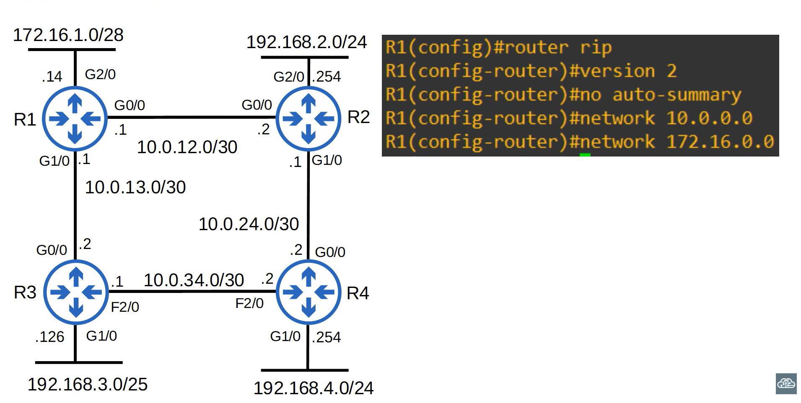

Primeiro, entre no modo de configuração do RIP com o comando `router rip`. Observe que, logo abaixo, o prompt agora exibe 'config-router' em vez de apenas 'config'. Em seguida, configure o roteador para usar a versão 2 do RIP com o comando `version 2`. Isso não é obrigatório, mas você deve sempre usar a versão 2 se for utilizar o RIP. O endereçamento IPv4 baseado em classes (*classful*) é coisa do passado; em redes modernas, precisamos utilizar recursos como VLSM e CIDR.

Depois, use o comando `no auto-summary`. O recurso de sumarização automática (*auto-summary*) vem ativado por padrão e converte automaticamente as redes anunciadas pelo roteador em redes baseadas em classes. Por exemplo, usando a lógica de classes, a rede 172.16.1.0/28 conectada ao R1 é uma rede de classe B, portanto, ela seria anunciada como 172.16.0.0/16. Sempre utilize esses dois comandos ao configurar o RIP: `version 2`, seguido por `no auto-summary`.

A seguir, precisamos usar o comando `network`. Primeiro, utilizei `network 10.0.0.0`. Agora, preciso explicar alguns detalhes sobre isso. O comando em si opera com base em classes (*classful*); ele converterá automaticamente o endereço para o formato de rede de classe padrão. Por exemplo, mesmo que você digite o comando `network  10.0.12.0`, ele será convertido para `10.0.0.0`. O endereço `10.0.12.0` pertence à faixa da Classe A; portanto, assume-se um comprimento de prefixo `/8`. Assim, após os primeiros 8 bits, todos os outros bits serão convertidos para 0. Devido a esse comportamento, não há necessidade de inserir uma máscara de rede. Certo, então qual é o efeito real desse comando?

A interface G0/0 do R1 é `10.0.12.0/30` e sua interface G1/0 é `10.0.13.0/30`, mas eu digitei apenas o comando `network 10.0.0.0`. Vamos examinar exatamente como o comando `network` funciona.

### Comando 'network'

O comando `network` instrui o roteador a procurar interfaces com um endereço IP que esteja dentro da faixa especificada — isto é, a faixa definida no próprio comando `network`. Em seguida, ele ativará o RIP na interface ou nas interfaces que se enquadrarem nessa faixa. Ele estabelecerá adjacências com outros vizinhos conectados que tenham o RIP habilitado e anunciará o prefixo de rede da interface.

Esse prefixo não é necessariamente aquele que você especificou no comando `network`. É assim que os comandos `network` do EIGRP e do OSPF também operam, embora existam algumas diferenças. Então, vou explicar passo a passo aqui; isso facilitará o entendimento do EIGRP e do OSPF mais adiante. Portanto, acabamos de inserir o comando `network 10.0.0.0` no R1. 

Como o comando `network` opera com base em classes (*classful*), assume-se que 10.0.0.0 seja 10.0.0.0/8. O R1 buscará interfaces com um endereço IP que corresponda a 10.0.0.0/8. /8 significa que apenas os primeiros 8 bits precisam coincidir; portanto, o primeiro octeto do endereço IP precisa ser igual. Tanto 10.0.12.1 quanto 10.0.13.1 correspondem a esse critério, pois ambos possuem o mesmo primeiro octeto: 10. Assim, o RIP é ativado nas interfaces G0/0 e G1/0. O R1 então estabelece adjacências com seus vizinhos, R2 e R3.

O R1 enviará e receberá informações de roteamento de e para o R2 e o R3. Aqui está a parte importante: o R1 anuncia 10.0.12.0/30 e 10.0.13.0/30 — os prefixos de rede de suas interfaces G0/0 e G1/0 — para seus vizinhos RIP, R2 e R3. Embora tenhamos usado o comando `network 10.0.0.0`, o R1 não anuncia a rede 10.0.0.0/8. O comando `network` não diz ao roteador quais redes anunciar. Ele indica em quais interfaces o RIP deve ser ativado e, então, o roteador anuncia o prefixo de rede dessas interfaces. Certo, também configuramos o comando `network 172.16.0.0`. Vamos analisar isso também. 

Como o comando de rede opera com base em classes, assume-se que 172.16.0.0 seja 172.16.0.0/16. O R1 buscará quaisquer interfaces com um endereço IP que corresponda a 172.16.0.0/16. O endereço 172.16.1.14 corresponde, portanto, o R1 ativará o RIP na interface G2/0. Desta vez, não há vizinhos RIP conectados à G2/0; logo, nenhuma nova adjacência é formada. No entanto, o R1 anuncia a rede 172.16.1.0/28 (e NÃO a 172.16.0.0/16) para seus vizinhos RIP. 

Mais um ponto importante: embora não haja vizinhos RIP conectados à G2/0, o R1 continuará enviando anúncios RIP pela interface G2/0. Esse é um tráfego desnecessário; portanto, a G2/0 deve ser configurada como uma interface passiva. Vamos ver como fazer isso. 

### Comando `passive-interface`

Utilizei o comando `passive-interface G2/0`.

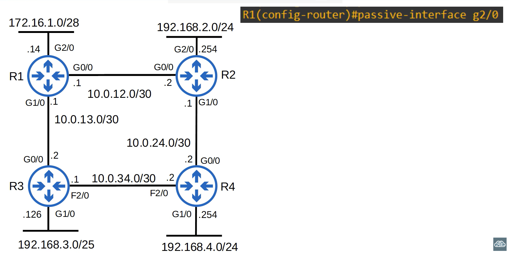

Isso configura a G2/0 como uma interface passiva. Observe que o comando é executado no modo de configuração do RIP, e não diretamente na própria interface. É por isso que você precisa especificar a interface no comando. O comando `passive-interface` instrui o roteador a parar de enviar anúncios RIP através da interface especificada — que, neste caso, é a G2/0. No entanto, o roteador continuará anunciando o prefixo de rede da interface, que é 172.16.1.0/28, para seus vizinhos RIP, R2 e R3. Recomenda-se sempre utilizar esse comando em interfaces que não possuam vizinhos RIP.

Tanto o EIGRP quanto o OSPF possuem a mesma funcionalidade de interface passiva, utilizando o mesmo comando. 

### Anunciar rota padrão via RIP 

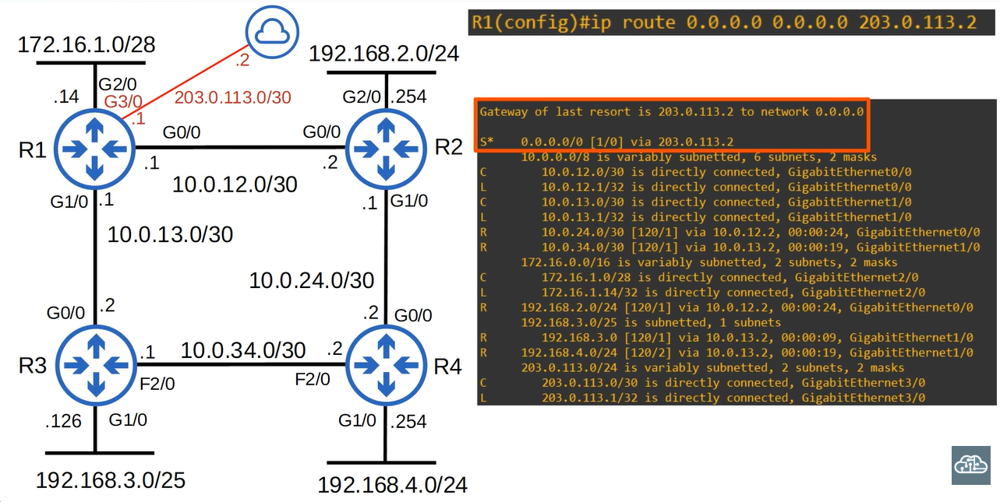

Para demonstrar mais uma função do RIP, adicionei uma conexão com a Internet ao R1, por meio de sua interface G3/0. Em seguida, configurei uma rota padrão apontando para a Internet. Assim, quaisquer pacotes que não correspondam a nenhuma das outras entradas na tabela de roteamento do R1 serão enviados para a Internet. Na imagem, é possível vê-la na tabela de roteamento. 

O gateway de última instância (*gateway of last resort*) é 203.0.113.2 para a rede 0.0.0.0. Logo abaixo, você pode ver a rota estática configurada para 0.0.0.0/0. Agora, quero usar o RIP para informar ao R2, R3 e R4 sobre essa rota padrão, para que eles também possam acessar a Internet. O comando para compartilhar essa rota padrão no RIP é `default-information originate`.

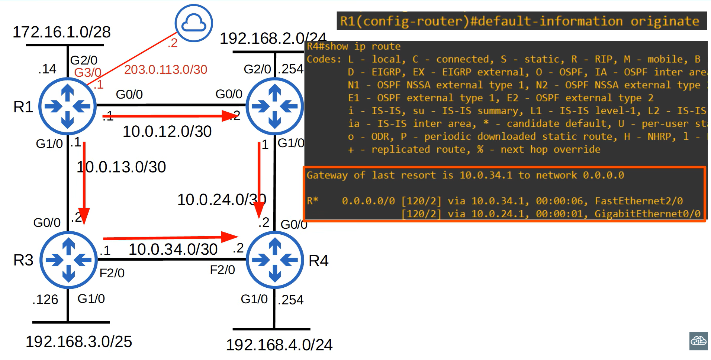

Novamente, o comando é executado no modo de configuração do RIP. Agora que inseri esse comando, o R1 anunciará a rota para o R2 e o R3, e eles a anunciarão para o R4. Vamos verificar a tabela de roteamento do R4. 

Observe que é indicado "Gateway of last resort is 10.0.34.1 to network 0.0.0.0" (Gateway de última instância é 10.0.34.1 para a rede 0.0.0.0); no entanto, abaixo disso, você pode ver duas rotas: uma via F2/0 para o R3 e outra via G0/0 para o R2. Apenas uma é realmente declarada no topo como o gateway de última instância, mas, como ambas as rotas têm a mesma contagem de saltos (*hop-count*), o R4 fará o balanceamento de carga do tráfego entre as duas rotas.

Estou me repetindo, mas o RIP trata todas as conexões da mesma forma, como um único salto; portanto, mesmo que a conexão via R3 seja uma conexão Fast Ethernet mais lenta, o RIP a considera equivalente à conexão Gigabit Ethernet mais rápida via R2. A propósito, o OSPF também possui o mesmo comando `default-information originate` para compartilhar uma rota padrão com vizinhos. Veremos isso novamente quando estudarmos o OSPF.

### 'show ip protocols' (RIP)

Agora, vamos analisar um comando `show` muito útil: o `show ip protocols`. 

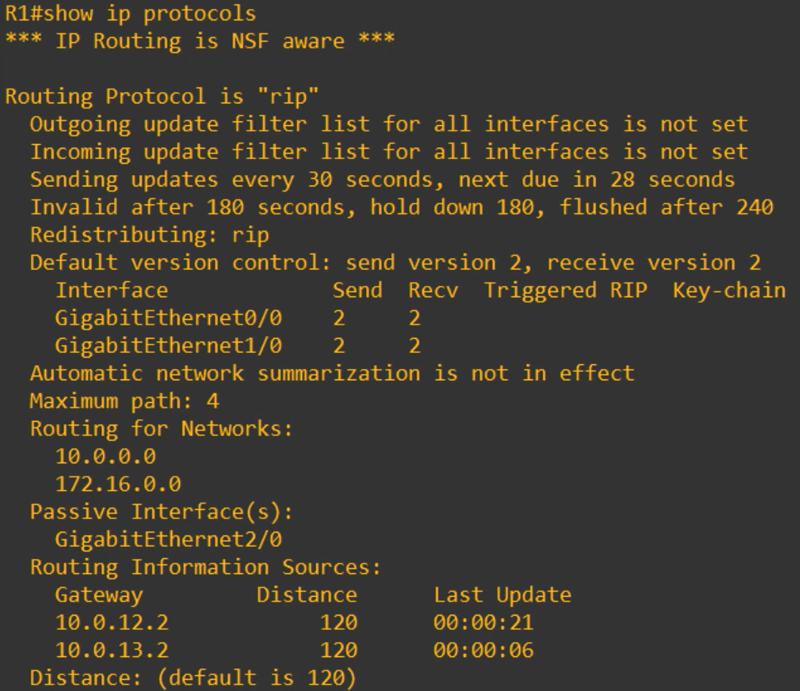

Esse comando pode ser usado com RIP, EIGRP e OSPF para verificar diversas estatísticas. Vamos passar rapidamente por alguns dos pontos que você precisa conhecer. 

Primeiramente, temos a parte 'Routing protocol is "RIP"' esta parte identifica o protocolo em uso — neste caso, o RIP. Mais abaixo, temos alguns temporizadores que o RIP utiliza para operar; não falaremos sobre eles no contexto de RIP ou EIGRP, mas abordaremos o assunto em detalhes quando estudarmos o OSPF.

Em seguida, temos o campo "Default version control", que consta de informações sobre a versão utilizada; note que é a versão 2, conforme configuramos anteriormente. O resumo automático de redes (*automatic network summarization*) não está ativo; isso ocorre porque usamos o comando `no auto-summary` mais cedo.

O número máximo de caminhos é 4; isso se refere ao balanceamento de carga ECMP. Por padrão, o RIP insere até 4 caminhos para o mesmo destino na tabela de roteamento, caso tenham a mesma métrica. No entanto, isso pode ser alterado. O comando é `maximum-paths`, seguido de um número de 1 a 32. Isso é feito no modo de configuração do RIP. Vou definir como 8, por exemplo. A propósito, esse comando é o mesmo para EIGRP e OSPF.

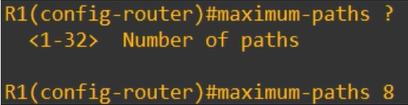

- A seguir, temos a seção que mostra as redes que inserimos com o comando `network`. Mais uma vez, essas não são as redes reais que o RIP está anunciando; o comando `network` apenas identifica em quais interfaces o RIP deve ser ativado.
- Abaixo você pode ver as interfaces passivas listadas — apenas a G2/0, neste caso.
- Em "routing information sources" (fontes de informações de roteamento), você pode ver os vizinhos RIP do R1: 10.0.12.2, que é o R2, e 10.0.13.2, que é o R3.
- Por fim, o campo "distance" indica a distância administrativa do RIP, que atualmente é o padrão de 120. Isso pode ser alterado no modo de configuração do RIP com o comando `distance`, seguido de um número de 1 a 255.

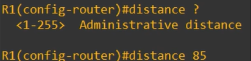

- Por exemplo, se você quiser dar preferência às rotas RIP em relação às rotas EIGRP por algum motivo, poderia definir o valor como 85, como acabei de fazer, para tornar a AD (distância administrativa) do RIP menor que a AD do EIGRP, que é de 90. A propósito, o comando `distance` também é o mesmo para EIGRP e OSPF.

Certo, isso é tudo sobre o RIP. Vamos passar para o EIGRP; você verá que muitas coisas são semelhantes às do RIP.

# Introdução ao EIGRP

EIGRP significa *Enhanced Interior Gateway Routing Protocol*. É uma versão aprimorada do antigo IGRP (Interior Gateway Routing Protocol). O EIGRP era proprietário da Cisco, mas a empresa o disponibilizou abertamente para que outros fabricantes pudessem implementá-lo em seus equipamentos. No entanto, pelo que entendo, a Cisco não abriu o protocolo por completo; partes dele permanecem como propriedade da Cisco, e acredito que poucos fabricantes se deram ao trabalho de implementar o EIGRP. Portanto, na prática, ele ainda é considerado um protocolo exclusivo da Cisco.

É considerado um protocolo de roteamento vetorial de distância "avançado" ou "híbrido". Ele aprimora as operações básicas do RIP, seu equivalente na categoria de protocolos de vetor de distância. Ele reage muito mais rápido que o RIP a mudanças na rede. Não possui o limite de 15 "saltos" (hop count) do RIP, permitindo, assim, o suporte a redes de grande porte.

Ele envia mensagens utilizando o endereço multicast 224.0.0.10. Lembre-se: o RIPv1 envia mensagens via broadcast, enquanto o RIPv2 utiliza multicast para o endereço 224.0.0.9. O EIGRP utiliza multicast para o endereço 224.0.0.10. 

Por fim, uma característica exclusiva do EIGRP é que ele é o único IGP capaz de realizar balanceamento de carga com custos desiguais. Por padrão, ele realiza balanceamento de carga ECMP (Equal-Cost Multi-Path) em 4 caminhos, assim como o RIP, mas é possível configurá-lo para realizar o balanceamento de carga em múltiplos caminhos que não possuem custos iguais. O EIGRP chega a distribuir a carga proporcionalmente à largura de banda de cada caminho. Assim, mais tráfego é enviado pelos caminhos com métrica menor, por serem mais rápidos, e menos tráfego é enviado pelos caminhos com métrica maior, por serem mais lentos. 

O EIGRP é um excelente protocolo, mas, como seu uso é praticamente restrito a dispositivos Cisco, ele não é tão utilizado quanto o OSPF. Certo, vamos analisar as configurações básicas do EIGRP.

## Configuração do EIGRP

Aqui está a mesma rede de antes.

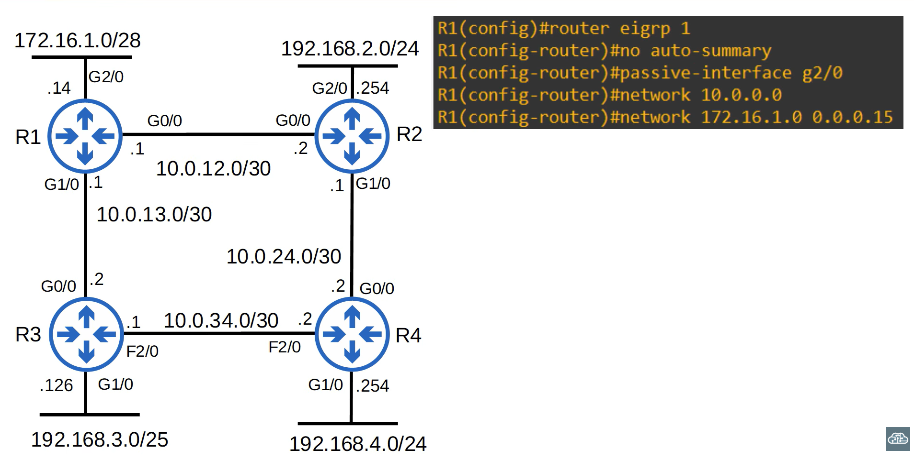

Removi as configurações do RIP, embora seja possível manter o RIP e o EIGRP em execução simultaneamente. Mas isso seria apenas um desperdício de recursos nos roteadores; portanto, geralmente haverá apenas um IGP em execução em um roteador. Então, entre no modo de configuração do EIGRP com este comando: `router eigrp`, seguido pelo número do AS, ou seja, o número do sistema autônomo. Eu usei 1. O número do AS deve coincidir entre os roteadores; caso contrário, eles não formarão uma adjacência nem compartilharão informações de roteamento.

Eu já havia configurado o mesmo número de AS (1) nos roteadores R2, R3 e R4, então precisei configurar o mesmo valor aqui no R1. Em seguida, desativei o *auto-summary* (resumo automático). Ele funciona da mesma forma que no RIP: anuncia redes com base em classes (*classful*) em vez do prefixo de rede real configurado nas interfaces. O *auto-summary* pode vir ativado ou desativado por padrão, dependendo do roteador ou da versão do IOS. Se estiver ativado, desative-o. Na verdade, na versão que estou usando aqui, ele já vem desativado por padrão, mas eu só queria mostrar que o EIGRP também possui o recurso de *auto-summary*, assim como o RIP, e que você deve garantir que ele esteja desativado.

Depois, usei o mesmo comando `passive-interface` que utilizei para o RIP. Em seguida, usei o comando `network 10.0.0.0` para ativar o EIGRP nas interfaces G0/0 e G1/0. Você pode usar uma máscara com o comando `network` do EIGRP; no entanto, ele assumirá um endereço baseado em classe (*classful*) se você não especificar a máscara. Portanto, `network 10.0.0.0` é interpretado como `10.0.0.0/8`. Esse comando `network` funciona como o do RIP. Você não está realmente instruindo o roteador a anunciar a rede `10.0.0.0/8`. Você está instruindo o sistema a ativar o EIGRP em interfaces com um endereço IP que se enquadre na faixa 10.0.0.0/8, ou seja, qualquer endereço IP que comece com 10. Isso inclui a G0/0 e a G1/0; portanto, o EIGRP é ativado em ambas as interfaces.

Se você especificar a máscara, o comando fica assim: `network 172.16.1.0 0.0.0.15` ativa o EIGRP na interface G2/0. Se esta é a primeira vez que você aprende isso, provavelmente está um pouco confuso agora. O que é 0.0.0.15? A máscara de sub-rede para um prefixo /28 não é 255.255.255.240? Sim, é. Mas o EIGRP usa uma "máscara curinga" (*wildcard mask*) em vez de uma máscara de sub-rede comum. Deixe-me explicar exatamente o que isso significa. 

### Máscaras Curinga

Uma máscara curinga é, basicamente, uma máscara de sub-rede "invertida". Todos os bits 1 na máscara de sub-rede tornam-se 0 na máscara curinga equivalente, e todos os bits 0 na máscara de sub-rede tornam-se 1 na máscara curinga equivalente. Vamos dar uma olhada. Aqui está uma máscara de sub-rede em binário: 255.255.255.0 em notação decimal pontuada.

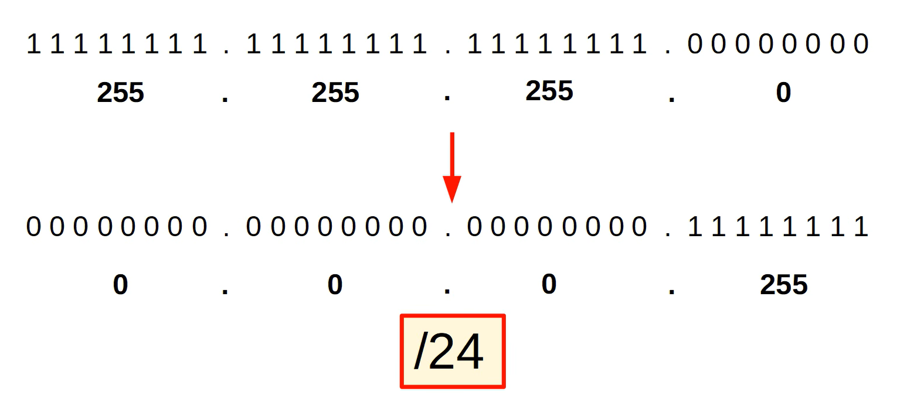

Se você inverter todos os bits, obtém isto: 0.0.0.255 em notação decimal pontuada. Portanto, essa é a máscara curinga equivalente a /24: 0.0.0.255. Observe que todos os bits 1 da máscara de sub-rede viraram 0, e os bits 0 da máscara de sub-rede viraram 1.

Aqui está outro exemplo. 

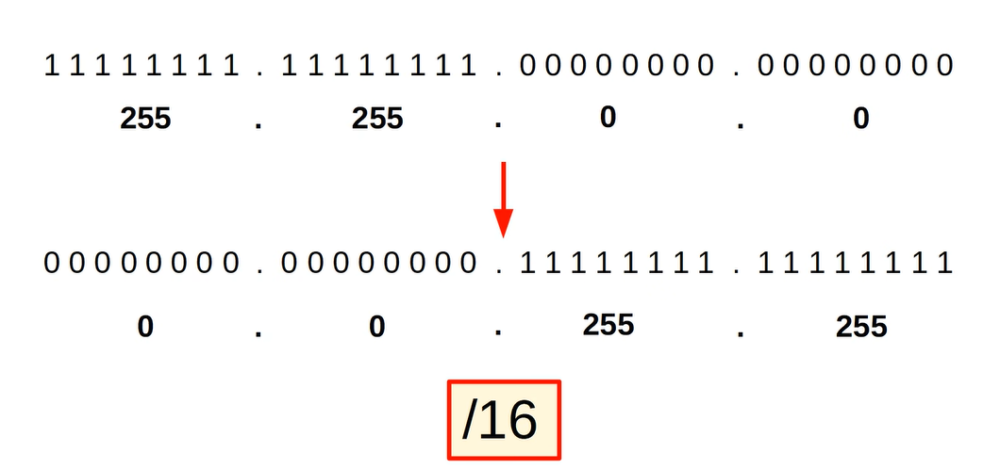

255.255.0.0 torna-se 0.0.255.255. Esta é a máscara curinga equivalente a /16.

E aqui está outra: 255.0.0.0 torna-se 0.255.255.255.

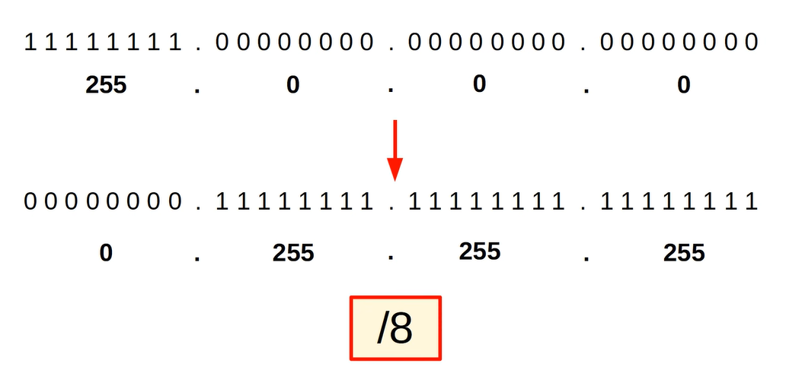

Esta é a máscara curinga equivalente a /8. Certo, esses são fáceis; agora vamos ver algo um pouco mais desafiador. Em nossa rede, a interface G2/0 do R1 tem um comprimento de prefixo /28 — ou seja, 255.255.255.240, escrito como uma máscara de sub-rede normal em formato decimal pontuado. Se você inverter os bits, obtém isto.

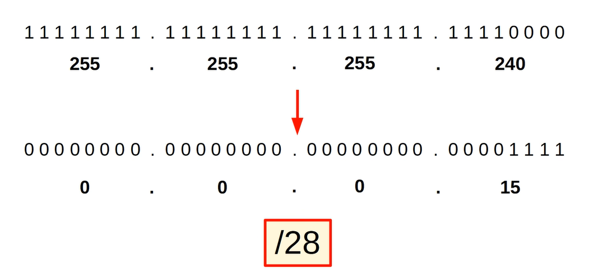

Se você escrever isso em decimal pontuado, obtém 0.0.0.15. Então, é assim que se escreve um comprimento de prefixo /28 usando uma máscara curinga. Para encerrar o assunto sobre máscaras curinga, vou explicar um pouco mais sobre a função delas. 

Um '0' na máscara curinga significa que os bits devem coincidir entre o endereço IP da interface e o comando de rede do EIGRP. Um '1' na máscara curinga significa que os bits não precisam coincidir. Então, o endereço IP na interface G2/0 do R1 é 172.16.1.14. Usei o comando de rede EIGRP `network 172.16.1.0`, com a seguinte máscara curinga: `0.0.0.15`. Isso significa que os primeiros 28 bits devem coincidir. Eles coincidem? 

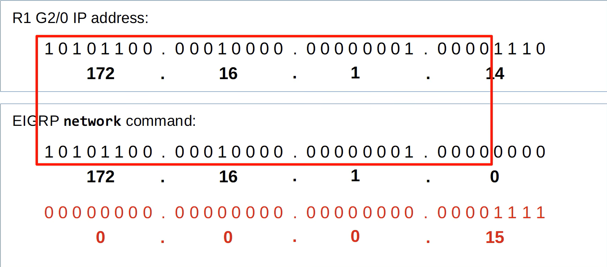

Sim, coincidem. Portanto, temos uma correspondência e o EIGRP será ativado na interface. Vamos tentar outro caso para ver se haverá correspondência. Com o mesmo endereço IP, usei este comando de rede: `network 172.16.1.0`, com uma máscara curinga de `0.0.0.7`. Isso significa que os primeiros 29 bits devem coincidir. Eles coincidem? Na verdade, não.

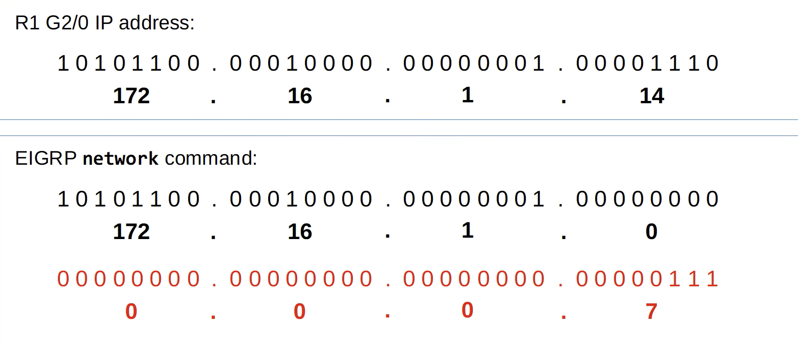

O bit na posição 4 não coincide entre a interface G2/0 do R1 e o comando `network`. Logo, não há correspondência e o EIGRP não será ativado na interface.

Certo, tente descobrir isso por conta própria. Com o comando `network 172.16.1.8 0.0.0.7`, o EIGRP seria ativado na interface? Certo, vamos verificar. Estamos usando a mesma máscara curinga da última vez, então os primeiros 29 bits precisam coincidir. Eles coincidem desta vez? Sim, coincidem; os primeiros 29 bits de `172.16.1.14` e os primeiros 29 bits de `172.16.1.8` correspondem. Portanto, temos uma correspondência e o EIGRP será ativado na interface.

Certo, uma última questão de prática sobre máscaras curinga. O comando de rede é `network 168.0.0.0 7.255.255.255`. Nesse caso, o EIGRP seria ativado na interface? Certo, vamos verificar. Com essa máscara curinga (*wildcard mask*), apenas os primeiros 5 bits precisam coincidir entre o IP da interface e o comando de rede do EIGRP. Os primeiros cinco bits do endereço IP são 1 0 1 0 1, e os primeiros cinco bits do comando de rede também são 1 0 1 0 1; portanto, temos uma correspondência novamente, e o EIGRP será ativado na interface. 

- 172.16.1.8    = 1 0 1 0 1 1 0 0 . 0 0 0 1 0 0 0 0 . 0 0 0 0 0 0 0 1 . 0 0 0 0 1 0 0 0
- 168.0.0.0     = 1 0 1 0 1 0 0 0 . 0 0 0 0 0 0 0 0 . 0 0 0 0 0 0 0 0 . 0 0 0 0 0 0 0 0
- 7.255.255.255 = 0 0 0 0 0 1 1 1 . 1 1 1 1 1 1 1 1 . 1 1 1 1 1 1 1 1 . 1 1 1 1 1 1 1 1

## Configuração do EIGRP (continuação)

Então, neste caso, usei uma máscara curinga /28 — o mesmo comprimento de prefixo da rede à qual a interface G2/0 está conectada —, mas, como acabei de demonstrar, você pode usar várias máscaras curinga diferentes para ativar o EIGRP na interface. No entanto, geralmente você optará pela simplicidade e usará o mesmo comprimento de prefixo da própria interface, como fiz aqui. Ou talvez usar uma máscara curinga /32 e especificar o endereço IP exato da interface.

Como você escreveria uma máscara curinga /32? Bem, como você sabe, a máscara de sub-rede é 255.255.255.255; portanto, a máscara curinga seria composta apenas por zeros: 0.0.0.0. Lembre-se apenas de que esse comando especifica apenas em qual interface (ou interfaces) o EIGRP deve ser ativado. O R1 então anunciará o prefixo de rede dessa interface — 172.16.1.0/28, neste caso. 

### 'show ip protocols' (EIGRP)

Vamos analisar o comando `show ip protocols` quando o EIGRP está em execução. 

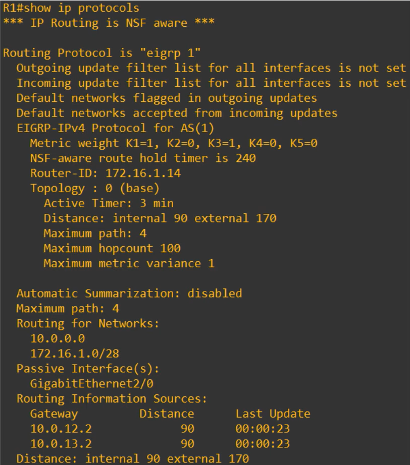

"Routing protocol is EIGRP 1" — sendo "1" o número do AS que configuramos, é claro.

Em relação a métrica do EIGRP, por padrão, ele utiliza a largura de banda e o atraso (delay) da interface; esses são os valores "K1" e "K3" que estão definidos como 1 no campo "Metrics weight". A largura de banda do link mais lento no caminho, somada aos valores de atraso de todos os links do caminho, é utilizada para calcular a métrica. Os outros valores K (K2, K4 e K5) são definidos como 0 por padrão e não são usados ​​para calcular a métrica; no entanto, isso pode ser alterado via configuração.

A seguir, temos o "Router-ID".

#### Router ID do EIGRP

No EIGRP e no OSPF, o roteador possui um router ID exclusivo que o identifica dentro do AS. Observe que o padrão no R1 é 172.16.1.14. Por que isso acontece? Bem, o router ID é determinado da seguinte forma: 

1. Primeiro, se o router ID for configurado manualmente, esse será o router ID utilizado.
2. Se o router ID não for configurado manualmente, o endereço IP mais alto entre todas as interfaces loopback do roteador será definido como o router ID (interfaces loopback são interfaces virtuais dentro do roteador. Falarei mais sobre eles no arquivo sobre OSPF).
3. Por fim, se não houver interfaces *loopback* configuradas, como é o caso aqui, o endereço IP mais alto em qualquer uma das interfaces físicas do roteador se tornará o *router ID*.

Assim, o endereço 172.16.1.14 da interface G2/0 tornou-se o *router ID*. Observe que o *router ID* não é, na verdade, um endereço IP; é apenas um número de 32 bits formatado como um endereço IP em notação decimal pontuada, e você pode alterá-lo para qualquer número de 32 bits.

Veja como configurar o *router ID* do EIGRP. No modo de configuração do EIGRP, use o comando `eigrp router-id`, seguido pelo *router ID* que você deseja configurar, como, por exemplo, 1.1.1.1. Assim, o *router ID* mudaria para 1.1.1.1, já que a configuração manual tem prioridade máxima. 

Certo, os dois campos seguintes nós vimos ao estudar o RIP. A sumarização automática está desativada, como deveria estar, e o EIGRP também realiza balanceamento de carga ECMP em até 4 caminhos por padrão, assim como o RIP.

No parte final, temos os dois comandos `network` que inserimos anteriormente. A interface G2/0 está configurada como interface passiva, há dois vizinhos — R2 e R3 — e o EIGRP possui dois valores de AD distintos: 90 para rotas internas e 170 para externas. Rotas internas são rotas EIGRP normais, mas rotas externas são rotas provenientes de fora do EIGRP que são então inseridas no EIGRP; mas esse é um tópico mais avançado.

### 'show ip route' (EIGRP)

Por fim, quero mostrar como o EIGRP aparece na tabela de roteamento. 

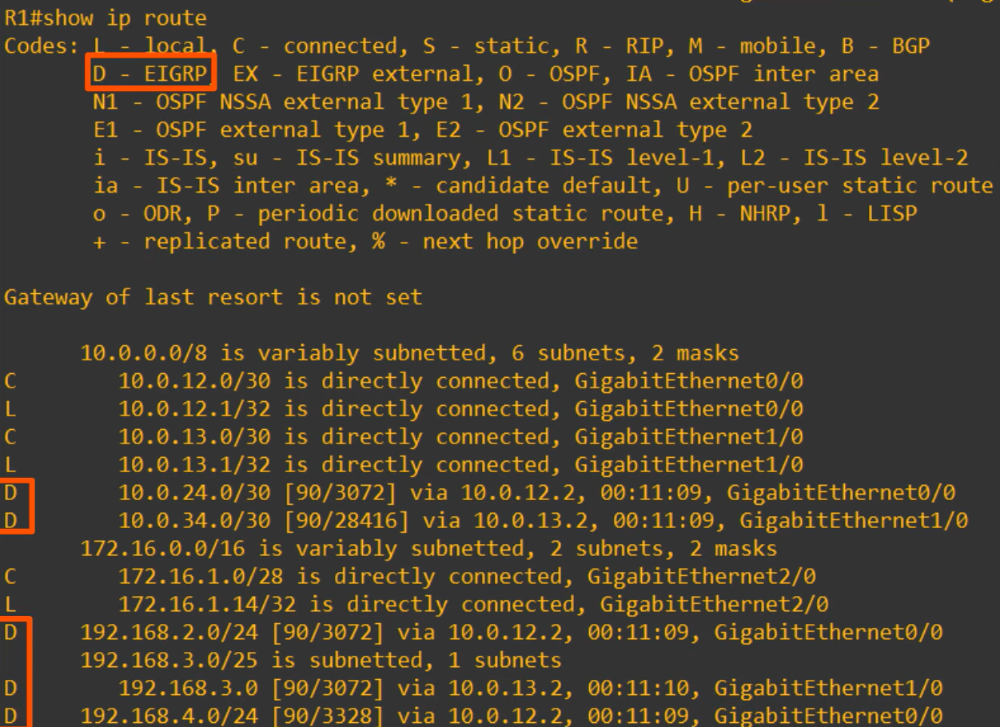

Primeiro, observe que as rotas EIGRP são indicadas pela letra D, e não E. Além disso, veja os custos das métricas. 3072, 3328, 28416 — esses custos são muito mais altos do que os vistos no OSPF e no RIP, e esta é uma rede muito pequena. Em redes grandes, esses números podem ser muito maiores. Talvez essa seja uma desvantagem do EIGRP: as métricas são mais difíceis de entender.

Certo, isso é tudo o que abordaremos sobre RIP e EIGRP neste arquivo.

