 O que é o EtherChannel e quais problemas ele resolve? Uma dica: o grande problema aqui é o Spanning Tree Protocol. Aqui, veremos vários métodos para configurar EtherChannels tanto de Camada 2 quanto de Camada 3.  

Um EtherChannel de Camada 2 é um grupo de portas de switch que operam como uma única interface, e um EtherChannel de Camada 3 é um grupo de portas roteadas que operam como uma única interface, à qual você atribui um endereço IP, justamente por ser de Camada 3. Muito bem, vamos começar.  

## Por que o EtherChannel é necessário  

Então, deixe-me demonstrar um problema. Temos dois switches aqui: ASW1 e DSW1.  

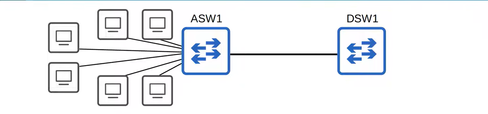

Falarei sobre o design básico de redes em outro artigo, mas ASW significa *access switch* (switch de acesso), que é o switch ao qual dispositivos finais, como PCs e servidores, se conectam. DSW significa *distribution layer switch* (switch da camada de distribuição), ao qual os switches da camada de acesso se conectam. 

Para esta demonstração, vamos supor que haja muitos dispositivos finais conectados ao ASW1 — digamos, 40 dispositivos — e todos estejam tentando acessar a Internet para realizar suas tarefas. O administrador da rede percebe que a conexão com o DSW1 está congestionada, então decide adicionar outro link para aumentar a largura de banda e, assim, suportar todos os dispositivos finais.  

O administrador adiciona, então, outro link e monitora a situação. No entanto, o link adicional não parece ajudar. A conexão entre o ASW1 e o DSW1 continua congestionada e os usuários finais estão relatando problemas. Então, o administrador decide adicionar outro link entre o ASW1 e o DSW1. Ele adiciona mais um link à conexão entre o ASW1 e o DSW1. Certamente, isso será suficiente.  

A largura de banda total das conexões com os hosts finais ainda é maior do que a largura de banda da conexão com o DSW1, mas tudo bem; nem todos os hosts da rede estão sempre em um estado constante de envio e recebimento de tráfego da Internet. 

Falarei mais sobre isso mais adiante no curso, mas quando a largura de banda das interfaces conectadas aos hosts finais é maior do que a largura de banda da conexão com os switches de distribuição, isso é chamado de *oversubscription* (sobreassinatura ou excesso de subscrição). 

Certo nível de *oversubscription* é aceitável, mas o excesso causará congestionamento. No entanto, mesmo com três links para o DSW1, o congestionamento não parece ter melhorado, então o administrador de rede decide, mais uma vez, adicionar outro link entre o ASW1 e o DSW1. Assim, agora existem quatro links entre o ASW1 e o DSW1.  

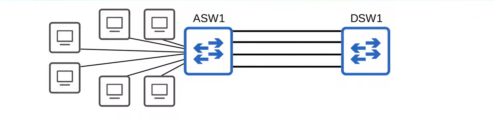

Você acha que a situação melhorou? Bem, não melhorou; a conexão entre os dois switches continua tão congestionada quanto antes. Por que isso acontece? 

Se você sabe a resposta, parabéns; se não, não se preocupe, você saberá agora. Digamos que o administrador tenha ido verificar fisicamente as luzes das portas dos dois switches. Que cor você acha que elas tinham? Bem, o administrador de rede verifica o DSW1 e todas as luzes das portas estão verdes, então não parece haver um problema. No entanto, ao verificar o ASW1, ele percebe que, dos links conectados ao DSW1, apenas uma luz está verde, enquanto as outras estão laranja.

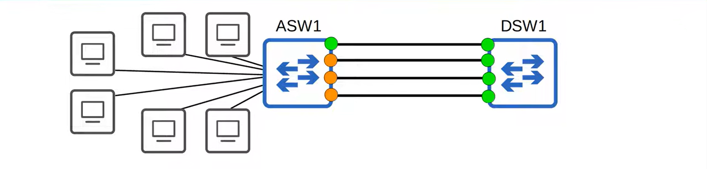

Por que isso acontece? É devido o protocolo Spanning Tree. Se você conectar dois switches usando múltiplos links, todos, exceto um, serão desativados pelo Spanning Tree. Por que ele faz isso? Bem, se todas as interfaces do ASW1 estivessem encaminhando tráfego, loops de Camada 2 seriam formados entre o ASW1 e o DSW1, resultando em tempestades de broadcast. 

Os outros links permaneceriam ociosos, a menos que o link ativo falhasse. Nesse caso, um dos links inativos passaria a encaminhar tráfego. Portanto, embora ter links de backup seja algo positivo — já que falhas podem ocorrer por diversos motivos —, é um desperdício de largura de banda manter essas três interfaces desativadas, sem encaminhar nenhum tráfego.  

No entanto, ao combinar essas quatro interfaces físicas em uma única interface lógica, o EtherChannel pode resolver esse problema, proporcionando tanto redundância quanto maior largura de banda.  

## Introdução ao EtherChannel  
 
Um EtherChannel é representado em diagramas de rede por um círculo desenhado ao redor das interfaces agrupadas, como mostrado aqui.  

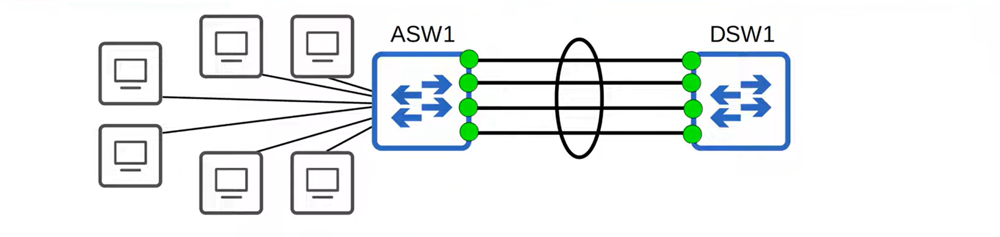

O EtherChannel agrupa múltiplas interfaces para que atuem como uma única interface. O STP tratará esse grupo como uma interface única. Assim, após agrupar essas interfaces em um EtherChannel, o administrador de rede verifica novamente as luzes dos links. Desta vez, todas estão verdes. Isso não causará um loop de Camada 2?  
 
Na verdade, não, pois esse grupo de quatro links se comporta como se fosse um único link. Por exemplo, digamos que um PC envie um quadro de broadcast. Então, ele é propagado (flooded) por todas as interfaces do ASW1. Todos os PCs conectados ao ASW1 receberão uma cópia do quadro. Agora, quantas cópias do quadro o DSW1 receberá?  

Lembre-se: embora existam quatro interfaces físicas, elas se comportam como uma única interface. A resposta é: o DSW1 receberá apenas uma cópia. Esse EtherChannel transforma essas quatro interfaces físicas em uma única interface lógica; o ASW1 não enviará quatro cópias do mesmo quadro de broadcast a partir de uma única interface.  

O tráfego que utiliza o EtherChannel terá sua carga balanceada entre as interfaces físicas do grupo. Um algoritmo é usado para determinar qual tráfego utilizará qual interface física. Darei mais detalhes sobre isso mais adiante. Então, o DSW1 recebeu o quadro de broadcast. O que ele fará agora?  

Ele propagará o quadro de broadcast por todas as interfaces, exceto aquela pela qual o quadro foi recebido. Digamos que o DSW1 tenha estes outros dois links.

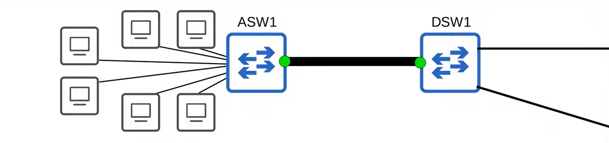

Por quais interfaces o DSW1 encaminhará o quadro? Apenas por essas duas. Por que ele não encaminhou o quadro pelas outras três interfaces do EtherChannel? Vou repetir mais uma vez: embora esse EtherChannel contenha quatro interfaces físicas separadas, elas se comportam como uma única interface. O DSW1 não enviará o quadro de broadcast de volta pela mesma interface pela qual ele foi recebido.  

Portanto, ele não é encaminhado de volta ao ASW1, e nenhum loop de Camada 2 é formado. Funciona mais ou menos assim, como mostrado na imagem acima: em vez de quatro interfaces separadas — talvez interfaces Gigabit Ethernet — conectando o ASW1 ao DSW1, é como se houvesse uma única interface Ethernet de quatro gigabits. A largura de banda das quatro interfaces separadas é combinada para formar uma interface mais rápida, uma interface virtual de quatro gigabits. A diferença entre as características físicas e as características lógicas ou virtuais de uma rede é algo que você precisa entender como engenheiro de redes. Por exemplo, VLANs.  

Vários PCs podem estar conectados ao mesmo switch e, portanto, na mesma LAN; no entanto, as VLANs dividem virtualmente esses PCs em LANs virtuais separadas, cada uma comportando-se como uma LAN distinta. Da mesma forma, essas interfaces existem como quatro interfaces físicas separadas, mas agora formam uma única interface virtual. 

Outros nomes para EtherChannel são Port Channel e LAG, que significa Link Aggregation Group (Grupo de Agregação de Links). Você verá que, para configurar um EtherChannel no Cisco IOS, é preciso usar alguns termos diferentes. Agora, vamos ver como o EtherChannel realiza o balanceamento de carga.  

## Balanceamento de Carga no EtherChannel  
  
Ele realiza o balanceamento de carga com base em "fluxos". O que é um fluxo? Um fluxo é uma comunicação entre dois nós na rede. Como, por exemplo, entre o PC1 e o SRV1. 

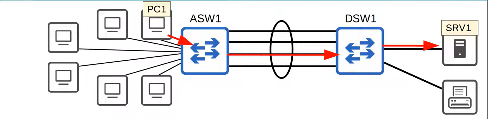

Aliás, normalmente você não verá um servidor ou uma impressora conectados diretamente a um switch da camada de distribuição; esses também são dispositivos finais (end hosts) que você deve conectar aos switches da camada de acesso. No entanto, apenas para simplificar este diagrama de rede, vou deixá-lo assim. 

Então, digamos que o PC1 inicie uma troca de dados com o SRV1 e envie alguns quadros para isso. O quadro é recebido pelo ASW1 e, supondo que ele já conheça o endereço MAC do SRV1, ele encaminhará o quadro através do Port Channel para o DSW1. Mas qual interface física ele usará?  

Bem, existe um algoritmo utilizado para calcular por qual interface física o tráfego será realmente enviado; digamos que ele determine que a interface com a seta vermelha será a escolhida. Agora, quando o PC1 envia o próximo quadro do fluxo, na comunicação entre o PC1 e o SRV1, a mesma interface será usada para encaminhar o tráfego para o SRV1. 

Portanto, a questão é que quadros de um mesmo fluxo serão encaminhados usando a mesma interface física. Se quadros de um mesmo fluxo fossem encaminhados usando interfaces físicas diferentes, alguns quadros poderiam chegar ao destino fora de ordem, o que pode causar problemas. Algumas aplicações conseguem lidar com quadros que chegam fora de ordem, mas outras não. 

Agora, se o PC1 quiser imprimir algo e iniciar um fluxo de comunicação separado com a PR1, o ASW1 encaminhará novamente o quadro usando sua interface virtual de *port channel*. No entanto, ele fará um cálculo separado para determinar qual interface física será usada para o fluxo. Por exemplo, ele pode determinar que a interface com a seta vermelha será usada para o fluxo.  

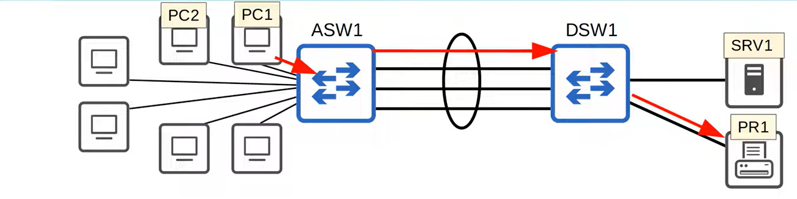

Assim como antes, quando o PC1 envia outro quadro do fluxo, a mesma interface membro do *EtherChannel* será usada para encaminhá-lo. E se o PC2 também quiser imprimir algo?  Ele envia o primeiro quadro do fluxo para o ASW1, que então fará um cálculo para determinar qual interface física do *EtherChannel* será usada. A escolhida poderia ser a rosa, por exemplo.

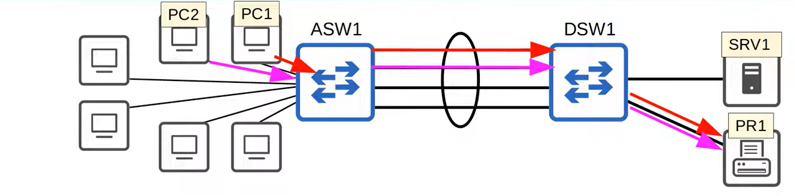

  
Então, é assim que o *EtherChannel* realiza o balanceamento de carga: usando interfaces físicas diferentes dentro do *EtherChannel* para fluxos diferentes. O cálculo realizado para determinar qual interface física usar leva em conta alguns parâmetros de entrada. Na verdade, você pode alterar os parâmetros de entrada usados no cálculo de seleção de interface.  

Aqui estão os parâmetros que podem ser usados:

- MAC de origem. Assim, todos os quadros com o mesmo endereço MAC de origem usarão sempre a mesma interface no EtherChannel;
- MAC de destino. Nesse caso, todos os quadros com o mesmo endereço MAC de destino usarão sempre a mesma interface física. 

	- Você também pode usar ambos os endereços MAC, de origem e de destino. Por exemplo, quadros do PC1 para o SRV1 usarão sempre uma determinada interface; quadros do PC2 para o SRV1 usarão sempre uma determinada interface, que pode ser a mesma ou diferente daquela usada para o tráfego do PC1 para o SRV1; quadros do PC1 para o PR1 podem usar outra interface diferente, etc. O cálculo é feito com base nos endereços MAC de origem e de destino.  

- IP de origem;
- IP de destino; 

	- IP de origem e de destino.  

Alguns switches também suportam balanceamento de carga com base nos números de porta TCP ou UDP da Camada 4, mas esse é um assunto para outra aula. Além disso, os métodos que o switch pode utilizar dependem do modelo do switch; alguns podem suportar apenas o uso de endereços MAC, outros podem suportar apenas endereços MAC ou IP, e alguns podem suportar todos os métodos. Então, ainda não configuramos um EtherChannel, mas, já que o mencionei, vamos dar uma olhada em como verificar e configurar o método de balanceamento de carga. 

## Verificação e configuração do balanceamento de carga do EtherChannel  

Use o comando `show etherchannel load-balance` para ver o método de balanceamento de carga atual. 

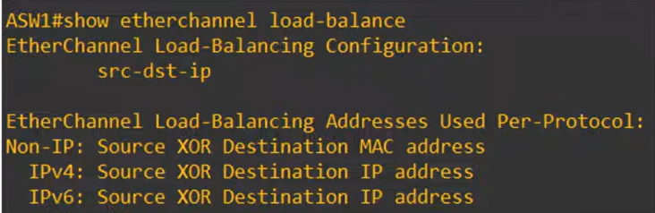

Você pode ver que o padrão para este modelo de switch é realizar o balanceamento de carga com base nos endereços IP de origem e de destino. Então, por exemplo, todo o tráfego vindo de 10.0.0.1 com destino a 10.0.0.2 sempre usará uma determinada interface física dentro do EtherChannel. 

Embaixo, você pode ver um detalhamento mais específico. Quadros que encapsulam pacotes IP, sejam IPv4 ou IPv6, terão seu balanceamento de carga realizado com base nos endereços IP de origem e destino. No entanto, observe que, na parte superior, é indicado que tráfego não-IP usará os endereços MAC de origem e destino.  

Bem, isso acontece porque, se um pacote IP não estiver encapsulado no quadro Ethernet, não há endereço IP que possa ser usado para determinar o balanceamento de carga; portanto, os endereços MAC são usados em seu lugar. Agora, quanto a como alterar o método de balanceamento de carga, entre no modo de configuração global e use este comando: `port-channel load-balance`, seguido pelo método.  

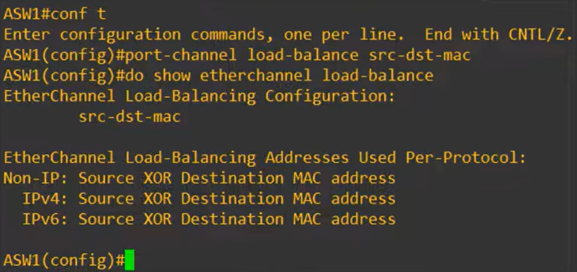

Neste caso, alterei para usar os endereços MAC de origem e destino do quadro. Depois confirmei mais uma vez, e você pode ver que a configuração de balanceamento de carga foi alterada com sucesso. A propósito, aqui estão as opções disponíveis neste dispositivo. 

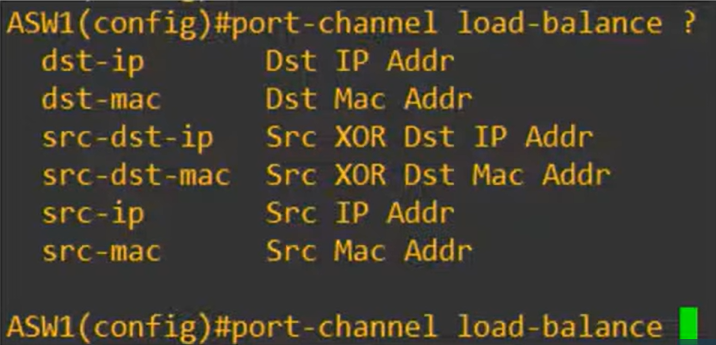

Ele pode realizar o balanceamento de carga com base em endereços MAC ou IP e, em ambos os casos, pode fazê-lo com base nos endereços de origem, de destino ou em ambos (origem E destino). Agora, quero destacar um ponto que é um pouco frustrante na configuração de EtherChannel em dispositivos Cisco.  

- Qual palavra-chave você usa para configurar o método de balanceamento de carga? `port-channel`. 

- E qual palavra-chave você usa para visualizar o método de balanceamento de carga? `etherchannel`.  
 
Palavras diferentes são usadas para a mesma coisa, o que é um pouco frustrante. Na verdade, mais adiante você descobrirá que há ainda mais uma que precisa memorizar. Então, estes são os dois primeiros comandos para lembrar neste vídeo: `show etherchannel load-balance`, para verificar o método de balanceamento de carga em uso. E `port-channel load-balance`, seguido pelo método de balanceamento de carga, para configurar o balanceamento de carga.

Agora, vamos passar para a criação efetiva de um EtherChannel entre dois switches.  

## Protocolos de EtherChannel - PAgP, LACP, Estático  
 
Existem três métodos de configuração de EtherChannel. O primeiro é o PAgP, que significa *Port Aggregation Protocol* (Protocolo de Agregação de Portas). É um protocolo proprietário da Cisco, portanto, só pode ser usado em switches Cisco. Se você estiver tentando formar um EtherChannel com um switch Juniper, por exemplo, não poderá usar o PAgP.  

Agora, o que o PAgP faz? Ele negocia dinamicamente a criação e a manutenção do EtherChannel. O DTP, por exemplo, que faz algo semelhante em relação à formação de troncos (*trunks*). Quadros são enviados ao switch vizinho para verificar se ele deseja formar um EtherChannel e, então, os switches concordam ou não em formar o EtherChannel.  

Certo, o próximo método de configuração é o LACP, que significa *Link Aggregation Control Protocol* (Protocolo de Controle de Agregação de Links). É um protocolo padrão da indústria — mais uma vez, dos nossos amigos do IEEE; seu código é 802.3ad. Basicamente, ele faz a mesma coisa que o PAgP. Ele negocia dinamicamente a criação e a manutenção do EtherChannel, assim como o DTP faz para troncos.  
 
Por ser um padrão da indústria, ele não funciona apenas em switches Cisco, então pode ser usado para formar EtherChannels com switches de outros fabricantes. Por isso, o LACP é o método preferido para configurar EtherChannels.

Então, o último método é o EtherChannel estático. Nesse caso, não se utiliza um protocolo para determinar se um EtherChannel deve ser formado. Em vez disso, as interfaces são configuradas estaticamente para formar um EtherChannel. Isso geralmente é evitado, pois o ideal é que os switches mantenham o EtherChannel de forma dinâmica; por exemplo, você quer que o switch remova uma interface do EtherChannel caso ocorra algum tipo de problema nela.  

Certo, por fim: é possível agrupar até 8 interfaces em um único EtherChannel. Na verdade, o LACP permite até 16, mas apenas 8 ficam ativas; as outras 8 permanecem em modo de espera (standby), aguardando a falha de uma interface ativa. 

Então, vamos ver como configurar cada método.  

### Configuração de EtherChannel – PAgP  

A configuração de cada um é quase idêntica; basta substituir algumas palavras-chave. APrimeiro, usei o comando `interface range` para configurar todas as interfaces membro de uma só vez.  

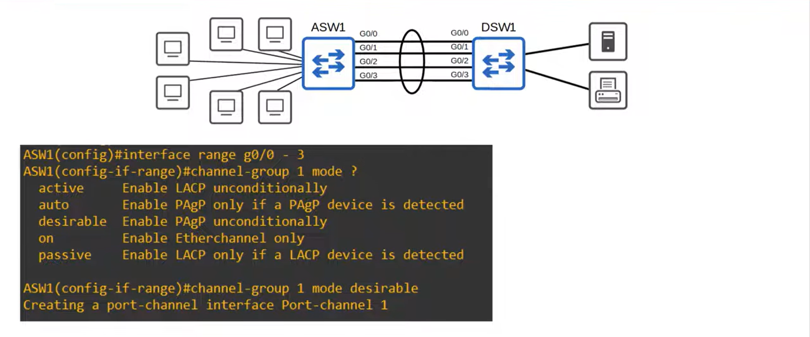

Essa é uma boa prática para EtherChannel, pois as configurações de cada interface membro precisam ser idênticas; ao configurá-las simultaneamente, você garante isso. Falarei mais sobre isso depois de mostrar as configurações. De qualquer forma, para configurar o EtherChannel propriamente dito, utilize este comando, que inclui mais uma palavra-chave nova: `channel-group`, seguido por um número que identifica a interface virtual, `mode` e, então, como você pode ver, usei o ponto de interrogação para verificar quais opções estão disponíveis. 

Existem cinco opções: duas são usadas para PAgP, duas para LACP e uma para EtherChannel estático. Você reconhece esses nomes de algum outro protocolo proprietário da Cisco? O DTP usava os mesmos modos para formar trunks, e a função de cada modo é basicamente a mesma. O modo "desirable" tenta ativamente formar um EtherChannel, enquanto o modo "auto" só formará um EtherChannel se o outro lado estiver configurado como "desirable", mas não se o outro lado estiver configurado como "auto".  

Então, aqui está um resumo: se ambos os lados da conexão estiverem configurados como "auto", nenhum EtherChannel será formado. No entanto, "auto" e "desirable", ou "desirable" e "desirable", formarão um EtherChannel. De qualquer forma, decidi configurar este lado como "desirable". 

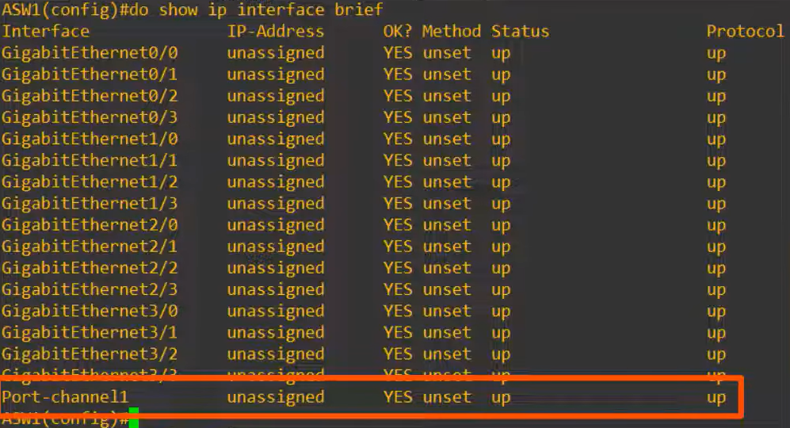

Você pode ver que a interface virtual "port-channel" foi criada, com o número que usamos no comando channel-group. Você pode vê-la aqui na saída do comando `do show ip interfaces brief`, lá embaixo. Então, lembre-se de que o comando `channel-group` é usado para configurar o EtherChannel, mas o nome da interface virtual criada é "port-channel". Aliás, esse número do channel group precisa coincidir entre as interfaces do mesmo switch; no entanto, ele NÃO precisa coincidir com o número do channel-group no outro switch. Por exemplo, o channel-group 1 no ASW1 pode formar um EtherChannel com o channel-group 2 no DSW1.  

O número serve apenas para identificar a interface virtual no switch local. Como é possível ter múltiplos EtherChannels em um único switch, você precisa de um número para identificá-los.  

### Configuração de EtherChannel - LACP  

A seguir, vamos ver a configuração do LACP. Depois de explicar tudo isso, não há muito mais o que explicar sobre o LACP. Observe apenas que os nomes dos modos são diferentes. Em vez de *desirable*, o LACP usa o modo *active*. E, em vez de *auto*, o LACP usa o modo *passive*.

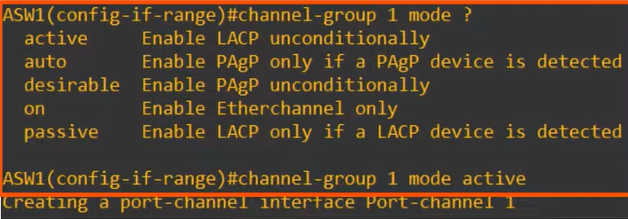

Portanto, se ambas as pontas estiverem configuradas no modo *passive*, um EtherChannel não será formado. No entanto, as combinações *active* e *passive*, ou *active* e *active*, formarão um EtherChannel. Neste caso, configurei este lado como *active*. Mais uma vez, a interface *port-channel* é criada.  

Note que, mesmo se você configurar ambos os lados como *passive*, a interface virtual ainda será criada em cada switch. No entanto, ela não funcionará efetivamente como um EtherChannel a menos que um dos lados esteja no modo *active*. Assim, como você pode ver, o comando é basicamente o mesmo; apenas os nomes dos modos são diferentes.  

Mais uma vez, o número do *channel-group* deve coincidir entre as interfaces membro no switch local, mas não precisa coincidir com o número no switch vizinho.  

### Configuração de EtherChannel - Estático  

Finalmente, vamos ver como o EtherChannel estático é configurado. Não existem dois modos separados, apenas um: o modo "ON", que instrui manualmente essas interfaces a formar um EtherChannel. Isso criará uma interface *port-channel*, assim como antes.  

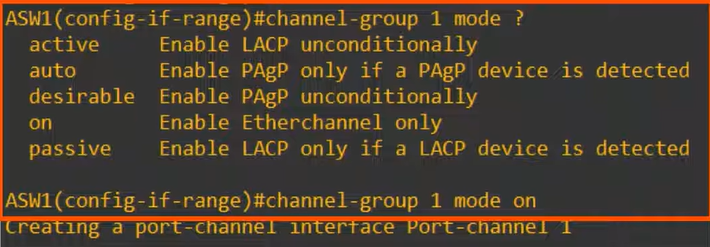

Vale ressaltar que o modo "on" só funciona com o modo "on". As combinações "on" e *desirable*, ou "on" e *active*, não formarão um EtherChannel com sucesso.  

## Configuração manual do protocolo de negociação (PAgP ou LACP)

Outro comando que você deve conhecer é o comando `channel-protocol`. 

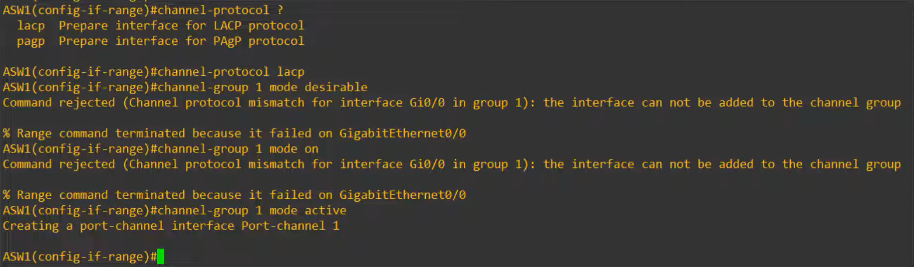

Ele configura manualmente o protocolo de negociação do EtherChannel que as interfaces membro devem utilizar. Na verdade, esse comando não é muito útil, pois não há necessidade de configurá-lo. Se você configurar `channel-group 1 mode desirable` ou `auto`, a interface utilizará automaticamente o PAgP; ou, se configurar `channel-group 1 mode active` ou `passive`, a interface utilizará automaticamente o LACP. Portanto, não faz muito sentido usar esse comando. Aqui está uma breve explicação. 

É claro que existem duas opções, LACP e PAgP, e decidi configurar o LACP.  Então, tentei o comando `channel-group 1 mode desirable`, mas ele foi rejeitado devido à incompatibilidade de protocolos. Eu havia configurado manualmente essas interfaces para usar LACP, mas o modo "desirable" (desejável) refere-se ao PAgP, por isso o comando foi rejeitado. Se eu tentar `channel-group 1 mode on`, ele também é rejeitado. Então, executo `channel-group 1 mode active` e o comando funciona, pois o modo ativo corresponde ao LACP. 

Assim, após configurar o EtherChannel — seja em qual modo for: PAgP, LACP ou estático —, você pode configurar a própria interface port-channel. 

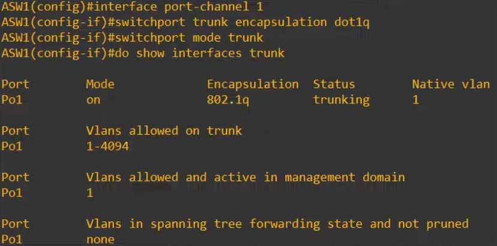

Note que estou usando apenas o exemplo do LACP aqui, já que todas essas informações são as mesmas, independentemente do método utilizado. Também realizei as mesmas configurações no DSW1, de modo que o EtherChannel está operacional. Entrei no modo de configuração da interface port-channel 1 e a configurei como trunk. Agora, na saída do comando `do show interfaces trunk`, você pode ver o port-channel 1, listado como Po1, como um trunk. Observe que as interfaces físicas individuais não são listadas aqui, apenas a interface port-channel.

Aqui está uma parte da saída do comando `show running-config`. Há algo interessante a notar aqui.  

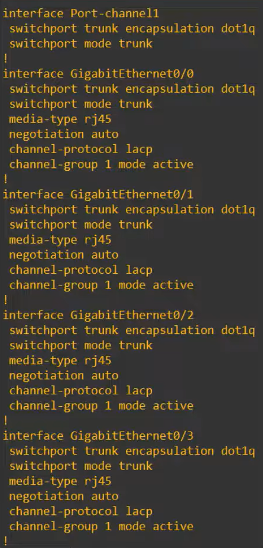

As configurações de trunk que apliquei à interface port-channel também foram aplicadas às interfaces físicas; eu não configurei manualmente as interfaces físicas como trunks. Agora, mais um ponto importante sobre a configuração do EtherChannel.  

## Requisitos do EtherChannel (correspondência de duplex, velocidade, etc.)  
  
As interfaces membro — as interfaces físicas no EtherChannel — devem ter configurações compatíveis. O que quero dizer com isso? Elas devem ter a mesma configuração de duplex. Devem ter a mesma velocidade. Devem ter o mesmo modo de porta (switchport mode), ou seja, access ou trunk. Se forem trunk, devem ter as mesmas VLANs permitidas e VLANs nativas. Se as configurações de uma interface individual não coincidirem com as das outras, ela será excluída do EtherChannel.

### Verificação do EtherChannel (`show etherchannel summary`)  

Ao verificar o status de um EtherChannel usando comandos `show`, o comando mais útil é o `show etherchannel summary`. Aqui embaixo há uma lista das interfaces port-channel no switch.  

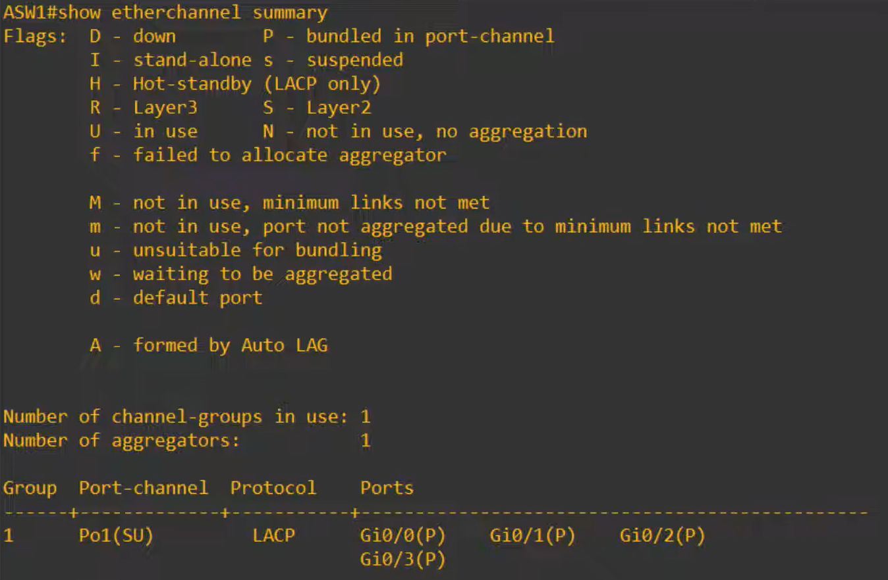
 
Ao lado do port-channel 1, há duas flags: um "S" maiúsculo e um "U" maiúsculo. Para verificar o significado delas, observe a legenda na parte superior. "S" significa que é um EtherChannel de Camada 2 (Layer 2). "S" vem de *switchport*, aliás. "U" significa *in use* (em uso), indicando que o EtherChannel está ativo e sendo utilizado. Ao lado das portas físicas, há a flag "P". Isso significa que essas portas estão corretamente agrupadas no port-channel. Estas são as flags que você espera ver em um EtherChannel de Camada 2 operacional. Agora, vamos analisar algumas situações em que veremos outras flags.  

Então, desativei (shutdown) a interface port-channel 1. 

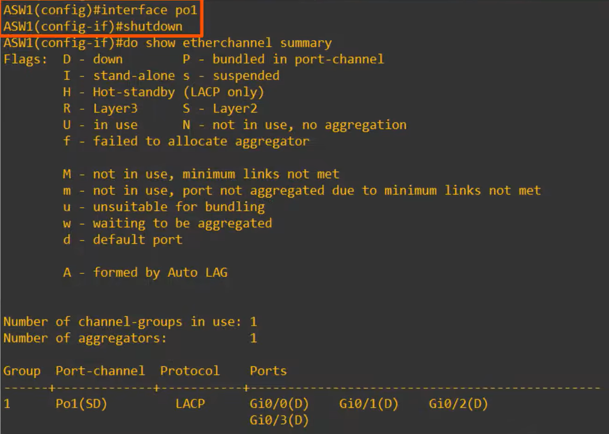

Agora, ao lado tanto da interface port-channel quanto das interfaces membro, você pode ver a flag "D". Isso significa "down" (inativa). Certo, vou reativar a interface e mostrar outra flag que você pode encontrar. 

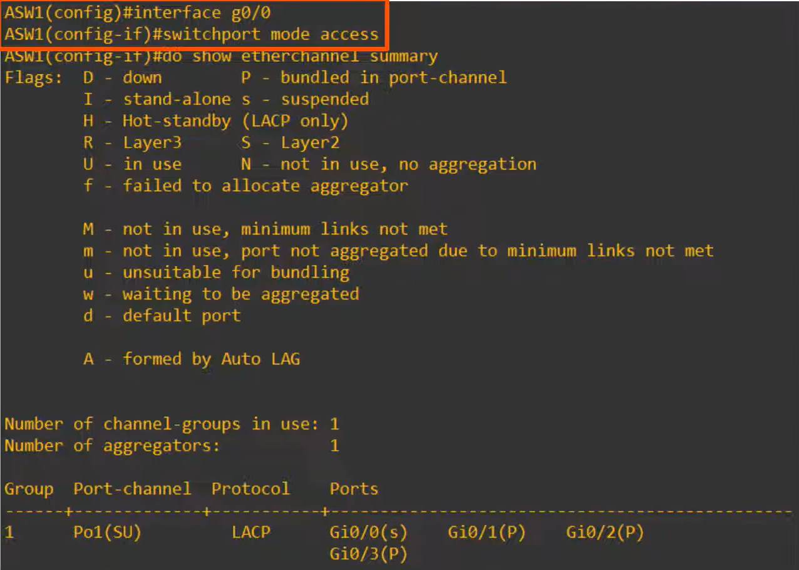

Agora alterei uma das interfaces membro para o modo de acesso. Agora ela apresenta a flag "s" minúscula. Observe que isso é diferente da flag "S" maiúscula. Ela significa "suspended" (suspensa). Portanto, apenas a G0/0 está suspensa, mas o EtherChannel continua operando com apenas três interfaces: G0/1, 2 e 3. Outro comando que você pode usar é o `show etherchannel port-channel`.  

### Verificação do EtherChannel (show etherchannel port-channel)  

Você pode ver o número de portas no port-channel, qual protocolo está sendo usado, etc.

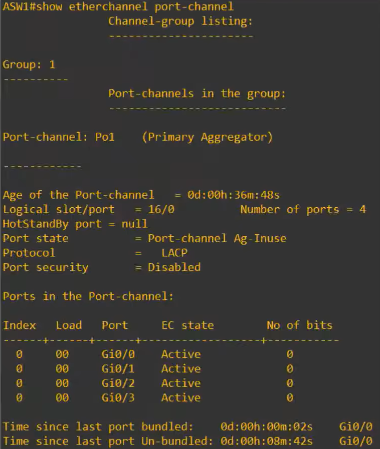

Uma informação importante que não aparece no `show etherchannel summary`, mas é exibida neste comando, é o modo do channel-group — "active" (ativo), neste caso, porque usei o comando `channel-group 1 mode active` anteriormente. No entanto, para EtherChannel, o comando que você certamente mais utilizará é o `show etherchannel summary`. Eu só queria mostrar outra opção.  
 
Como comecei a aula falando sobre Spanning Tree, vamos ver como ele é afetado quando o EtherChannel é configurado.  

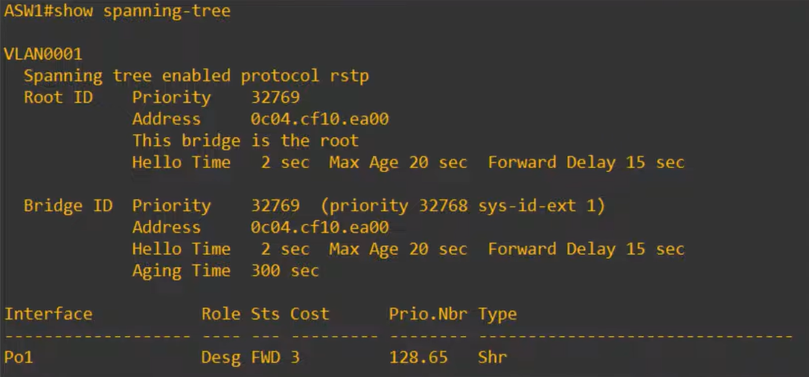

Como você pode ver, apenas a interface port-channel é listada; as interfaces físicas não aparecem de forma alguma na saída deste comando. Então, como eu disse, o Spanning Tree trata essas quatro interfaces físicas como uma única interface lógica. Em vez de bloquear três delas, todas podem encaminhar e receber tráfego, sem a preocupação com loops de Camada 2. Para encerrar esta aula, vamos dar uma breve olhada nos EtherChannels de Camada 3.  

## EtherChannel de Camada 3  
  
Substituí o ASW1 e o DSW1 por switches multicamada (multilayer switches).  

Em vez de uma conexão de Camada 2 entre eles, vamos usar uma conexão de Camada 3. O design de redes moderno frequentemente tende a utilizar conexões de Camada 3 entre switches, pois, dessa forma, o Spanning Tree não será um problema em nenhuma parte da rede. Poderíamos ter quatro switches interconectados em uma malha (mesh) e, se os conectássemos com portas roteadas de Camada 3, todas as interfaces estariam ativas e encaminhando tráfego; nenhuma precisaria ser desativada devido ao Spanning Tree. 

Agora você pode estar pensando: você não acabou de mostrar que o EtherChannel significa que o Spanning Tree não precisa bloquear nenhuma porta? Bem, estamos analisando apenas uma conexão entre dois switches. Mesmo usando EtherChannel, loops de Camada 2 ainda podem ocorrer se vários switches estiverem conectados entre si formando um loop. Por exemplo, veja este diagrama. Todas as conexões entre os switches utilizam EtherChannel, mas se não bloquearmos nenhuma das interfaces port-channel, os broadcasts ainda podem circular pelos switches dessa maneira...

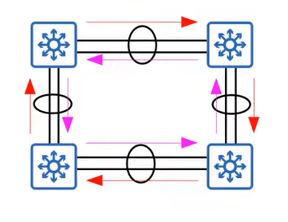

... e causar uma tempestade de broadcast (broadcast storm). Portanto, o Spanning Tree bloqueará uma dessas interfaces port-channel.  

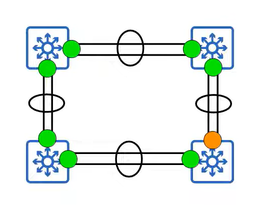

No entanto, se todas essas conexões entre switches fossem feitas usando portas roteadas, e não portas de switch de Camada 2, não haveria necessidade alguma de executar o Spanning Tree. Portas roteadas não encaminham broadcasts de Camada 2; logo, não podem ser formados loops de Camada 2. Você já sabe como configurar portas roteadas com o comando `no switchport`. Vamos ver como configurar um EtherChannel de Camada 3.  

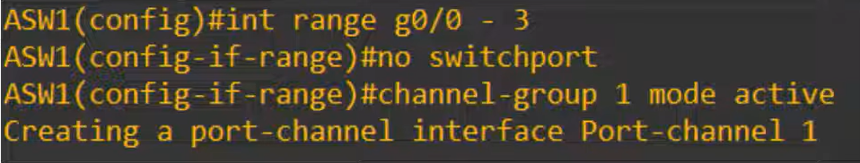

Então, começando de uma configuração limpa, nenhum port-channel foi configurado ainda no ASW1.  
29:11  
Entro no modo de configuração de intervalo de interfaces (*interface range*) para as interfaces membro e, desta vez, antes de usar  
29:17  
o comando CHANNEL-GROUP, uso o comando NO SWITCHPORT para transformá-las em interfaces roteadas de Camada 3.  
29:24  
Depois, após usar o comando CHANNEL-GROUP, utilizei o comando SHOW RUNNING-CONFIG para verificar a configuração.  
29:31  
Observe que a interface port-channel criada recebe o comando NO SWITCHPORT automaticamente.  
29:37  
Agora, como estamos criando um EtherChannel de Camada 3, precisamos de um endereço IP.  
29:43  
Onde você acha que ele deve ser configurado? Ele deve ser configurado na interface port-channel.  
29:48  
Então, aí está. Agora, vamos verificar o comando SHOW ETHERCHANNEL SUMMARY mais uma vez.  
29:54  
A única diferença na saída é que, em vez da flag 'S' (maiúscula), ela  
29:59  
apresenta a flag 'R'. O que isso significa? Significa que é um EtherChannel de Camada 3; 'R' significa porta roteada (*routed port*).  
30:08  
Na saída do comando SHOW IP INTERFACE BRIEF, você pode ver o endereço IP configurado na interface port-channel  
30:14  
1. Assim, agora o ASW1 e o DSW1 funcionam como dois roteadores conectados entre si.  
30:19  
Eles estão conectados na Camada 3 e o Spanning Tree não está em execução na conexão entre eles.  
30:26  
No entanto, assim como no EtherChannel de Camada 2, o tráfego agora será balanceado entre as  
30:31  
quatro interfaces membro. Certo, vamos revisar rapidamente os comandos que abordamos. Revisão dos comandos de configuração e verificação  
30:38  
O primeiro é o `PORT-CHANNEL LOAD-BALANCE`, seguido pelo modo que, dependendo do modelo do switch, pode envolver endereços MAC, endereços IP ou números de porta da Camada 4, utilizando  
30:49  
a origem, o destino ou ambos (origem e destino) no cálculo para determinar qual interface física  
30:56  
é usada para encaminhar um fluxo de tráfego específico. Para visualizar a configuração atual de balanceamento de carga do EtherChannel, use `SHOW ETHERCHANNEL LOAD-BALANCE`.  
31:07  
Para configurar uma interface para fazer parte de um EtherChannel, use o comando `CHANNEL-GROUP`, seguido pelo número do port-channel, `MODE` e, em seguida, o modo, que pode ser `DESIRABLE`,  
31:18  
`AUTO`, `ACTIVE`, `PASSIVE` ou `ON`. O comando `show` mais útil para EtherChannel é o `SHOW ETHERCHANNEL SUMMARY`, que exibe um  
31:27  
resumo de todos os EtherChannels no switch e seus status. Outro comando `show` que você pode usar é o `SHOW ETHERCHANNEL PORT-CHANNEL`, que exibe  
31:36  
informações mais detalhadas sobre as interfaces port-channel no switch.  
31:42  
Esses são todos os comandos que aprendemos hoje. Claro, existem muitos outros comandos que podem ser usados, mas não precisamos nos aprofundar  
31:48  
mais no conceito de EtherChannels. 
