Aqui estão os tópicos que abordaremos no vídeo de hoje. Primeiro, o que é uma LAN?  

Sabemos que a sigla significa *Local Area Network* (Rede de Área Local), mas vou apresentar uma definição mais específica. 

Para ajudar a entender LANs e VLANs, também veremos os domínios de broadcast. Depois de analisar LANs e domínios de broadcast, apresentarei as VLANs (LANs virtuais). Vou ensinar os conceitos básicos das VLANs e sua finalidade.  

Por fim, veremos o básico sobre a configuração de VLANs em switches Cisco. Vamos começar.  

## O que é uma LAN?  

Então, o que é uma LAN? Vamos analisar uma definição: uma LAN é um único domínio de broadcast. Um domínio de broadcast é o grupo de dispositivos que receberá um quadro de broadcast (ou seja, um quadro com endereço MAC de destino composto apenas por "F"s) enviado por qualquer um dos membros.  

Vamos dar uma olhada em um diagrama.  

### LANs/Domínios de Broadcast  

Observe esta rede aqui.  

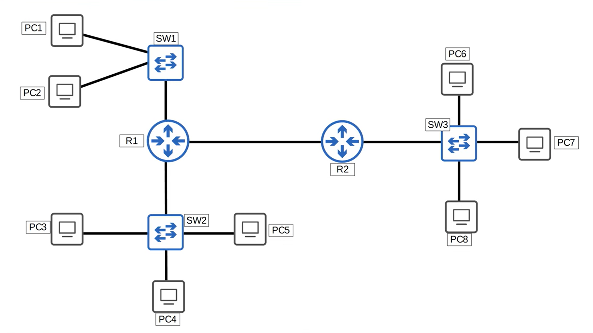

Quantos domínios de broadcast você acha que existem?  

Lembre-se: um domínio de broadcast inclui todos os dispositivos que receberão um quadro de broadcast. Então, digamos que o PC1 envie um quadro de broadcast; lembre-se de que um quadro de broadcast é um quadro com um endereço MAC de destino composto apenas por "F"s. Quais dispositivos receberão o quadro?  
  
Bem, o PC1 envia o quadro para o SW1, e o que um switch faz com um quadro de broadcast? Ele o encaminha (faz o *flood*) por todas as interfaces, exceto aquela pela qual o quadro foi recebido. Assim, o quadro é enviado para o PC2 e para o R1.  
 
O que um roteador faz com um quadro de broadcast? Ele não o encaminha. Ele receberá o quadro, mas não o enviará para outras redes.  

Isso significa que temos um domínio de broadcast que inclui o PC1, o PC2, o SW1 e uma das interfaces do R1. Portanto, esse é um domínio de broadcast.  

Quantos restam? E se o PC3 enviar um quadro de broadcast? Quais dispositivos o receberão? O SW2 receberá o quadro e o encaminhará por todas as interfaces, para o R1, o PC4 e o PC5. O R1, no entanto, não encaminhará o quadro de broadcast.  

Assim, esse é o domínio de broadcast: PC3, PC4, PC5, SW2 e uma das interfaces do R1.  

Até agora, identificamos 2 domínios de broadcast. Agora, e se o PC6 enviar um quadro de broadcast? Quais dispositivos o receberão?  

Quando o SW3 o receber, ele encaminhará o quadro para o PC7, o PC8 e o R2. E o R2 não encaminhará o quadro. Então, este é o domínio de broadcast, incluindo PC6, 7, 8, SW3 e uma das interfaces do R2.  

Portanto, identificamos três domínios de broadcast até agora. No entanto, há mais um. E se o R1 enviar um quadro de broadcast pela interface conectada ao R2? Ele será recebido apenas pelo R2. No entanto, embora seja uma conexão com apenas dois dispositivos, ainda é tecnicamente um domínio de broadcast.  
  
Então, você entendeu o que é um domínio de broadcast agora? Um domínio de broadcast é o grupo de dispositivos que receberá um quadro de broadcast (com um endereço MAC de destino composto apenas por letras F) enviado por qualquer um dos membros.  
  
Nesta rede aqui, existem quatro domínios de broadcast e, portanto, quatro LANs.  

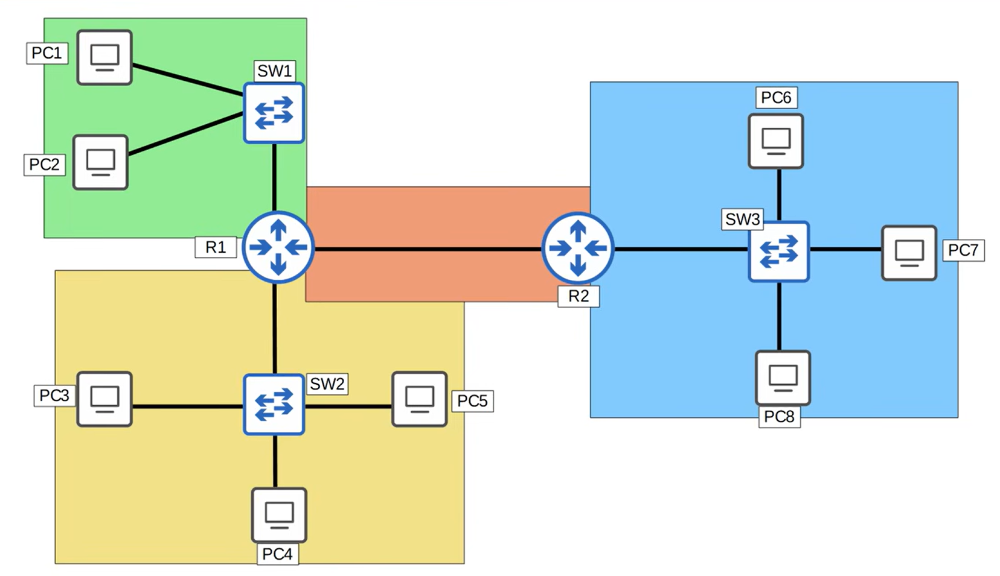

## O que é uma VLAN?  

Aqui está uma pequena LAN de uma empresa. 

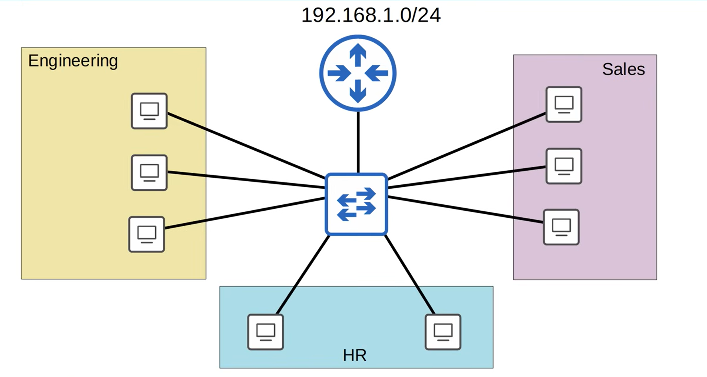

Digamos que existam três departamentos principais neste escritório: engenharia, vendas e recursos humanos.  

Além disso, a empresa está usando a rede 192.168.1.0/24 para esta LAN. No entanto, essa não é necessariamente a melhor configuração. Tanto para fins de segurança quanto de desempenho, seria melhor dividi-los em sub-redes separadas.  

Por exemplo, digamos que um PC no departamento de engenharia envie uma mensagem de broadcast destinada a outros PCs do departamento de engenharia. Como é uma mensagem de broadcast, o switch a encaminhará (fará o *flood*) por todas as interfaces. Assim, não apenas os PCs do departamento de engenharia receberão o broadcast; TODOS os PCs, bem como o roteador, receberão o broadcast. 

Isso é um problema, tanto para a segurança quanto para o desempenho da rede.  

No que diz respeito ao desempenho, uma grande quantidade de tráfego de broadcast desnecessário pode reduzir a performance da rede. Seja um broadcast vindo de um host final ou de um switch que não sabe como alcançar o endereço MAC de destino e, por isso, inunda a rede com o quadro (frame), devemos minimizar o tráfego desnecessário em nossa rede.  

Quanto à segurança, mesmo dentro do mesmo escritório, é importante limitar quem tem acesso a quê. Você pode aplicar políticas de segurança em um roteador ou firewall. Como se trata de uma única LAN, os PCs conseguem se comunicar diretamente entre si, sem que o tráfego passe pelo roteador. Portanto, mesmo que você configure políticas de segurança no roteador, elas não surtirão efeito.  

Devemos separar esses hosts para que possamos aplicar políticas de segurança determine quem pode acessar o quê na rede.  

Então, vamos dividir esses departamentos em sub-redes separadas.  

### Segmentação na Camada 3 (Sub-redes)  

192.168.1.0/26 para o departamento de ENGENHARIA, 192.168.1.64/26 para o departamento de RH e 192.168.1.128/26 para o departamento de VENDAS.  

No entanto, há um problema. O roteador precisará de um endereço IP em cada sub-rede; portanto, precisará de uma interface em cada sub-rede. Então, vamos substituir essa conexão única entre o switch e o roteador por três conexões separadas, uma em cada sub-rede.  

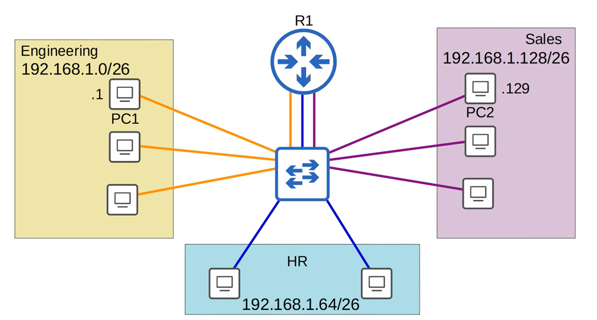

Na verdade, existe uma maneira mais eficiente de fazer isso; você não precisa usar três interfaces separadas, mas não se preocupe com isso agora; abordarei esse assunto mais adiante.  

Então, você pode pensar que o problema está resolvido agora. Digamos que um PC no departamento de ENGENHARIA tenha o endereço IP 192.168.1.1, e um PC no departamento de VENDAS tenha o endereço IP 192.168.1.129. Se o PC1 enviar dados para o PC2, o PC1 reconhecerá que o PC2 está em uma sub-rede diferente da sua própria; portanto, definirá o endereço MAC de destino como o de seu gateway padrão, o R1.  

É assim que o quadro ficará: 

- IP de origem do PC1;
- IP de destino do PC2;
- MAC de origem do PC1; e
- MAC de destino do R1. 

O PC1 encaminhará o quadro para o switch, que o enviará para o R1, o qual então alterará o MAC de origem para o seu próprio MAC e o MAC de destino para o MAC do PC2. Em seguida, ele encaminhará o quadro de volta para o switch, que o repassará para o destino, o PC2.  

Certo, então, em vez de o PC1 conseguir enviar tráfego diretamente para o PC2, nós o forçamos a enviar o tráfego primeiro pelo R1, onde teríamos configurado algumas políticas de segurança e coisas do tipo para controlar exatamente qual tráfego tem permissão para passar entre essas sub-redes. No entanto, ainda há um problema.  

Aqui está o problema. E se o quadro for um quadro de broadcast ou de unicast desconhecido? O switch fará o *flood* (difusão) do quadro por todas as interfaces. Onde está o problema?  

Bem, lembre-se de que um switch só opera até a Camada 2. Ele analisa apenas informações da Camada 2, como endereços MAC de origem e destino. Ele não se preocupa com as Camadas 3, 4, etc. Então, embora existam três sub-redes separadas aqui, o switch não sabe disso.  

O PC1 enviará o quadro para o switch; este verá o endereço MAC de destino composto apenas por letras F e, então, fará o *flood* do quadro. Repito: isso é ruim tanto em termos de desempenho da rede quanto de segurança.  

Então, mostrei a vocês que, embora tenhamos separado os três departamentos em três sub-redes, o que significa que estão separados na Camada 3, eles ainda estão no mesmo domínio de broadcast, na mesma rede de Camada 2 ou na mesma LAN. Uma solução possível é comprar um switch separado para cada departamento.  
 
No entanto, isso não é muito flexível, e equipamentos de rede não são baratos; portanto, comprar um ou mais switches para cada departamento poderia sair muito caro, especialmente para uma pequena empresa. É aí que entram as VLANs.  

### Segmentação na Camada 2 (VLANs)  
 
Embora todos esses PCs estejam na mesma LAN (Rede de Área Local), podemos usar VLANs, ou Redes Locais Virtuais, para separá-los na Camada 2. Vamos atribuir o departamento de ENGENHARIA à VLAN10, o departamento de RH à VLAN20 e o departamento de VENDAS à VLAN30.  

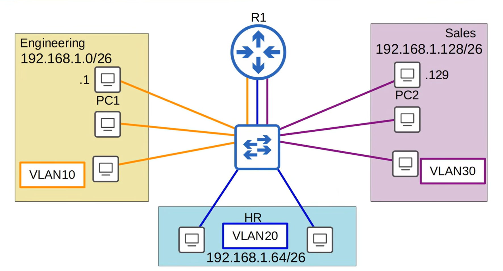

Como exatamente atribuímos esses hosts às VLANs? Nós os configuramos no switch. Mais especificamente, nas interfaces do switch. Você configura a interface do switch para pertencer a uma VLAN específica e, então, o host final conectado a essa interface passa a fazer parte dessa VLAN.  

O switch tratará cada VLAN como uma LAN separada e não encaminhará tráfego entre as VLANs, incluindo tráfego de broadcast ou unicast desconhecido. Então, se configurarmos essas VLANs e o PC1 enviar esse mesmo quadro de broadcast, após o quadro chegar ao switch, ele será encaminhado para todas as interfaces NA MESMA VLAN.  
 
Se o broadcast chegar em uma interface configurada na VLAN10, por exemplo, o switch apenas encaminhará o quadro para outras interfaces na VLAN10. Se o PC1 quiser enviar esse mesmo quadro unicast para o PC2, o processo funcionará exatamente como antes.  

Ele envia o quadro para o switch, que o encaminha para o roteador; este altera os endereços MAC de origem e destino e o envia de volta ao switch, que o encaminha para o destino. Observe que o roteador é utilizado para realizar o roteamento entre VLANs.  

O switch não realiza esse "roteamento inter-VLAN". Ele precisa enviar o tráfego através do roteador. Observe, o tráfego que chega em uma interface da VLAN10 é encaminhado para fora por uma interface da VLAN10.  

Além disso, o tráfego que chega em uma interface da VLAN30 é encaminhado para fora por uma interface da VLAN30. Ambos na mesma VLAN. Um switch nunca encaminhará tráfego diretamente entre duas VLANs dessa forma. Bem, antes de tudo, os dois hosts estão em sub-redes separadas, então o próprio PC1 enviará o tráfego para seu gateway padrão, o R1.  

No entanto, mesmo que o PC1 e o PC2 estivessem na mesma sub-rede, o switch não encaminharia o tráfego do PC1 para o PC2, porque eles estão em VLANs separadas.  

### Resumo sobre VLANs  

Apenas uma breve revisão. As VLANs são configuradas nos switches interface por interface. As VLANs separam logicamente os hosts finais na Camada 2. Embora os hosts na topologia que analisamos estivessem fisicamente conectados ao mesmo switch, e, portanto, no mesmo domínio de broadcast, usamos VLANs para separá-los logicamente, e colocá-los em domínios de broadcast separados.  
  
Switches não encaminham tráfego diretamente entre hosts em VLANs diferentes. Como mostrei a vocês, o switch deve encaminhar o tráfego para um roteador. Na verdade, existem alguns outros métodos de roteamento entre VLANs, e eu os abordarei em breve.  

Por fim, vamos dar uma olhada na configuração básica de VLAN. 

## Configuração de VLAN  
 
Adicionei os números das interfaces ao diagrama; as interfaces na VLAN10 vão da G1/0 até a G1/3. As interfaces na VLAN20 vão da G2/0 até a G2/2. E as interfaces na VLAN30 vão da G3/0 até a G3/3.  

Vamos acessar a CLI e colocar essas interfaces nas VLANs corretas. Antes da configuração, vamos ver quais VLANs existem por padrão em um switch.  

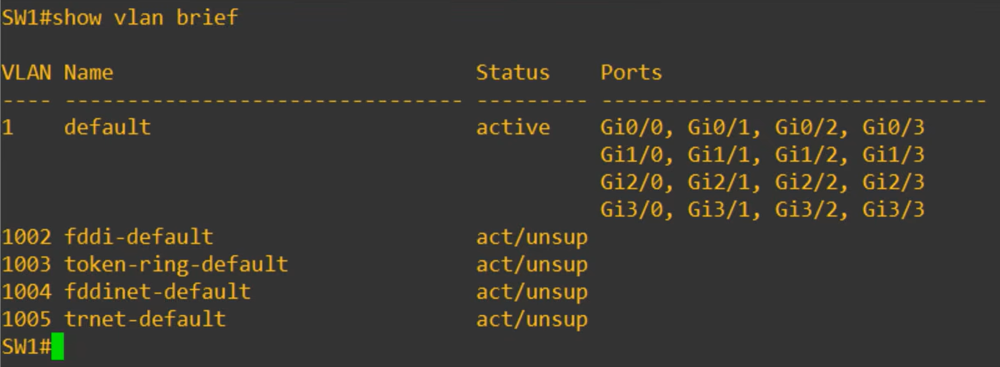

Nesta saída, você pode ver que usei o comando `show vlan brief`. Ele exibe as VLANs existentes no switch e quais interfaces pertencem a cada VLAN.  

Aqui, você pode ver a VLAN1, com o nome DEFAULT. Essa é a VLAN à qual todas as interfaces são atribuídas por padrão. Portanto, mesmo que você não configure nenhuma VLAN, todas as interfaces ficam na VLAN1 por padrão.  

Em "ports" (portas), você pode ver todas as interfaces deste dispositivo, da G0/0 até a G3/3. 

Abaixo delas, há outras quatro VLANs — de 1002 a 1005 — usadas para FDDI e Token Ring. Essas são tecnologias antigas. 

As VLANs 1 e 1002-1005 existem por padrão e não podem ser excluídas; lembre-se disso!  

É assim que se atribui interfaces a uma VLAN.  

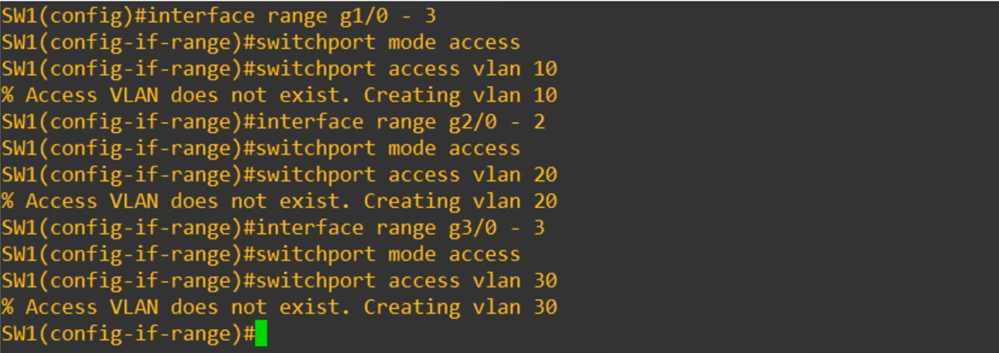

Primeiro, usei o comando de intervalo de interfaces, `interface range`, para configurar todas as interfaces da VLAN 10 de uma só vez.  

Use o comando `switchport mode access` para definir a interface como uma porta de acesso. O que é uma porta de acesso?  
  
Uma porta de acesso é uma porta de switch que pertence a uma única VLAN e, geralmente, conecta-se a dispositivos finais, como PCs. É por isso que se chama porta de acesso (*access port*): ela dá aos dispositivos finais acesso à rede.  

Existe outro tipo importante de porta de switch, chamada de porta *trunk* (tronco). Portas de switch que transportam múltiplas VLANs são chamadas de portas *trunk*.  Vou abordar as portas *trunk* detalhadamente depois, mas, agora, vamos focar apenas nas portas de acesso e avançar passo a passo.  

Uma porta de switch conectada a um dispositivo final deve entrar no modo de acesso por padrão; no entanto, é sempre uma boa ideia configurar essa definição explicitamente, em vez de depender da autonegociação do tipo de porta. De qualquer forma, o último comando após `switchport mode access` é `switchport access vlan 10`.  

Este é o comando que realmente atribui a VLAN à porta. Observe a mensagem que aparece após esse comando.  
 
> %Access VLAN does not exist. (A VLAN não existe.) Creating vlan 10. (Criando a VLAN 10.)   

Como a VLAN 10 ainda não existia no dispositivo, ela foi criada automaticamente quando atribuímos a interface à VLAN 10. Vou mostrar como criar uma VLAN manualmente posteriormente.  

Em seguida, usei novamente o comando de intervalo de interfaces (*interface range*) para configurar todas as interfaces da VLAN 20 de uma só vez. Usei o mesmo comando `switchport mode access` e, depois, `switchport access vlan 20` para atribuir as interfaces à VLAN 20.  

Por fim, fiz o mesmo para a VLAN 30 e, mais uma vez, a VLAN foi criada automaticamente. Então, usei o comando `show vlan brief` mais uma vez, e aqui você pode ver as três VLANs que criamos e as portas que atribuímos a cada VLAN.  

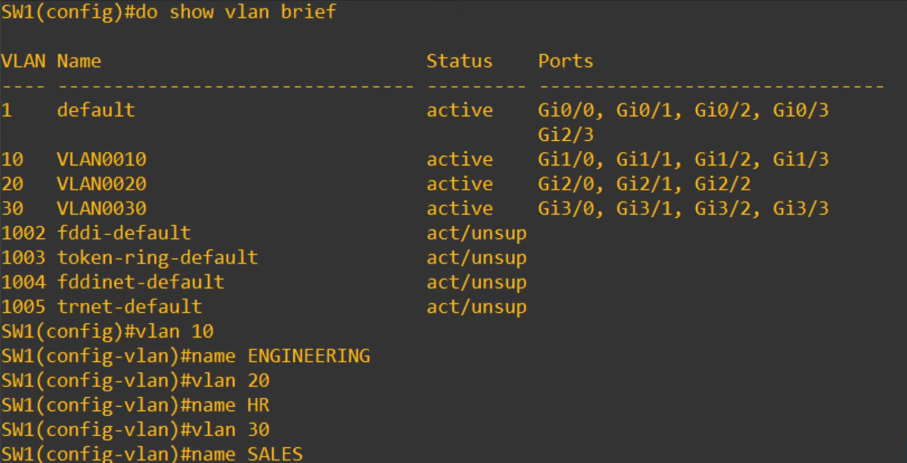

Observe os nomes padrão de cada VLAN; vamos alterá-los para tornar tudo mais compreensível. Então, usei o comando `vlan 10` para entrar no modo de configuração da VLAN 10. Aliás, esse também é o comando para criar uma VLAN. Mas, neste caso, ela já havia sido criada automaticamente quando atribuímos as interfaces.  

Em seguida, atribuo o nome com este comando simples: `name ENGINEERRING`.  Depois, faço o mesmo para a VLAN 20 (HR) e para a VLAN 30 (SALES).  Por fim, confirmei mais uma vez com o comando `show vlan brief`.  

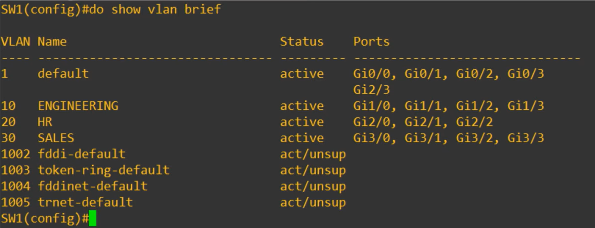

Observe que os nomes foram alterados para ENGINEERING, HR e SALES. Certo, então, isso é tudo em relação às configurações.  

Se eu usar o comando `ping 255.255.255.255` no PC1, enviando um ping com o endereço MAC de destino composto apenas por "F"s — o endereço MAC de broadcast —, o broadcast chegará apenas aos hosts na VLAN10.  

Da mesma forma, se eu usar o mesmo comando no PC2, o broadcast chegará apenas aos PCs na VLAN30.  

## Nova topologia

Para uma rápida revisão, aqui está a topologia de rede utilizada.  

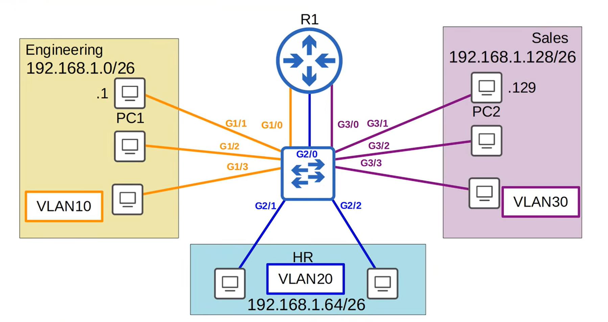

Há um único switch e três VLANs. Todas as interfaces do switch são portas de acesso que pertencem a uma única VLAN: VLAN10, VLAN20 ou VLAN30. Três interfaces são usadas para a conexão com o roteador, uma para cada VLAN. 

Vamos utilizar uma topologia de rede diferente. Aqui está a topologia.

Desta vez, são utilizados dois switches. Observe que a VLAN10, a VLAN do departamento de engenharia, está dividida entre os dois switches. Isso é muito comum, já que os departamentos de uma empresa nem sempre estão divididos exatamente por localização.  

Você pode ter alguns engenheiros em um andar do prédio, por exemplo, e outros em outro andar. Ainda estamos usando apenas portas de acesso. Existem dois links entre o SW1 e o SW2: um para a VLAN10 e outro para a VLAN30.  

É preciso haver um link na VLAN10 entre os dois switches, pois há PCs da VLAN10 conectados tanto ao SW1 quanto ao SW2, e também porque os PCs conectados ao SW1 precisam conseguir alcançar o R1 através do SW2. Quanto ao link na VLAN30, ele é necessário porque os PCs da VLAN30 também precisam conseguir alcançar o R1 através do SW2. 

Não há link na VLAN20 entre o SW1 e o SW2. Isso ocorre porque não há PCs da VLAN20 conectados ao SW1. Os PCs da VLAN20 ainda podem alcançar os PCs conectados ao SW1; o R1 realizará o roteamento inter-VLAN. Deixe-me demonstrar esse roteamento inter-VLAN. 

Digamos que um PC na VLAN20 queira enviar tráfego para um dos PCs da VLAN10 conectados ao SW1. Ele enviará o quadro com o endereço MAC de destino do R1, seu gateway padrão. O R1 então o encaminha de volta para o SW2. O tráfego chegará ao SW2 pela interface da VLAN10; o tráfego agora está na VLAN10, portanto, ele o encaminha para o SW1 pela conexão da VLAN10 entre eles, e então o SW1 encaminha o tráfego para o PC de destino.

Então, você pode ver que, embora não haja uma conexão VLAN20 entre o SW2 e o SW1, o PC na VLAN20 ainda consegue enviar tráfego para o PC na VLAN10, porque o roteador realiza o roteamento entre VLANs. Em uma rede pequena com poucas VLANs, é possível usar uma interface separada para cada VLAN ao conectar switches entre si e switches a roteadores.

No entanto, quando o número de VLANs aumenta, isso não é viável. Isso resultaria em desperdício de interfaces e, muitas vezes, os roteadores não teriam interfaces suficientes para cada VLAN. Você pode usar "portas de trunk" para transportar tráfego de múltiplas VLANs por uma única interface.  

Mais uma vez, elas são diferentes das portas de acesso, que pertencem a apenas uma VLAN. Vamos dar uma olhada rápida em como as portas de trunk funcionam.
## Trunk ports 

Então, agora substituí aquelas conexões separadas para cada VLAN por uma única conexão entre SW1 e SW2, e entre SW2 e R1. Para tornar mais claro, vamos adicionar aquelas cores.  

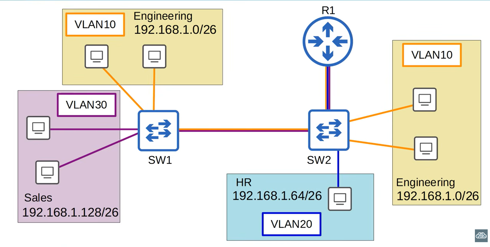
 
Ok, agora você pode ver quais VLANs são permitidas em cada trunk. Lembre-se: são conexões físicas únicas, mas o tráfego de múltiplas VLANs é permitido em cada trunk. 

Digamos que um PC na VLAN10 conectada ao SW2 queira enviar dados para outro PC na VLAN10 conectada ao SW1. Ele envia o tráfego para o SW2, que então o envia para o SW1. Agora, aqui está uma pergunta. Como o SW1 sabe a qual VLAN o tráfego pertence? Tanto a VLAN 10 quanto a 30 são permitidas na interface em que o tráfego foi recebido, mas como o SW1 sabe a qual VLAN ele pertence?

A resposta é a marcação de VLAN (VLAN tagging). Os switches "marcam" (tag) todos os quadros que enviam por um link de trunk. Isso permite que o switch receptor saiba a qual VLAN o quadro pertence. 

Na verdade, outro nome para uma porta *trunk* é porta com *tagged* (marcada), e outro nome para uma porta de acesso é porta  *untagged* (não marcada). Quadros enviados por portas de acesso não possuem *tag*; eles não precisam ter *tag* porque a interface pertence a uma única VLAN. Se um quadro chega a uma porta de switch na VLAN 10, o switch sabe que o quadro pertence à VLAN 10.  

Vamos falar sobre isso.

### Tags de VLAN

Existem dois protocolos principais de trunking: ISL (Inter-Switch Link) e IEEE 802.1Q. Normalmente, chamamos o 802.1Q de "dot1q". 

O ISL é um protocolo antigo e proprietário da Cisco, criado antes do padrão da indústria IEEE 802.1Q. O Dot1q é um protocolo padrão da indústria criado pelo IEEE (Institute of Electrical and Electronics Engineers). Lembra do IEEE? Que tal o IEEE 802.3? Esse é o Ethernet, outro protocolo padrão da indústria.  

Você provavelmente NUNCA usará o ISL no mundo real. Até mesmo equipamentos modernos da Cisco não oferecem suporte a ele. 

Você se lembra dos campos do cabeçalho e do trailer Ethernet? 

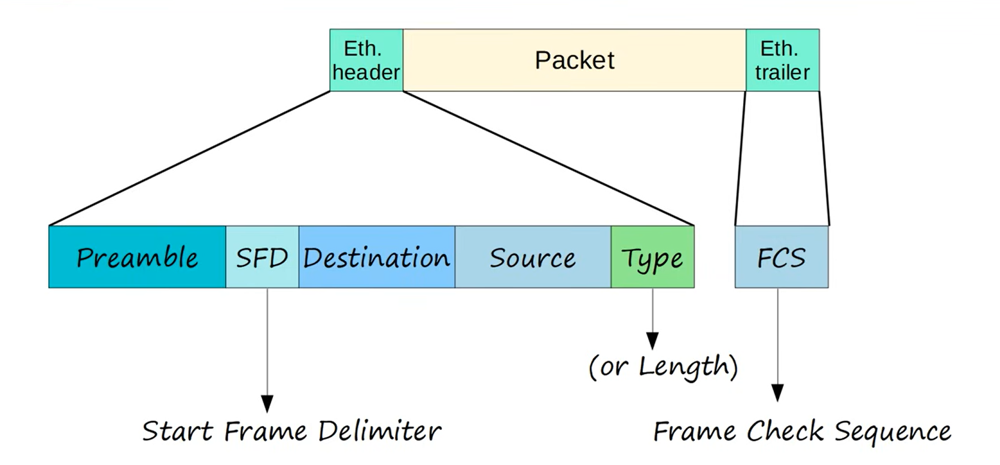

O motivo de eu estar mostrando isso é que a tag dot1q é, na verdade, inserida entre dois campos do cabeçalho Ethernet. O Dot1q insere um campo de 4 bytes (ou 32 bits) entre dois campos deste cabeçalho Ethernet. Vamos dar uma olhada.

Como você pode ver aqui, a tag dot1q é inserida entre o endereço MAC de origem e os campos de tipo ou comprimento do cabeçalho Ethernet. Vamos rever alguns conceitos básicos. 

### Tag 802.1Q 

Como acabei de dizer, a tag 802.1Q é inserida entre os campos Origem (Source) e Tipo/Comprimento (Type/Length) do quadro Ethernet. A tag tem 4 bytes, ou 32 bits, de comprimento. A tag consiste em dois campos principais. São eles: o Identificador de Protocolo da Tag (TPID) e as Informações de Controle da Tag (TCI).  

O TCI, por sua vez, consiste em três subcampos. Vamos dar uma olhada rápida em cada campo da tag dot1q. Aqui está um diagrama do formato da tag dot1q, cortesia da Wikipedia.  

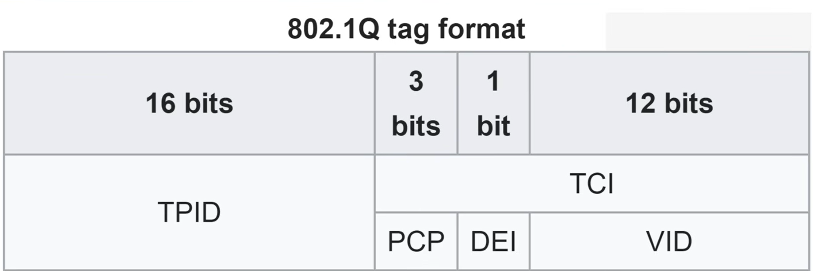

Observe que ela pode ser dividida em duas metades: o TPID e o TCI, que mencionei anteriormente. Além disso, o TCI pode ser dividido em três subcampos: PCP, DEI e VID.  

#### Tag 802.1Q - TPID  

Certo, primeiro vamos analisar o campo TPID. Esse campo tem 16 bits, ou 2 bytes, de comprimento, ocupando metade do tamanho total da tag 802.1Q.  

O TPID é SEMPRE definido com o valor 0x8100. Lembre-se: "0x" indica apenas notação hexadecimal; portanto, o valor real no campo é 8 1 0 0 — quatro dígitos hexadecimais. Cada dígito hexadecimal equivale a 4 bits; logo, 4 x 4 resulta em 16, que é o comprimento total do campo. 

Esse valor 8 1 0 0 indica que o quadro possui uma tag dot1q. Como acabei de mostrar, a tag dot1q aparece logo após o campo de endereço MAC de origem do quadro Ethernet. É nesse local que o campo TIPO (Type) geralmente se encontra. Quando o switch detecta esse valor 8 1 0 0, ele identifica que se trata de um quadro com tag dot1q. Certo, isso é tudo sobre o campo TPID.  

#### Tag 802.1Q – PCP

A seguir, vamos analisar o primeiro campo do TCI, que é o PCP, ou *Priority Code* *Point* (Código de Prioridade). 

O campo tem 3 bits de tamanho. Ele é usado para a Classe de Serviço (CoS), que prioriza tráfego importante em redes congestionadas. Não se preocupe muito com esse campo; basta saber o nome e que ele é usado para CoS.  

#### Tag 802.1Q – DEI  

O próximo é o DEI, ou *Drop Eligible Indicator* (Indicador de Elegibilidade para Descarte). Esse campo tem apenas um bit de tamanho. Ele é usado para indicar quadros que podem ser descartados se a rede estiver congestionada, garantindo assim que o tráfego de rede mais importante consiga passar.  

Certo, por fim, temos um campo muito importante: o VID, ou campo VLAN ID.  

#### Tag 802.1Q – VID  
 
Ele tem 12 bits de tamanho. É o campo que realmente identifica a VLAN à qual o quadro pertence; portanto, pode-se dizer que este é o campo mais importante da tag 802.1Q. Como esse campo tem 12 bits, isso significa que existem 4096 VLANs no total, pois 2 elevado à 12ª potência é igual a 4096. 

No entanto, a primeira e a última VLANs — 0 e 4095 — são reservadas e não podem ser utilizadas. Portanto, o intervalo real de VLANs que pode ser utilizado vai de 1 a 4094. Aliás, o ISL — protocolo proprietário da Cisco e uma alternativa para a marcação de VLANs em conexões *trunk* — também utiliza o intervalo de VLANs de 1 a 4094.  

No entanto, como mencionei anteriormente, você não precisa realmente conhecer o ISL; ele foi praticamente substituído pelo padrão da indústria, o dot1q.  

Então, esses são os campos da *tag* dot1q. Certo, deixe-me falar um pouco mais sobre os intervalos de VLANs.  

### Intervalos de VLANs  

O intervalo de VLANs — que, como mencionei, vai de 1 a 4094 — é dividido em duas seções as "VLANs normais", numeradas de 1 a 1005, e as "VLANs estendidas", numeradas de 1006 a 4094. Alguns dispositivos mais antigos não suportam o intervalo de VLANs estendidas; no entanto, é seguro esperar que switches modernos suportem a faixa estendida de VLANs. 

Certo, então vamos analisar este diagrama mais uma vez. 

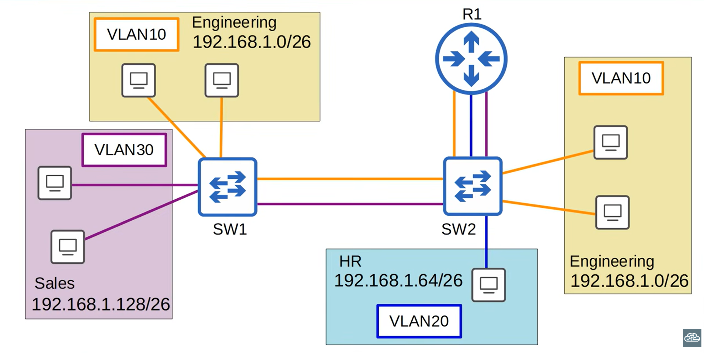

### Tráfego em Portas de Trunk  

Um PC na VLAN 10 conectado ao SW2 quer enviar tráfego para outro PC na VLAN 10 conectado ao SW1. O tráfego vai para o SW2, que então o encaminha para o SW1, com uma tag indicando que o tráfego pertence à VLAN 10. O SW1 recebe o quadro e, como o destino também está na VLAN 10, ele encaminhará o tráfego para o destino.

Lembre-se: um switch padrão de Camada 2 como este só encaminhará tráfego dentro da mesma VLAN; ele não encaminhará tráfego entre VLANs.  

### VLAN Nativa  

Deixe-me apresentar outro conceito do dot1q. O dot1q possui um recurso chamado "native vlan". O ISL da Cisco não possui esse recurso, aliás. A VLAN nativa é a VLAN 1 por padrão em todas as portas de trunk; no entanto, isso pode ser configurado manualmente em cada porta de trunk. 

É importante lembrar que isso deve ser configurado separadamente em cada porta de trunk; não é uma configuração global no switch. Agora, o que exatamente a VLAN nativa faz?  
 
O switch não adiciona uma tag 802.1Q aos quadros da VLAN nativa. Ele encaminha o quadro normalmente, sem adicionar a tag dot1q a ele. Então, o que o switch receptor faz quando recebe esse quadro sem tag em uma porta de trunk? 

Quando um switch recebe um quadro sem tag em uma porta trunk, ele assume que o quadro pertence à VLAN nativa. Portanto, é muito importante que a VLAN nativa corresponda entre os switches! Os switches ainda encaminharão o tráfego se houver uma incompatibilidade de VLAN nativa, mas problemas podem ocorrer. Vamos ver um exemplo.

Digamos que eu tenha configurado a VLAN nativa como VLAN10 no link trunk entre o SW1 e o SW2.

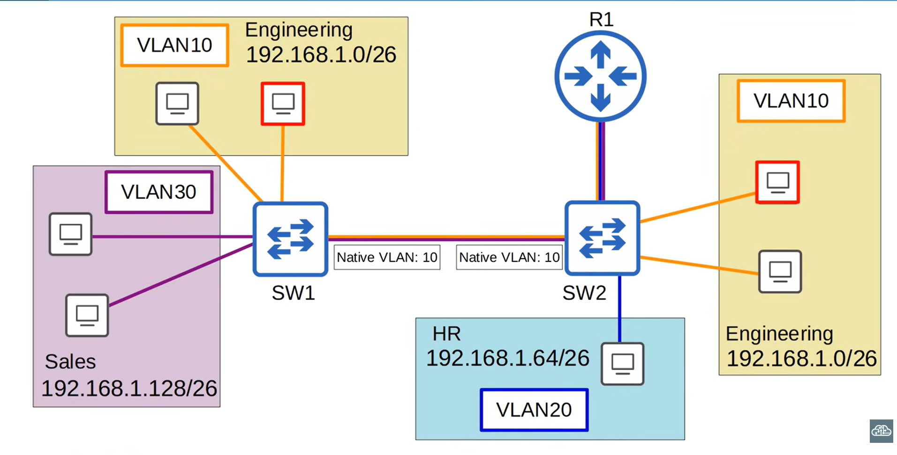

Então, vamos imaginar que o PC envia o tráfego para o SW2. Ele enviará o tráfego para o SW1, mas, como está na VLAN nativa (VLAN10), não adicionará uma tag indicando que pertence à VLAN10. O quadro sem tag chega ao SW1, que assume que o tráfego pertence à VLAN10; então, ele o encaminha para o destino. 

Desta vez, vamos analisar o que acontece se houver uma configuração de VLAN nativa incompatível.  

Na interface do SW2, configurei a VLAN10 como VLAN nativa. No entanto, na interface do SW1, configurei a VLAN30 como VLAN nativa.  

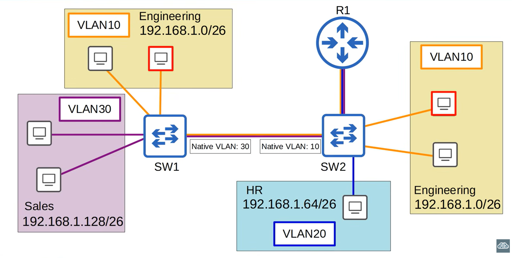

Vamos ver o que acontece. Até o momento em que o tráfego chega ao SW1, tudo ocorre da mesma forma. No entanto, quando o SW1 recebe o quadro, é isso que ele pensa: "Este quadro não tem tag de VLAN, portanto, ele deve pertencer à VLAN30". Mas o destino está na VLAN10, não na VLAN30.  

Assim, ele não encaminhará o tráfego para a VLAN10. Acho que agora você consegue entender por que é importante que a configuração da VLAN nativa corresponda entre os switches. 

Certo, vamos finalmente passar para a configuração das portas trunk. Adicionei os números das interfaces ao diagrama para facilitar a compreensão.

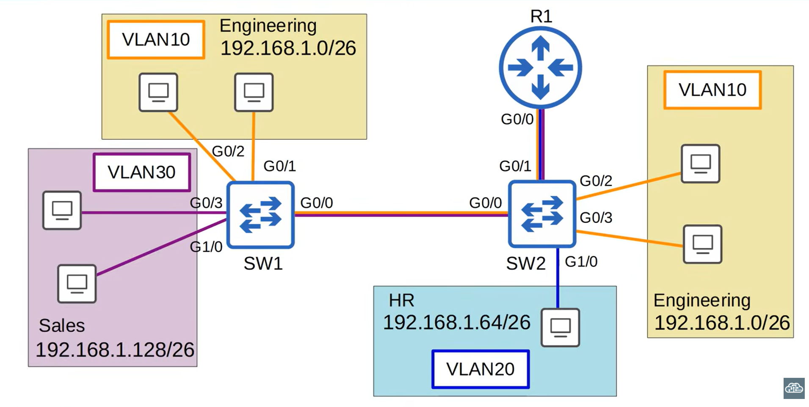

Então, vamos configurar a G0/0 no SW1, e as interfaces G0/0 e G0/1 no SW2 como portas de tronco (*trunk ports*). Vamos começar pelo SW1.

### Configuração de Tronco  

Primeiro, vejamos a configuração de tronco mais básica: configurar manualmente a interface como tronco.

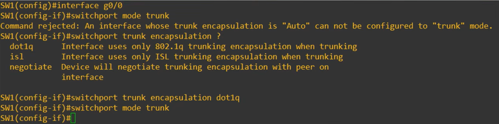

Após entrar no modo de configuração da interface, utilize o comando `switchport mode trunk` para configurar manualmente a interface como tronco. No entanto, neste caso, recebemos uma mensagem de erro.  

"Comando rejeitado: uma interface cuja encapsulação de tronco está definida como 'auto' não pode ser configurada para o modo 'trunk'."

Isso é um pouco peculiar. Muitos switches modernos não oferecem suporte algum ao protocolo ISL da Cisco. Eles suportam apenas o dot1q. Embora o ISL seja um protocolo proprietário da Cisco, até mesmo os switches da Cisco estão migrando para suportar apenas o dot1q.

No entanto, switches que suportam tanto dot1q quanto ISL (como aquele que estou usando neste exemplo) têm a encapsulação de tronco definida como 'auto' por padrão. Para configurar manualmente a interface como uma porta de tronco, você deve primeiro definir a encapsulação como 802.1Q ou ISL. Em switches que suportam apenas dot1q, isso não é necessário.  

Depois de definir o tipo de encapsulação, você pode configurar a interface como tronco. Para isso, você utiliza o comando `switchport trunk encapsulation`. Usei o ponto de interrogação para ver as opções. Há dot1q, isl e negotiate. A opção 'negotiate' define o modo como 'auto', então não podemos escolhê-la.  

> A propósito, falarei mais sobre o modo 'auto' posteriormente.

Defino o encapsulamento como dot1q e, então, desta vez o comando `switchport mode trunk` é aceito. Em switches que suportam apenas dot1q, você precisará APENAS do comando `switchport mode trunk`, mas em alguns switches será necessário definir o encapsulamento primeiro.  

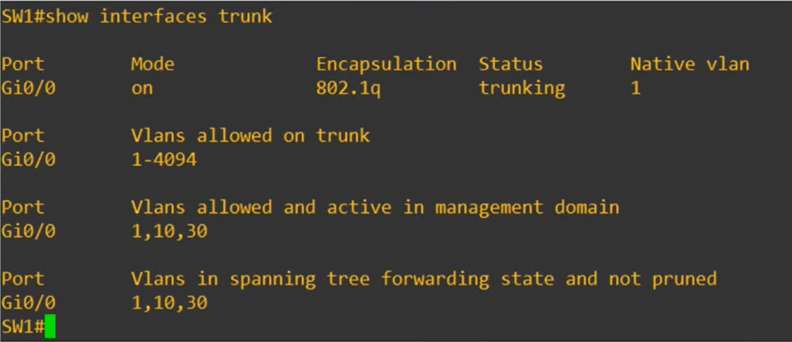

Usei o comando `show interfaces trunk` para confirmar. Primeiramente, as interfaces de trunk estão listadas aqui. "Mode on" significa que a interface foi configurada manualmente como trunk. O encapsulamento é dot1q, conforme configuramos; o status é trunking; e a VLAN nativa, que eu mencionei anteriormente, é a padrão (VLAN 1).

Logo abaixo, são exibidas as VLANs permitidas no trunk. Por padrão, TODAS as VLANs, de 1 a 4094, são permitidas no trunk. No entanto, por questões de segurança, podemos querer limitar quais VLANs podem ser encaminhadas pelo trunk; portanto, veremos essa configuração a seguir.  

A seguir, temos as VLANs permitidas e ativas no domínio de gerenciamento. Isso inclui a VLAN padrão 1, bem como as VLANs 10 e 30, que eu já configurei neste switch. Observe que, embora a VLAN 1 — que existe por padrão — apareça aqui, as VLANs de 1002 a 1005, que mostrei no anteriormente, não aparecem. Como mencionei antes, não se preocupe com essas VLANs; elas não são realmente utilizadas em redes modernas.

O último campo do comando `show interfaces trunk` é "Vlans in spanning tree forwarding state and not pruned" (VLANs em estado de encaminhamento no Spanning Tree e não podadas). Isso está relacionada ao Spanning Tree e podagem (pruning) de VLANs. 

Aqui está o comando para configurar as VLANs permitidas em um trunk: `switchport trunk allowed vlan`.

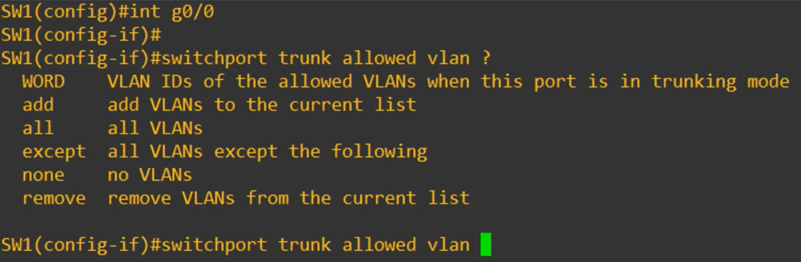

Há algumas opções disponíveis. A opção `WORD` permite configurar simplesmente a lista de VLANs permitidas. 

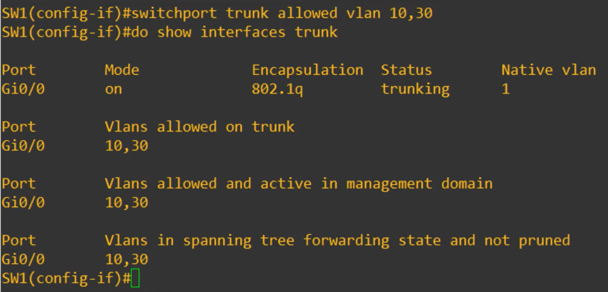

Vamos ver como isso funciona. Então, usei o comando `switchport trunk allowed vlan 10,30`. Observe que o comando `show interfaces trunk` agora mostra apenas as VLANs 10 e 30 como permitidas no tronco. 

Agora, vamos dar uma olhada na opção `add`. Ela permite adicionar VLANs permitidas à lista existente. Atualmente, as VLANs 10 e 30 estão permitidas; digamos que eu também queira adicionar a 20, mesmo que nenhum host da VLAN 20 esteja conectado ao SW1. Desta vez, usei o comando `switchport trunk allowed add 20`.  

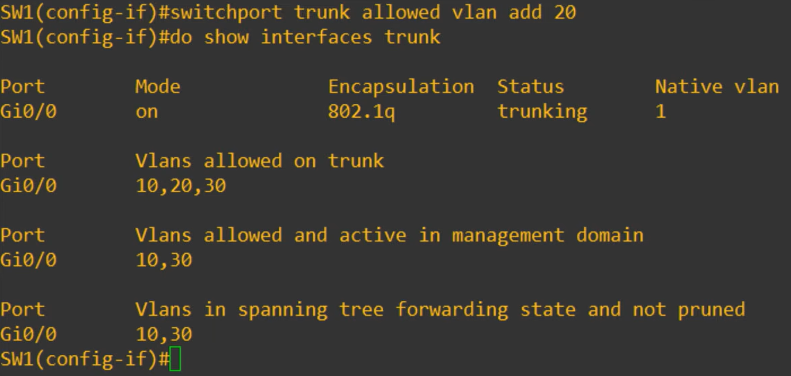

O comando `show interfaces trunk` agora mostra as VLANs 10, 20 e 30 como permitidas; portanto, a 20 foi adicionada à lista. Note que, como não criei a VLAN 20 neste switch, ela ainda não é exibida na seção de VLANs permitidas e ativas no domínio de gerenciamento. A seguir, vou mostrar a opção `remove`. A VLAN 20 não é necessária neste tronco, então vamos removê-la.  

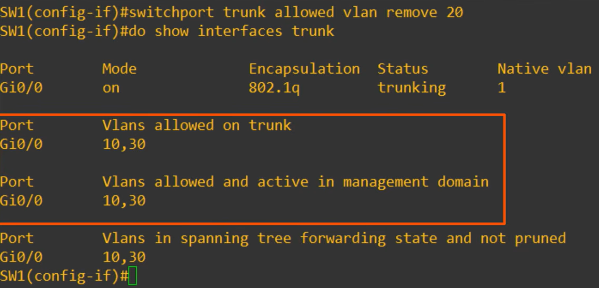

Usei o comando `switchport trunk allowed vlan remove 20`. Agora, como você pode ver, a VLAN 20 foi removida da lista de VLANs permitidas, restando apenas as VLANs 10 e 30. Em seguida, vamos ver a opção `all`. Acho que esta é bem óbvia, mas vamos dar uma olhada assim mesmo.  

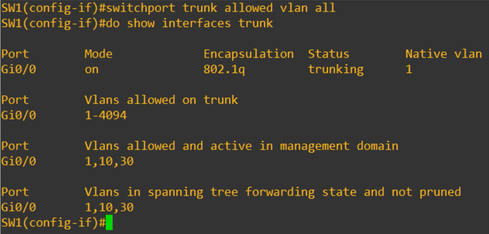

Desta vez, usei o comando `switchport trunk allowed vlan all`. Agora, todas as VLANs são permitidas no tronco. Isso é o mesmo que o estado padrão, já que todas as VLANs são permitidas por padrão. A seguir, vamos analisar a opção `except`. Ela permite todas as VLANs, exceto aquelas que você especificar. Vamos conferir. 

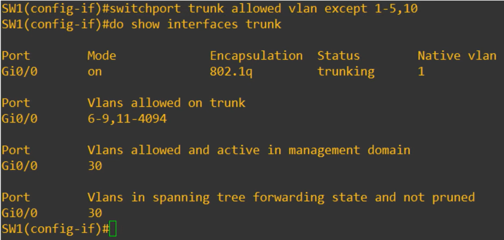

Usei o comando `switchport trunk allowed vlan except 1-5, 10`.  Como você pode ver, ela permite todas as VLANs, exceto essas; ou seja, da 6 a 9 e da 11 a 4094. Certo, finalmente vamos ver a opção `none`, que também é bem fácil de entender.  

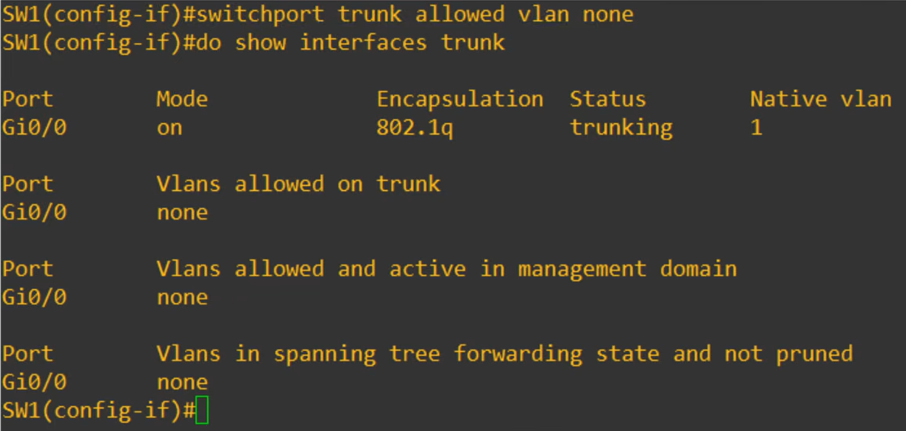

Desta vez, usei o comando `switchport trunk allowed vlan none` e, como você pode ver, nenhuma VLAN é permitida no tronco. Isso efetivamente impede a passagem de qualquer tráfego pelo tronco; então, agora vamos realizar as configurações desejadas para esta rede. Aqui está o diagrama mais uma vez.  

O SW1 tem hosts das VLANs 10 e 30 conectados a ele. Não há hosts da VLAN 20 conectados, portanto, não há necessidade de permitir a VLAN 20 no tronco entre o SW1 e o SW2. Assim, vamos definir as VLANs permitidas como 10 e 30, como fizemos anteriormente.  

Certo, pronto. Agora, as únicas VLANs permitidas no tronco são as VLANs 10 e 30. O motivo para fazer isso é a segurança: garantir que apenas o tráfego das VLANs necessárias possa utilizar essa conexão. Além disso, para o desempenho da rede, isso evita tráfego desnecessário, pois broadcasts e outros tipos de tráfego de outras VLANs não serão enviados pelo tronco. 

Agora, eu disse que mostraria como alterar a VLAN nativa. Por questões de segurança, o ideal é alterar a VLAN nativa para uma VLAN que não esteja sendo utilizada. Além disso, lembre-se de configurar a VLAN nativa de forma consistente entre os switches. Agora, vamos ver como alterar a VLAN nativa.  

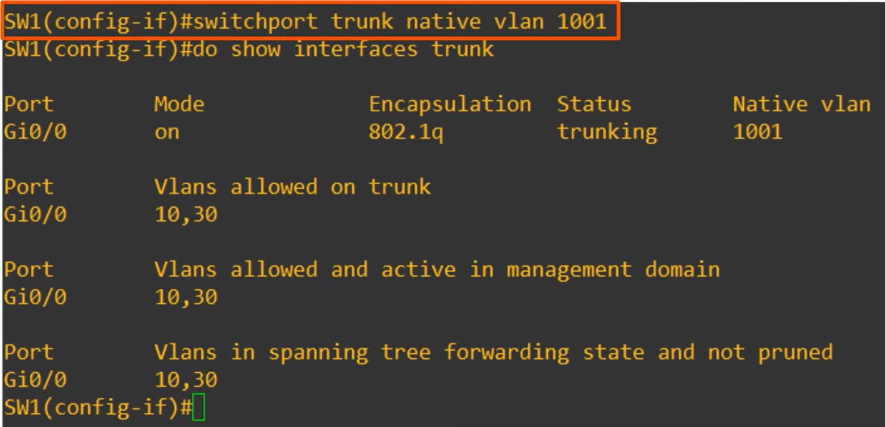

O comando para alterar a VLAN nativa é `switchport trunk native VLAN`, seguido pelo número da VLAN. Escolhi uma VLAN não utilizada, a 1001. Como você pode ver, a VLAN nativa foi alterada para 1001. Após configurar essa porta de tronco (*trunk*), executei o comando `show vlan brief`. 

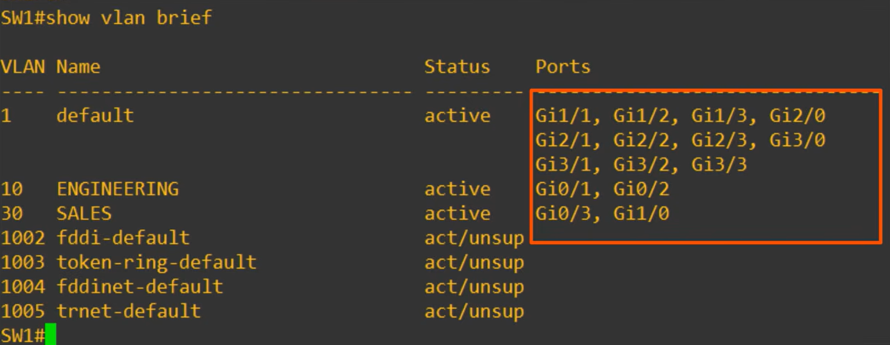

Observe que a G0/0 não aparece em lugar nenhum. Nem na VLAN 10 nem na VLAN 30, embora essas sejam as VLANs permitidas no tronco. Isso ocorre porque o comando `show vlan brief` exibe as portas de acesso atribuídas a cada VLAN, e não as portas de tronco que permitem a passagem de cada VLAN.

Em vez disso, utilize o comando `sh interfaces trunk` para verificar as portas de tronco.  

Agora que vimos as configurações no SW1, farei rapidamente as configurações no SW2 também.  

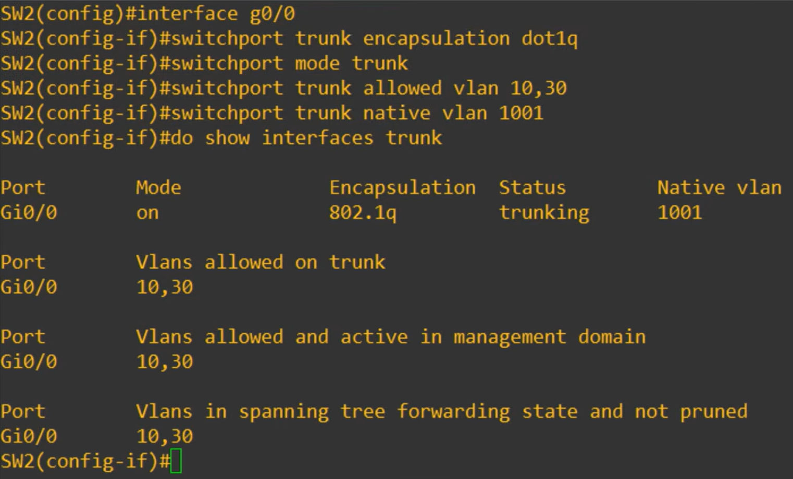

Na interface G0/0 do SW2, devemos permitir as VLANs 10 e 30. Já na interface G0/1 do SW2, devemos permitir também a VLAN 20. Aqui estão as configurações para a interface G0/0 do SW2, a interface conectada ao SW1. Elas são iguais às anteriores, então não vou detalhar cada uma.
  
Agora vamos passar para a G0/1, que está conectada ao R1. Certo, aqui estão as configurações.  

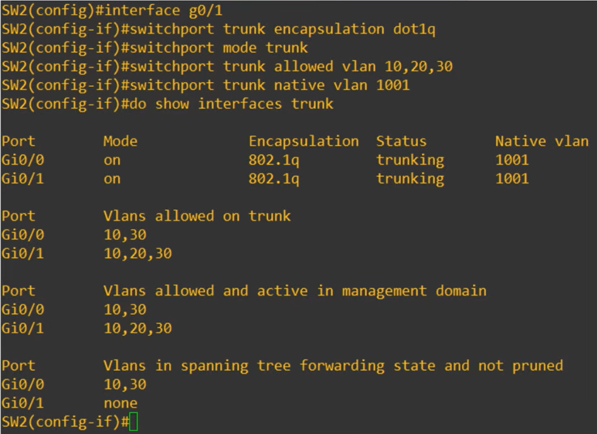

Quase idênticas às da G0/0, exceto pelo fato de que permiti a VLAN 20 além das VLANs 10 e 30. Agora, tanto a G0/0 quanto a G0/1 aparecem na saída do comando `show interfaces trunk`. Então, é isso quanto às configurações dos switches por agora. No entanto, você pode estar se perguntando sobre o roteador. Anteriormente, usamos três interfaces separadas para a conexão do SW2 ao R1, e atribuímos um endereço IP diferente a cada uma delas no R1. 

Cada um deles servia como endereço de gateway padrão para os PCs em cada VLAN. No entanto, agora estamos usando apenas uma conexão física entre os dois dispositivos. Portanto, devemos usar "subinterfaces" no R1. Vamos dar uma olhada.  

## Router on a Stick (ROAS)

"Router on a Stick" (Roteador em uma Haste), também conhecido pela sigla ROAS. É um nome um tanto peculiar, mas é a denominação utilizada para esse método de roteamento entre VLANs, visto que existe apenas uma única interface física conectando o roteador ao switch, e ela se assemelha a uma "haste" no diagrama de topologia da rede.

Assim, neste caso, a interface física utilizada no R1 para conexão com o SW2 é a G0/0. Ela está conectada à interface G0/1 do SW2. Porém, podemos dividir essa interface física única em três subinterfaces distintas, o que nos permitirá realizar o roteamento entre VLANs utilizando apenas uma interface física. O resultado seria algo assim:  
  
- G0/0.10 para a VLAN 10;
- G0/0.20 para a VLAN 20; e 
- G0/0.30 para a VLAN 30. 

Essas três subinterfaces lógicas constituem, na verdade, uma única interface física — a G0/0 —, que está conectada à interface G0/1 do SW2, mas elas podem operar como se fossem três interfaces independentes. Antes de analisarmos as configurações do roteador, observe que não precisamos realizar nenhuma configuração adicional no SW2.  
  
Já configuramos a G0/1 como um tronco (trunk) e garantimos que as VLANs 10, 20 e 30 estejam permitidas. Isso é tudo o que é necessário fazer no switch: configurar a interface como um tronco convencional.

Agora, vamos analisar as configurações do roteador. Aqui estão as configurações.  

### Configuração de ROAS

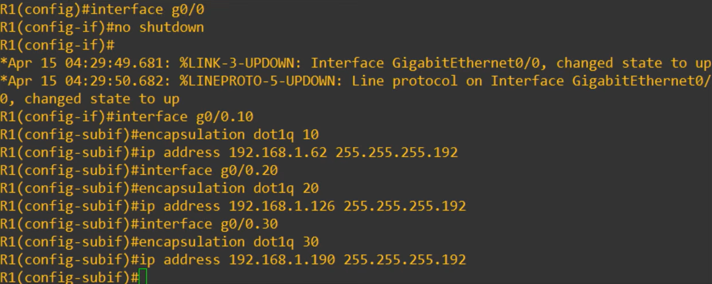

Primeiro, certifique-se de que a interface esteja habilitada com o comando `no shutdown`, pois as interfaces do roteador vêm desabilitadas por padrão. A seguir, temos a primeira subinterface. Observe como entrar no modo de configuração da subinterface: `interface g0/0.10`. O número dessa subinterface não precisa coincidir com o número da VLAN. No entanto, é altamente recomendável que coincidam, para facilitar a compreensão. Se o número de cada subinterface corresponder ao número da VLAN, fica fácil identificar qual subinterface é utilizada para cada VLAN. 

O próximo comando é `encapsulation dot1q`, seguido pelo número da VLAN, que é 10 neste caso. Isso instrui o roteador a tratar quaisquer quadros recebidos que contenham a tag da VLAN especificada como se tivessem chegado por essa subinterface. Se um quadro chegar com a tag VLAN10, o R1 agirá como se ele tivesse chegado pela interface G0/0.10. Ele também adicionará a tag VLAN10 a todos os quadros que saírem dessa subinterface, utilizando o padrão dot1q.  

Por fim, após o comando `encapsulation dot1q`, basta atribuir o endereço IP à subinterface. Mais uma vez, atribuí o último endereço utilizável da sub-rede. E isso é tudo para esta subinterface.  

Depois, fiz o mesmo com as outras duas subinterfaces. Novamente, fiz com que os números da subinterface e da VLAN coincidissem e configurei o último endereço IP utilizável de cada sub-rede como o endereço IP da subinterface.  

Ao verificar com o comando `show ip interface brief`, é possível ver que cada uma das subinterfaces aparece, assim como a interface física, embora a interface física em si não tenha nenhum endereço IP atribuído a ela.

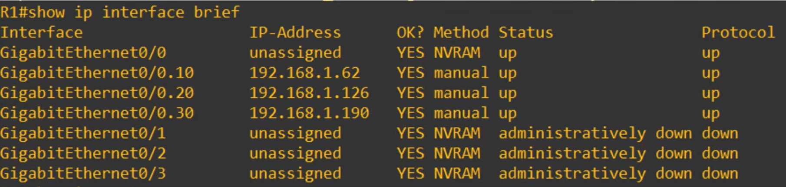

E aqui está a tabela de roteamento.  

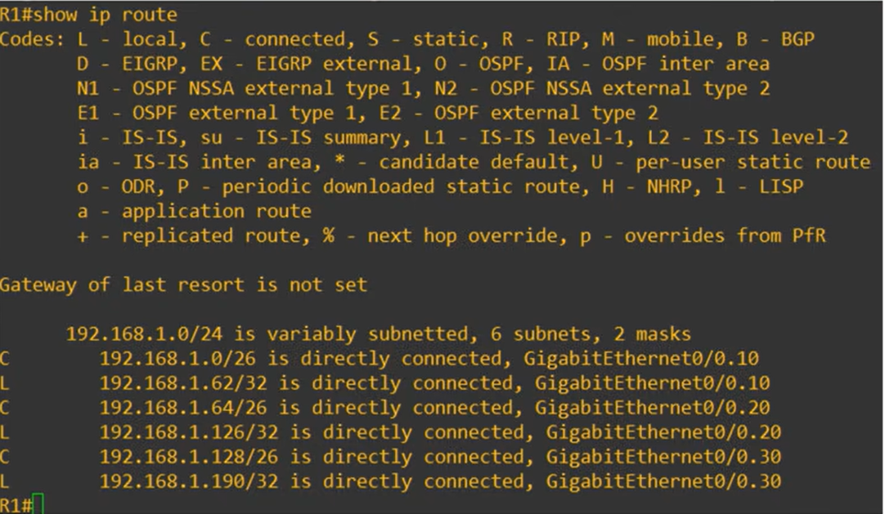

Observe que as rotas conectadas e locais são adicionadas exatamente como quando endereços IP são atribuídos a interfaces físicas comuns. Quando o R1 envia quadros a partir dessas subinterfaces, ele adiciona a tag VLAN configurada na subinterface. Por exemplo, se um pacote chegar com destino à sub-rede 192.168.1.64/26, ele enviará o pacote pela sua interface G0/0 com a tag da VLAN20. 

Certo, vamos rever os pontos importantes sobre o *router-on-a-stick* (ROAS). O ROAS é usado para rotear entre múltiplas VLANs utilizando uma única interface no roteador e no switch. A interface do switch é configurada como um *trunk* padrão. A interface do roteador é configurada usando subinterfaces. Você configura a tag da VLAN e o endereço IP em cada subinterface.  

O roteador se comportará como se os quadros que chegam com uma determinada tag de VLAN tivessem chegado à subinterface configurada com essa tag. Finalmente, o roteador adicionará a tag da VLAN configurada aos quadros enviados por cada subinterface na própria subinterface. Agora que configuramos o roteador, vamos voltar a este diagrama para ver como o roteamento inter-VLAN funciona com essas subinterfaces. 

Imaginando que um PC na VLAN10 está tentando alcançar um PC na VLAN30. O quadro é enviado para o SW2. O SW2 envia o quadro pela sua interface G0/1 para o R1, marcando-o como pertencente à VLAN10. O R1 o recebe na interface G0/0, identificando que ele chegou pela subinterface G0/0.10 devido à tag da VLAN10. 

O destino está na sub-rede 192.168.1.128/26, que está conectada à subinterface G0/0.30 do R1, então ele envia o quadro pela sua interface G0/0. Ele adiciona a tag da VLAN30 porque foi isso que foi configurado na subinterface G0/0.30. O SW2 então o encaminha para o SW1, marcando-o como VLAN30 através do *trunk*. O SW1 então encaminha o quadro para o destino.

## Native VLAN no roteador

VLAN Nativa em um roteador. Eu mencionei antes que a melhor prática é definir a VLAN nativa como uma VLAN não utilizada, pois o recurso de VLAN nativa pode causar alguns problemas de segurança. No entanto, se você quiser utilizar o recurso de VLAN nativa, vamos ver como configurá-lo em um roteador.  

O recurso de VLAN nativa oferece uma vantagem. Como os quadros na VLAN nativa não são marcados (tagged), o processo é mais eficiente; cada quadro  
3:08  
é menor, permitindo que o dispositivo envie mais quadros por segundo.  
3:14  
No vídeo anterior, defini a VLAN nativa como 1001 na interface G0/0 do SW1 e nas interfaces  
3:21  
G0/0 e G0/1 do SW2. Portanto, apenas para esta demonstração, vamos redefini-las para uma VLAN em uso: a VLAN 10 em todos os troncos (trunks).  
Configurando a VLAN Nativa em um Roteador  
3:31  
Existem dois métodos para configurar a VLAN nativa em um roteador; vamos dar uma olhada rápida em ambos.  
3:38  
Primeiro, você pode usar o comando ENCAPSULATION DOT1Q, seguido pelo ID da VLAN e, depois,  
3:44  
por NATIVE. Isso indica ao roteador que essa subinterface pertence à VLAN nativa e que ela funcionará  
3:50  
exatamente como a VLAN nativa em um switch. O roteador assumirá que quadros não marcados pertencem à VLAN nativa e que os quadros enviados na VLAN  
3:58  
nativa não serão marcados. A segunda opção é não utilizar uma subinterface, mas apenas configurar o endereço IP  
4:05  
para a VLAN nativa na interface física do roteador. O comando ENCAPSULATION DOT1Q não é necessário neste caso.  
4:13  
Certo, vamos analisar cada opção. Primeiro, vou configurar a primeira opção.  
4:19  
Aqui está. Na interface g0/0.10, configurei ENCAPSULATION DOT1Q 10 NATIVE.  
4:28  
Observe que esta é a topologia completa do vídeo da aula anterior, portanto, o endereço IP já está configurado.  
4:35  
A única alteração é que adicionei NATIVE ao comando encapsulation dot1q.  
Análise no Wireshark (SW2 para R1)  
4:40  
Vamos aproveitar para examinar uma captura do Wireshark e demonstrar a VLAN nativa.  
4:47  
Este PC na VLAN20 tem o endereço IP 192.168.1.65, e este PC na VLAN10 tem o endereço IP  
4:56  
192.168.1.1. Vou usar o Wireshark para monitorar essa conexão entre R1 e SW2.  
5:05  
O Wireshark capturará todos os quadros nessa conexão, em ambas as direções, para que possamos observar o tráfego que está passando.  
5:11  
Vamos enviar aquele ping. Primeiro, examinaremos a captura da mensagem de solicitação de eco ICMP (echo request)  
5:17  
enquanto ela segue do SW2 para o R1. Ela estará na VLAN20 e está sendo enviada ao R1 para roteamento entre VLANs.  
5:25  
Aqui está a captura do Wireshark para a solicitação de eco ICMP enquanto ela segue do SW2 para o R1.  
5:32  
Primeiro, você pode ver os endereços IP de origem e destino aqui. Agora, vamos examinar o cabeçalho Ethernet que encapsula o pacote IP.  
5:41  
Especificamente, observe aqui. Tipo: LAN virtual 802.1Q; observe o valor hexadecimal 8100 aqui.  
5:51  
Eu disse no vídeo anterior que o dot1q é inserido após o campo de endereço MAC de origem,  
5:57  
e é aí que fica o campo TIPO.

...geralmente fica. Este aqui é o campo 'TPID' da tag dot1q.  
6:04  
Logo abaixo, temos os demais campos da tag 802.1Q. O primeiro é o PCP (*Priority Code Point*).  
6:13  
Ele tem valor 0, portanto, nenhuma prioridade especial é atribuída a este quadro.  
6:18  
Abaixo dele está o DEI (*Drop Eligible Indicator*). Novamente, o valor é 0; logo, ele não será descartado em momentos de congestionamento da rede.  
6:28  
A seguir, temos o campo mais importante: o VLAN ID, que é 20, como seria de esperar.  
6:34  
O PC que enviou o *ping* está na VLAN 20; como não se trata da VLAN nativa, o quadro recebe uma tag.  
6:40  
Por fim, abaixo disso, temos o campo TYPE padrão do cabeçalho Ethernet, indicando que um pacote IPv4 está encapsulado.  
6:49  
Normalmente, ele vem logo após o campo SOURCE MAC ADDRESS, mas agora a tag dot1q está posicionada entre eles.  
Análise no Wireshark (do R1 para o SW2)  
6:56  
Agora, vamos examinar a solicitação de eco ICMP enviada do R1 de volta para o SW2.  
7:01  
Ela estará na VLAN 10, pois o destino pertence à VLAN 10. A VLAN 10 está configurada como VLAN nativa tanto no R1 quanto no SW2; vamos ver o que muda.  
7:14  
Aqui está exatamente a mesma solicitação de eco ICMP — o mesmo pacote de camada 3 — conforme é enviada  
7:20  
do R1 para o SW2. O que há de diferente? Ela foi encapsulada com um novo cabeçalho Ethernet, mas esse cabeçalho não  
7:29  
possui uma tag dot1q. É a função de VLAN nativa em ação. Tanto o R1 quanto o SW2 entendem que quadros sem tag pertencem à VLAN 10; portanto, não há necessidade de marcar  
7:39  
cada quadro com uma tag dot1q. Essa solicitação de eco ICMP seguirá para o destino, sem tag durante todo o trajeto, pois  
7:47  
a VLAN10 está configurada como a VLAN nativa em todos os dispositivos. Quando esse PC na VLAN10 enviar a resposta de eco ICMP, ela não terá tag até chegar ao  
7:58  
R1, que então adicionará a tag da VLAN20 e a enviará de volta ao PC que fez a solicitação.  
Configuração da VLAN Nativa em um Roteador (continuação)  
8:05  
Agora, vamos dar uma olhada rápida no segundo método de configuração da VLAN nativa em um roteador, que consiste simplesmente em configurar o endereço IP na interface física do roteador,  
8:14  
sem a necessidade de uma subinterface ou do comando de encapsulamento dot1q.  
8:19  
Veja como configurá-lo. Primeiro, usei o comando ‘NO INTERFACE G0/0.10’.  
8:25  
Isso exclui a subinterface. Em seguida, entrei no modo de configuração da interface G0/0 e simplesmente configurei o endereço IP  
8:33  
apropriado na interface. Para ajudar na visualização, aqui está a saída do comando SHOW RUNNING-CONFIG para a G0/0 e suas subinterfaces.  
8:45  
Primeiramente, estes comandos na interface física já existem por padrão; eu não os configurei.  
8:51  
A interface física é configurada normalmente com um endereço IP. Ele será usado para a VLAN nativa, a VLAN10.  
8:59  
As outras subinterfaces estão configuradas exatamente como no vídeo anterior, com o comando de encapsulamento  
9:04  
dot1q e seus próprios endereços IP. Isso funcionará da mesma forma que a primeira opção que vimos.  
9:11  
O SW2 enviará pacotes da VLAN10 em quadros sem tag para o R1, e o R1 também os enviará em quadros  
9:18  
sem tag. Como mencionei anteriormente, recomenda-se alterar a VLAN nativa para uma VLAN não utilizada  
9:25  
por questões de segurança; no entanto, se você quiser utilizar a VLAN nativa, é importante saber como configurá-la em um roteador. Aqui estão dois métodos que você pode utilizar.  
9:34  
Aliás, você também pode precisar saber isso para o seu exame. Aqui está o diagrama de rede mais uma vez.  
Introdução aos Switches de Camada 3 (Multicamada)  
9:40  
Temos um roteador e dois switches. Ou melhor, dois switches de Camada 2.  
9:47  
Este é o ícone que temos utilizado para switches comuns de Camada 2. Mas deixe-me apresentar a você outro tipo de switch.  
9:55  
Este é o ícone que usarei para o chamado switch de Camada 3, também conhecido como switch  
10:00  
multicamada. De agora em diante, usarei qualquer um dos termos: switch de Camada 3 ou switch multicamada.  
10:06  
Você deve conhecer ambos. A propósito, estes são os ícones oficiais da Cisco para um switch de Camada 2 e um switch de Camada 3,  
10:14  
mas acho que os que uso em meus vídeos têm um visual mais limpo e moderno.  
Características do Switch de Camada 3  
10:20  
Primeiro, vamos rever exatamente o que um switch multicamada faz. Um switch multicamada é capaz de realizar tanto a comutação (switching) quanto o roteamento.  
10:28  
Ele reconhece a Camada 3. Um switch comum de Camada 2 NÃO reconhece a Camada 3; ele não leva em conta endereços IP  
10:36  
ou qualquer coisa acima da Camada 2. Ele se preocupa apenas com informações da Camada 2, como endereços MAC.  
10:43  
Você pode atribuir endereços IP às suas interfaces, assim como em um roteador. Anteriormente, não atribuíamos endereços IP a switches, apenas a roteadores.  
10:52  
Com um switch de Camada 3, você pode configurar "portas roteadas" (routed ports), que funcionam como uma interface de roteador. 10:59  
Não apenas interfaces físicas; você também pode criar interfaces virtuais para cada VLAN,  
11:05  
e atribuir endereços IP a essas interfaces. Elas não são interfaces físicas separadas, mas sim interfaces virtuais no  
11:12  
software do switch, que podem ser usadas para rotear tráfego na Camada 3.  
11:18  
Você pode configurar rotas, como rotas estáticas, em um switch multicamada, assim como em um roteador.  
11:23  
Por fim, ele pode ser usado para roteamento entre VLANs. Até agora, nós...

...analisamos dois métodos de roteamento entre VLANs.  
11:31  
O primeiro, apresentado no vídeo do dia 16, utilizava uma conexão para cada VLAN entre o roteador  
11:37  
e o switch. Isso funciona, mas se você tiver muitas VLANs, provavelmente não terá interfaces suficientes no  
11:43  
seu roteador. O segundo método foi o *router-on-a-stick*, que utiliza uma única conexão *trunk* (tronco) para transportar  
11:50  
o tráfego de todas as VLANs entre o switch e o roteador para o roteamento entre VLANs.  
11:55  
Isso é eficiente em termos de número de interfaces — apenas uma —, mas em uma rede com tráfego intenso,  
12:00  
todo o tráfego indo para o roteador e retornando ao switch pode causar congestionamento na rede. Por isso, em redes grandes, o switch multicamada (*multilayer switch*) é o método preferido para roteamento entre VLANs.  
12:10  
Vamos ver como isso funciona. Aqui está a topologia novamente; agora, vamos substituir o SW2 por um switch multicamada.  
12:20  
Pronto. E agora vamos fazer mais uma alteração. Substituí o link *trunk* entre o SW2 e o R1 por um link ponto a ponto de Camada 3;  
Roteamento entre VLANs via SVI (Switch Virtual Interface)  
12:30  
não utilizaremos mais VLANs nesse link. Falarei sobre esse link mais tarde e atribuirei endereços IP à interface G0/0 do R1 e  
12:40  
à interface G0/1 do SW2. Mas, por enquanto, vamos focar no roteamento entre VLANs realizado no SW2.  
12:48  
Para recapitular: quando usamos o *router-on-a-stick* para roteamento entre VLANs, o tráfego roteado entre as VLANs era enviado primeiro para o R1, depois enviado de volta ao SW2 e, em seguida, encaminhado para o  
12:58  
destino. Por exemplo, se este PC na VLAN20 quiser fazer um *ping* para este PC na VLAN10, o tráfego  
13:06  
seguiria um caminho como este. Do PC para o SW2, do SW2 para o R1 (com tag da VLAN20), do R1 para o SW2 (com tag da VLAN10),  
13:17  
do SW2 para o SW1 (com tag da VLAN10) e, finalmente, para o destino. No entanto, o SW2 é um switch multicamada.  
13:25  
Ele não precisa enviar o tráfego para o R1 para realizar o roteamento entre VLANs. Ele pode fazer isso usando algo chamado "Switch Virtual Interfaces" (SVIs).  
13:34  
SVIs (ou Switch Virtual Interfaces) são interfaces virtuais às quais você pode atribuir endereços IP  
13:41  
em um switch multicamada. Configure cada PC para usar a SVI (e NÃO o roteador) como seu endereço de gateway.  
13:50  
Ao usar a técnica "router-on-a-stick", o roteador era utilizado como gateway do PC. Desta vez, usaremos as SVIs do switch.  
13:58  
Para enviar tráfego para sub-redes ou VLANs diferentes, os PCs enviarão o tráfego para o switch, e  
14:03  
o switch fará o roteamento desse tráfego. Estas são as SVIs que configurei no SW2.  
14:11  
Estes são os mesmos endereços IP que configurei no R1 ao utilizar "router-on-a-stick": o último endereço IP utilizável de cada sub-rede.  
14:18  
Como eles já estão configurados como gateways em cada PC, não há necessidade de alterar as configurações dos computadores.  
14:27  
Agora, vamos observar o caminho que o tráfego entre esses dois PCs percorre desta vez. O quadro chega ao SW2.  
14:34  
O destino está na sub-rede 192.168.1.0/26. O SW2 possui sua própria tabela de roteamento; portanto, ele consulta o destino nessa tabela e  
14:45  
verifica que o destino está conectado à sua SVI da VLAN10. Assim, o tráfego é roteado para a VLAN10. 14:52  
Se o SW2 não tiver o endereço MAC de destino em sua tabela de endereços MAC, ele irá  
14:57  
encaminhar o quadro (fazer *flood*) para todas as interfaces da VLAN10. Mas vamos supor que ele já tenha aprendido o endereço MAC; então, ele o encaminha para o SW1  
15:06  
através de sua interface *trunk*, com a *tag* da VLAN10. O SW1, então, o encaminha para o destino.  
15:12  
Agora, e se os *hosts* quiserem alcançar destinos fora da LAN?  
15:18  
Por exemplo, adicionei uma nuvem conectada ao R1 para representar a Internet.  
15:23  
Como o SW2 é o *gateway* padrão deles, quaisquer pacotes destinados a fora de sua sub-rede serão  
15:28  
enviados para o SW2. Mas nossas configurações anteriores de *router-on-a-stick* para a conexão entre o SW2 e o R1  
15:35  
não funcionarão mais. Além de configurar interfaces virtuais (SVIs) em *switches* multicamada, também podemos  
15:43  
configurar suas interfaces físicas para operar como uma interface de roteador, em vez de uma porta de *switch* (*switchport*).  
15:49  
Assim, podemos atribuir a sub-rede 192.168.1.192/30 para este enlace ponto a ponto entre o SW2 e  
15:57  
o R1, com a interface G0/1 do SW2 tendo o endereço IP 192.168.1.193 e a interface G0/0 do R1  
16:07  
tendo o endereço IP 192.168.1.194.  
16:12  
Então, configuramos uma rota padrão no SW2 apontando para o R1, para que todo o tráfego destinado  
16:18  
a fora da LAN seja enviado para o R1. Já abordei rotas estáticas, incluindo rotas padrão, em vídeos anteriores, então não vou  
16:27  
explicar o conceito em detalhes novamente, mas mostrarei as configurações mais uma vez. Então, vamos fazer isso: vamos passar para as configurações, começando pelo link ponto a ponto  
16:37  
entre o SW2 e o R1 e, em seguida, pelas SVIs no SW2.  
Configuração do R1  
16:44  
Primeiro, remova as configurações de *router-on-a-stick* do R1 e configure o novo endereço IP  
16:50  
na interface G0/0. Começo excluindo cada subinterface com o comando `no interface g0/0.10`, `.20` e `.30`.  
17:01  
Depois, uso o comando `default interface g0/0` para restaurar a G0/0 às suas configurações padrão.  
17:10  
Em seguida, usei o comando `show ip interface brief` para

verifique as interfaces.  
17:15  
Observe o status das subinterfaces; ele indica DELETED (excluída). Embora tenhamos excluído as subinterfaces com sucesso, elas permanecerão aqui com  
17:23  
o status "deleted" a menos que reiniciemos o roteador. Mas isso não é um problema, então vou deixá-las como estão.  
17:31  
Em seguida, simplesmente entro no modo de configuração de interface para a G0/0 e configuro o novo endereço IP,  
17:36  
com uma máscara de sub-rede /30. Uso o comando SHOW IP INTERFACE BRIEF novamente e você pode ver que o novo endereço IP foi  
17:45  
configurado com sucesso. Agora, vamos analisar o lado do switch na conexão ponto a ponto.  
Configuração de conexão de Camada 3 no SW2 ('ip routing', 'no switchport')  
17:51  
Primeiro, restauro a interface G0/1 para sua configuração padrão usando o comando DEFAULT INTERFACE,  
17:58  
pois ela estava configurada como um tronco (trunk) para *router-on-a-stick* devido ao laboratório anterior.  
18:03  
O próximo passo é um comando muito importante, que você não deve esquecer: IP ROUTING.  
18:09  
Esse comando habilita o roteamento de Camada 3 no switch, permitindo que ele construa sua própria tabela de roteamento, assim como um roteador.  
18:15  
Se você esquecer esse comando, o roteamento entre VLANs não funcionará. O próximo comando importante é o NO SWITCHPORT na interface.  
18:26  
Esse é o comando que altera a interface de uma porta de switch de Camada 2 para uma porta roteada  
18:31  
de Camada 3. Agora será possível atribuir um endereço IP a ela. Então, atribuí o endereço 192.168.1.193/30 e usei o comando show IP interface brief; como você pode ver,  
18:45  
o endereço IP foi atribuído a ela, exatamente como em uma interface de roteador. Por fim, temos a rota padrão apontando para o R1. 18:54  
Como já mostrei em um vídeo anterior, o comando é `IP ROUTE 0.0.0.0 0.0.0.0`,  
19:02  
seguido pelo próximo salto (*next hop*), neste caso 192.168.1.194, que é o R1.  
19:10  
Em seguida, usei `SHOW IP ROUTE` para confirmar, e você pode ver que o SW2 agora possui uma tabela de roteamento,  
19:16  
com uma rota padrão apontando para o R1, além de rotas conectadas e locais para a interface roteada que configuramos.  
19:22  
E um comando adicional que você pode usar para confirmar é o `SHOW INTERFACES STATUS`, que mostrei em um vídeo anterior sobre comutação Ethernet.  
19:31  
Observe que, na coluna VLAN, em vez de um número de VLAN, a interface G0/1 exibe "ROUTED".  
19:37  
Certo, agora vamos configurar as SVIs no SW2.  
Configuração de SVI  
19:43  
A configuração de SVI é muito simples. Aqui estão as configurações para o SW2.  
19:49  
Use o comando `INTERFACE VLAN10`, por exemplo, para criar uma SVI para a VLAN10 e configurá-la.  
19:56  
Depois, atribua um endereço IP e use `NO SHUTDOWN` para ativá-la.  
20:01  
As SVIs vêm desativadas (*shutdown*) por padrão, então lembre-se de usar o comando `NO SHUTDOWN` para habilitá-las.  
20:08  
Repeti o processo para a VLAN20 e a VLAN30; é só isso para configurar SVIs,  
20:14  
muito simples. Agora, apenas para demonstrar um problema que você pode encontrar, criei outra SVI para uma VLAN  
Requisitos para uma SVI ficar 'up/up'  
20:23  
que não existe no switch — a VLAN40 — e atribuí um endereço IP: 40.40.40.40/24.  
20:31  
Também me certifiquei de ativá-la com o comando `NO SHUTDOWN`. No entanto, observe a própria SVI.  
20:38  
Ela está no estado DOWN/DOWN. Por que isso acontece? Bem, é porque a VLAN não existe no switch.  
20:45  
Vamos analisar as condições necessárias para que uma SVI fique no estado UP/UP. Primeiro, a VLAN deve existir no switch.  
20:54  
Neste caso, não criamos a VLAN 40 no switch; portanto, a SVI não ficará no estado UP/UP.  
21:01  
Quando você atribui uma porta de acesso a uma VLAN, se a VLAN ainda não existir, o switch  
21:07  
a criará automaticamente. No entanto, se você criar uma SVI para uma VLAN que ainda não existe, o switch NÃO criará  
21:15  
a VLAN automaticamente. Em segundo lugar, o switch deve ter pelo menos uma porta de acesso nessa VLAN em estado UP/UP,  
21:24  
e/ou uma porta de tronco que permita a passagem dessa VLAN e que esteja em estado UP/UP.  
21:30  
Por exemplo, na topologia que estamos usando aqui, o SW2 tem hosts conectados nas VLANs 10 e  
21:36  
20, então suas SVIs conseguem ficar ativas (UP). Não há hosts conectados na VLAN 30; no entanto, há uma porta de tronco, a G0/0, que permite a VLAN 30  
21:47  
passar por ela, então a SVI da VLAN 30 também fica ativa. Certo, próxima regra.  
21:53  
A VLAN não deve estar desativada (shutdown). Observe que isso não se refere à SVI, mas à própria VLAN.  
22:01  
Você pode entrar no modo de configuração da VLAN e desativá-la usando o comando SHUTDOWN.  
22:07  
Se você fizer isso, a SVI dessa VLAN não conseguirá ficar no estado UP/UP.  
22:12  
Vale notar que, acredito eu, não é possível executar esse comando no Packet Tracer; portanto, você precisará de um switch Cisco real se quiser testar isso. 22:19  
Por fim, se a própria SVI estiver desativada (shutdown), obviamente ela não ficará no estado "up/up"; portanto, certifique-se de  
22:25  
usar o comando NO SHUTDOWN após criar uma SVI, pois elas vêm desativadas por padrão.  
22:33  
Usei o comando SHOW IP ROUTE novamente e você pode ver que rotas conectadas e locais foram adicionadas à tabela de roteamento para as SVIs que criamos, todas exibidas como diretamente conectadas  
22:43  
à SVI de cada VLAN. Certo, então nossas configurações estão concluídas.  
Resumo: Roteamento Inter-VLAN via SVI  
22:50  
O próximo vídeo será um laboratório prático, para que você possa praticar a realização dessas configurações.  
22:55  
Se você tiver dificuldades...

Para memorizar os comandos, recomendo fortemente realizar exercícios práticos — e repeti-los várias vezes — até se sentir confiante.  
23:04  
Então, se um de nossos PCs quiser acessar um destino fora da LAN, o tráfego será enviado para o SW2,  
23:12  
que o encaminhará para o R1, o qual cuidará do processo a partir daí. Observe que não configuramos rotas no R1 neste laboratório; estou focando apenas  
23:21  
no roteamento inter-VLAN neste momento. Se um de nossos PCs quiser acessar um destino na LAN, mas em uma sub-rede e  
23:29  
VLAN diferentes, o SW2 fará o roteamento inter-VLAN sem precisar enviar o tráfego para o R1.  
Tópicos abordados  
23:36  
Certo, antes de passarmos para o quiz, vamos revisar o que vimos no vídeo de hoje.  
23:42  
Mostrei duas maneiras de configurar a VLAN nativa em um roteador. Geralmente, o ideal é definir a VLAN nativa como uma VLAN não utilizada, mas se você quiser  
23:50  
usar o recurso de VLAN nativa, precisa saber como configurá-lo em um roteador. Analisamos algumas capturas do Wireshark: um quadro com tag 802.1Q (dot1q) e outro sem tag,  
24:01  
pois pertencia à VLAN nativa. Por fim, apresentei o método final de roteamento inter-VLAN, utilizando um tipo de switch  
24:08  
que eu ainda não havia mencionado: o switch de Camada 3, também conhecido como switch multicamada.  
24:14  
Ao configurar SVIs (interfaces virtuais de switch) em um switch multicamada, é possível realizar o roteamento entre  
24:21  
sub-redes e VLANs sem precisar enviar o tráfego para um roteador. É como ter um minirroteador dentro do switch.  

